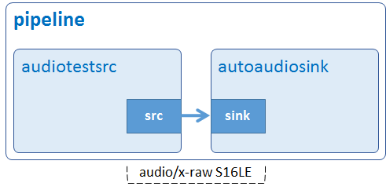

# Hello World

[GStreamer](https://gstreamer.freedesktop.org/) is a framework designed to handle multimedia flows. Media data travels from source elements (the producers) to sink elements (the consumers), passing through a series of intermediate elements performing all kinds of tasks. The set of all interconnected elements is called a pipeline.

Let's get started with this application. Instead of printing “hello world”, we are going to create a sound and send it to the audio output jack. You need to connect [PCM5102A DAC Sound Card](https://www.ebay.com/p/819603476) to the board, then plug a speaker or headphone in it to listen.



## Development Environment

GStreamer: 1.16.3 (edited by Renesas).

## Application Content

+ [`main.c`](main.c)

### Walkthrought

#### Include header file

```c
#include <gst/gst.h>
```

You need to include `gst/gst.h` header file so that all functions and objects of GStreamer are properly defined.

#### Initialize GStreamer
```c
gst_init (&argc, &argv);
```

The first thing that always needs to do is initializing GStreamer library by calling gst_init(). This function will initialize all internal structures, check what plug-ins are available, and execute any command-line options intended for GStreamer. The GStreamer command-line options can be passed as application arguments.

#### Create pipeline
```c
pipeline = gst_parse_launch ("audiotestsrc num-buffers=100 ! autoaudiosink", NULL);
```
In GStreamer, you usually build the pipeline by manually assembling the individual elements like the [sample applications](/README.md#application-samples). For this application, the pipeline is easy and you do not need any advanced features so you can take the shortcut: gst_parse_launch(). This function takes a textual representation of a pipeline and turns it into an actual pipeline.
Element audiotestsrc generates basic audio signals. It supports several different waveforms and allows to set the frequency and volume. The number of buffers to output before sending EOS (End-of-Stream) signal is set to 100. If not, the audio will not stop unless you press Ctrl-C to terminate the program.
Element autoaudiosink is an audio sink that automatically detects an appropriate audio sink to use. In RZ/G2L platform, the audio sink is alsasink.

#### Play pipeline
```c
gst_element_set_state (pipeline, GST_STATE_PLAYING);
```
Every pipeline has an associated [state](https://gstreamer.freedesktop.org/documentation/plugin-development/basics/states.html). To start audio playback, the pipeline needs to be set to PLAYING state.

#### Wait until error or EOS
```c
bus = gst_element_get_bus (pipeline);
msg = gst_bus_timed_pop_filtered (bus, GST_CLOCK_TIME_NONE, GST_MESSAGE_ERROR | GST_MESSAGE_EOS);
```
gst_element_get_bus() retrieves the pipeline's bus, then gst_bus_timed_pop_filtered() will block until you receive either an error or EOS through that bus.
Basically, the bus is an object responsible for delivering the generated messages (GstMessage) from the elements to the application. Note that the actual streaming of media is done in another thread. The application can always be stopped by pressing Ctrl-C in the console.
#### Clean up
```c
if (msg != NULL) {
  gst_message_unref (msg);
}

/* Out of the main loop, clean up nicely */
gst_object_unref (bus);
gst_element_set_state (pipeline, GST_STATE_NULL);
gst_object_unref (GST_OBJECT (pipeline));
```
At last, we need to do tidy up correctly after the pipeline ends:
-	 gst_bus_timed_pop_filtered() returns a message (GstMessage) which needs to be freed with gst_message_unref().
-	 Setting the pipeline to the NULL state will make sure it frees any resources it has allocated.
-	 gst_element_get_bus() adds a reference to the bus that must be freed with gst_object_unref().

#### Note

> Always read the documentation of the functions you use, to know if you should free the objects they return after using them.

## How to Build and Run GStreamer Application

This section shows how to cross-compile and deploy GStreamer _hello world_ application.

### How to Extract SDK
***Step 1***.	Install toolchain on a Host PC:
```sh
$   sudo sh ./poky-glibc-x86_64-core-image-weston-aarch64-smarc-rzg2l-toolchain-3.1.5.sh
```
Note:
> sudo is optional in case user wants to extract SDK into a restricted directory (such as: /opt/)

If the installation is successful, the following messages will appear:

***Step 2***.	Set up cross-compile environment:
```sh
$   source /<Location in which SDK is extracted>/environment-setup-aarch64-poky-linux
```
Note:
>User needs to run the above command once for each login session.

### How to Build and Run GStreamer Application

***Step 1***.	Go to gst-helloworld directory:
```sh
$   cd $WORK/gst-helloworld
```

***Step 2***.	Cross-compile:
```sh
$   make
```
***Step 3***.	Copy all files inside this directory to /usr/share directory on the target board:
```sh
$   scp -r $WORK/gst-helloworld/ <username>@<board IP>:/usr/share/
```
***Step 4***.	Run the application:
```sh
$   /usr/share/gst-helloworld/gst-helloworld
```
