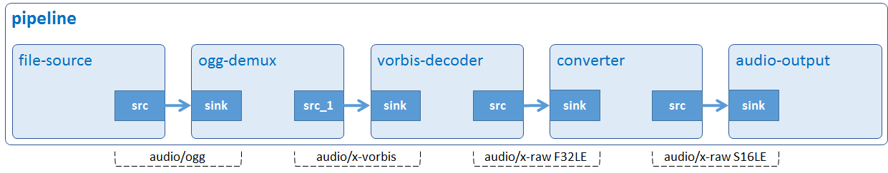

# Audio Play

Play an Ogg/Vorbis audio file.



## Development Environment

GStreamer: 1.16.3 (edited by Renesas).

## Application Content

+ [`main.c`](main.c)
+ [`Makefile`](Makefile)

### Walkthrough: [`main.c`](main.c)

#### Input location
```c
if (argc != ARG_COUNT)
{
  g_print ("Invalid arugments.\n");
  g_print ("Format: %s <path to file> \n", argv[ARG_PROGRAM_NAME]);
  return -1;
}
```
This application accepts one command-line argument which points to an Ogg/Vorbis file.

#### Create new pipeline
```c
pipeline = gst_pipeline_new ("audio-play");
```
The `gst_pipeline_new()` function creates a new empty pipeline which is the top-level container with clocking and bus management functionality.

#### Create elements
```c
source = gst_element_factory_make ("filesrc", "file-source");
demuxer = gst_element_factory_make ("oggdemux", "ogg-demuxer");
decoder = gst_element_factory_make ("vorbisdec", "vorbis-decoder");
conv = gst_element_factory_make ("audioconvert", "converter");
capsfilter = gst_element_factory_make ("capsfilter", "conv_capsfilter");
sink = gst_element_factory_make ("autoaudiosink", "audio-output");
```
To play an Ogg/Vorbis audio file, the following elements are used:
-	 Element `filesrc` reads data from a local file.
-	 Element `oggdemux` de-multiplexes Ogg files into their encoded audio and video components. In this case, only audio stream is available.
-	 Element `vorbisdec` decompresses a Vorbis stream to raw audio.
-	 Element `audioconvert` converts raw audio buffers between various possible formats depending on the given source pad and sink pad it links to.
-	 Element `capsfilter` specifies raw audio format S16LE.
-	 Element `autoaudiosink` automatically detects an appropriate audio sink (such as: alsasink).

#### Check elements
```c
if (!pipeline || !source || !demuxer || !decoder || !capsfilter || !conv || !sink) {
  g_printerr ("One element could not be created. Exiting.\n");
  return -1;
}
```

If either `gst_element_factory_make()` `or gst_pipeline_new()` is unable to create an element, NULL will be returned. Next, the application prints error and exit.
>Note that this statement is used for reference purpose only. If an element cannot be created, the application should use `gst_object_unref()` to free all created elements.

#### Set element’s properties
```c
g_object_set (G_OBJECT (source), "location", input_file, NULL);
```
The `g_object_set()` function is used to set the location property of filesrc (source) to an _Ogg/Vorbis_ file.
```c
caps = gst_caps_new_simple ("audio/x-raw", "format", G_TYPE_STRING, FORMAT, NULL);

g_object_set (G_OBJECT (capsfilter), "caps", caps, NULL);
gst_caps_unref (caps);
```
Target audio format S16LE is added to a new cap (`gst_caps_new_simple`) which is then added to caps property of `capsfilter (g_object_set)`. Then, audioconvert will use this element to convert audio format F32LE (of vorbisdec) to S16LE which is supported by sound driver.
>Note that the caps should be freed with `gst_caps_unref()` if it is not used anymore.

#### Build pipeline
```c
gst_bin_add_many (GST_BIN (pipeline), source, demuxer, decoder, conv, capsfilter, sink, NULL);

gst_element_link (source, demuxer);
gst_element_link_many (decoder, conv, capsfilter, sink, NULL);
```
Above lines of code add all elements to pipeline and then links them into separated groups as below:
-	 Group #1: `source and demuxer`.
-	 Group #2: `decoder, conv, capsfilter, and sink`.

The reason for the separation is that `demuxer` (oggdemux) contains no source pads at this point, so it cannot link to `decoder` (vorbisdec) until pad-added signal is emitted (see below).
>Note that the order counts, because links must follow the data flow (this is, from source elements to sink elements).

#### Signal

```c
g_signal_connect (demuxer, "pad-added", G_CALLBACK (on_pad_added), decoder);
```
Signals are a crucial point in GStreamer. They allow you to be notified (by means of a callback) when something interesting has happened. Signals are identified by a name, and each element has its own signals.\
In this application, `g_signal_connect()` is used to bind pad-added signal of oggdemux `(demuxer)` to callback function `pad_added_handler()` and `decoder` (vorbisdec). GStreamer does nothing with this element, it just forwards it to the callback.

### Link oggdemux to vorbisdec
When oggdemux (demuxer) finally has enough information to start producing data, it will create source pads, and trigger the pad-added signal. At this point our callback will be called:
```c
static void on_pad_added (GstElement * element, GstPad * pad, gpointer data);
```
The `element` parameter is the GstElement which triggered the signal. In this application, it is oggdemux. The first parameter of a signal handler is always the object that has triggered it.\
The `pad` parameter is the GstPad that has just been added to the oggdemux. This is usually the pad to which we want to link.\
The `data` parameter is the decoder (vorbisdec) we provided earlier when attaching to the signal.
```c
GstPad *sinkpad;
GstElement *decoder = (GstElement *) data;

sinkpad = gst_element_get_static_pad (decoder, "sink");
gst_pad_link (pad, sinkpad);
gst_object_unref (sinkpad);
```
The application retrieves the sink pad of vorbisdec using `gst_element_get_static_pad()`, then uses `gst_pad_link()` to connect it to the source pad of oggdemux.
>Note that `sinkpad` should be freed with `gst_caps_unref()` if it is not used anymore.

### Play pipeline
```c
gst_element_set_state (pipeline, GST_STATE_PLAYING);
```

Every `pipeline` has an associated state. To start audio playback, the `pipeline` needs to be set to PLAYING state.

### Wait until error or EOS
```c
bus = gst_element_get_bus (pipeline);
msg = gst_bus_timed_pop_filtered (bus, GST_CLOCK_TIME_NONE, GST_MESSAGE_ERROR | GST_MESSAGE_EOS);
Now, the pipeline is running. gst_bus_timed_pop_filtered() waits for execution to end and returns a GstMessage which is either an error or an EOS (End-of-Stream) message.
Handle messages
if (msg != NULL) {
  GError *err;
  gchar *debug_info;

  switch (GST_MESSAGE_TYPE (msg)) {
    case GST_MESSAGE_ERROR:
      gst_message_parse_error (msg, &err, &debug_info);
      g_printerr ("Error received from element %s: %s.\n",
          GST_OBJECT_NAME (msg->src), err->message);
      g_printerr ("Debugging information: %s.\n",
          debug_info ? debug_info : "none");
      g_clear_error (&err);
      g_free (debug_info);
      break;
    case GST_MESSAGE_EOS:
      g_print ("End-Of-Stream reached.\n");
      break;
    default:
      /* We should not reach here because we only asked for ERRORs and EOS */
      g_printerr ("Unexpected message received.\n");
      break;
  }
  gst_message_unref (msg);
}
```
If the message is `GST_MESSAGE_ERROR`, the application will print the error message and debugging information.\
If the message is `GST_MESSAGE_EOS`, the application will inform to users that the audio is finished.\
After the message is handled, it should be un-referred by `gst_message_unref()`.

### Clean up
```c
gst_object_unref (bus);

gst_element_set_state (pipeline, GST_STATE_NULL);
gst_object_unref (GST_OBJECT (pipeline));
```
The `gst_element_get_bus()` function added the bus that must be freed with `gst_object_unref()`.
Next, setting the `pipeline` to the NULL state will make sure it frees any resources it has allocated.\
Finally, un-referencing the `pipeline` will destroy it, and all its contents.

## How to Build and Run GStreamer Application

This section shows how to cross-compile and deploy GStreamer _audio play_ application.

### How to Extract Renesas SDK
***Step 1***.	Install toolchain on a Host PC:
```sh
$   sudo sh ./poky-glibc-x86_64-core-image-weston-aarch64-smarc-rzg2l-toolchain-3.1.17.sh
```
Note:
> This step installs the RZG2L toolchain. If you want to install the RZV2L toolchain, please use `poky-glibc-x86_64-core-image-weston-aarch64-smarc-rzv2l-toolchain-3.1.17.sh` instead.\
> Sudo is optional in case user wants to extract SDK into a restricted directory (such as: _/opt/_)

If the installation is successful, the following messages will appear:
```sh
SDK has been successfully set up and is ready to be used.
Each time you wish to use the SDK in a new shell session, you need to source the environment setup script e.g.
$ . /opt/poky/3.1.17/environment-setup-aarch64-poky-linux
$ . /opt/poky/3.1.17/environment-setup-armv7vet2hf-neon-vfpv4-pokymllib32-linux-gnueabi
```
***Step 2***.	Set up cross-compile environment:
```sh
$   source /<Location in which SDK is extracted>/environment-setup-aarch64-poky-linux
```
Note:
>User needs to run the above command once for each login session.

### How to Build and Run GStreamer Application

***Step 1***.	Go to gst-audioplay directory:
```sh
$   cd $WORK/01_gst-audioplay
```

***Step 2***.	Cross-compile:
```sh
$   make
```
***Step 3***.	Copy all files inside this directory to _/usr/share_ directory on the target board:
```sh
$   scp -r $WORK/01_gst-audioplay/ <username>@<board IP>:/usr/share/
```
***Step 4***.	Run the application:

Download the input file [Rondo_Alla_Turka.ogg](https://upload.wikimedia.org/wikipedia/commons/b/bd/Rondo_Alla_Turka.ogg) and place it in _/home/media/audios_.
```sh
$   /usr/share/01_gst-audioplay/gst-audioplay /home/media/audios/Rondo_Alla_Turka.ogg
```
### Special instruction:
To set the playback volume: please use the alsamixer or amixer tool. Reference: https://en.wikipedia.org/wiki/Alsamixer
> A short guide that how to use alsamixer (https://wiki.ubuntu.com/Audio/Alsamixer).