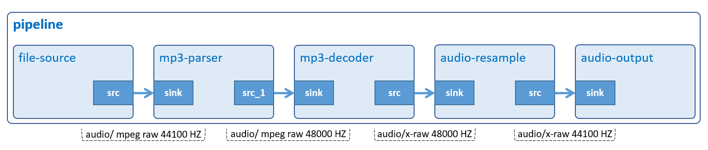

# Audio Play

Play an MP3 audio file.



## Development Environment

GStreamer: 1.16.3 (edited by Renesas).

## Application Content

+ [`main.c`](main.c)
+ [`Makefile`](Makefile)

### Walkthrough: [`main.c`](main.c)

#### UserData structure
```c
typedef struct tag_user_data
{
  GstElement *pipeline;
  GstElement *source;
  GstElement *parser;
  GstElement *decoder;
  GstElement *audioresample;
  GstElement *capsfilter;
  GstElement *sink;
  const gchar *input_file;
} UserData;
```
This structure contains:
- Gstreamer element variables: `pipeline`, `source`, `parser`, `decoder`, `audioresample`, `capsfilter`, `sink`. These variables will be used to create pipeline and elements as sections [Create new pipeline](#create-new-pipeline) and [Create elements](#create-elements).
- Variable `input_file (const gchar)` to represent MP3 audio input file.

#### Command-line argument
```c
if (argc != ARG_COUNT)
{
  g_print ("Invalid arugments.\n");
  g_print ("Format: %s <path to file> \n", argv[ARG_PROGRAM_NAME]);
  return -1;
}
```
This application accepts one command-line argument which points to an MP3 file.

#### Create new pipeline
```c
user_data.pipeline = gst_pipeline_new ("audio-play");
```
The `gst_pipeline_new()` function creates a new empty pipeline which is the top-level container with clocking and bus management functionality.

#### Create elements
```c
user_data.source = gst_element_factory_make ("filesrc", "file-source");
user_data.parser = gst_element_factory_make ("mpegaudioparse",
                        "mp3-parser");
user_data.decoder = gst_element_factory_make ("mpg123audiodec",
                        "mp3-decoder");
user_data.audioresample = gst_element_factory_make ("audioresample",
                              "audio-resample");
user_data.capsfilter = gst_element_factory_make ("capsfilter",
                            "resample_capsfilter");
user_data.sink = gst_element_factory_make ("alsasink", "audio-output");
```
To play an MP3 audio file, the following elements are used:
-	 Element `filesrc` reads data from a local file.
-  Element `mpegaudioparse` parses and frames mpeg1 audio streams.
-	 Element `mpg123audiodec` decode MPEG Layer 1, 2, and 3 (MP3) audio data.
-	 Element `audioresample` resample raw audio buffers to different sample rates using a configurable windowing function to enhance quality.
-	 Element `capsfilter` contains target sample rate 44100 Hz so that `audioresample` can resample audio based on this value.
-	 Element `alsasink` renders audio samples using the ALSA audio API.

#### Check elements
```c
if (!user_data.pipeline || !user_data.source ||
        !user_data.parser || !user_data.decoder ||
        !user_data.audioresample || !user_data.capsfilter ||
        !user_data.sink) {
  g_printerr ("One element could not be created. Exiting.\n");
  return -1;
}
```

If either `gst_element_factory_make()` or `gst_pipeline_new()` is unable to create an element, NULL will be returned. Next, the application prints error and exit.
>Note that this statement is used for reference purpose only. If an element cannot be created, the application should use `gst_object_unref()` to free all created elements.

#### Set element’s properties
```c
caps = gst_caps_new_simple ("audio/x-raw", "rate", G_TYPE_INT,
            AUDIO_SAMPLE_RATE, NULL);
g_object_set (G_OBJECT (data->capsfilter), "caps", caps, NULL);
gst_caps_unref (caps);

g_object_set (G_OBJECT (data->source), "location", data->input_file, NULL);
```
The `g_object_set()` function is used to set the location property of filesrc (source) to an MP3 file.\
The `caps` property of `capsfilter` element which specifies output audio sample rate 44100 Hz.
>Note that the caps should be freed with `gst_caps_unref()` if it is not used anymore.

#### Build pipeline
```c
gst_bin_add_many (GST_BIN (data->pipeline), data->source, data->parser,
    data->decoder, data->audioresample, data->capsfilter, data->sink, NULL);

if (gst_element_link_many (data->source, data->parser, data->decoder,
        data->audioresample, data->capsfilter, data->sink, NULL) != TRUE) {
  g_printerr ("Elements could not be linked.\n");
  return FALSE;
}
```
>Note that the order counts, because links must follow the data flow (this is, from source elements to sink elements).

#### Play pipeline
```c
gst_element_set_state (user_data.pipeline, GST_STATE_PLAYING);
```

Every `pipeline` has an associated state. To start audio playback, the `pipeline` needs to be set to PLAYING state.

#### Wait until error or EOS
```c
bus = gst_element_get_bus (user_data.pipeline);
msg = gst_bus_timed_pop_filtered (bus, GST_CLOCK_TIME_NONE,
          GST_MESSAGE_ERROR | GST_MESSAGE_EOS);
gst_object_unref (bus);
```
Now, the pipeline is running. `gst_bus_timed_pop_filtered()` waits for execution to end and returns a GstMessage which is either an error or an EOS (End-of-Stream) message.\
The `gst_element_get_bus()` function added the bus that must be freed with `gst_object_unref()`.

#### Handle messages
```c
void
parse_message (GstMessage *msg)
{
  GError *error;
  gchar  *dbg_inf;

  switch (GST_MESSAGE_TYPE (msg)) {
    case GST_MESSAGE_EOS:
      g_print ("End of stream !\n");
      break;
    case GST_MESSAGE_ERROR:
      gst_message_parse_error (msg, &error, &dbg_inf);
      g_printerr (" Element error %s: %s.\n",
          GST_OBJECT_NAME (msg->src), error->message);
      g_printerr ("Debugging information: %s.\n",
          dbg_inf ? dbg_inf : "none");
      g_clear_error (&error);
      g_free (dbg_inf);
      break;
    default:
      /* We don't care other message */
      g_printerr ("Undefined message.\n");
      break;
  }
}
```
If the message is `GST_MESSAGE_EOS`, the application will inform to users that the audio is finished.\
If the message is `GST_MESSAGE_ERROR`, the application will print the error message and debugging information.\
After the message is handled, it should be un-referred by `gst_message_unref()`.

#### Clean up
```c
gst_element_set_state (user_data.pipeline, GST_STATE_NULL);
gst_object_unref (GST_OBJECT (user_date.pipeline));
```
Next, setting the `pipeline` to the NULL state will make sure it frees any resources it has allocated.\
Finally, un-referencing the `pipeline` will destroy it, and all its contents.

## How to Build and Run GStreamer Application

This section shows how to cross-compile and deploy GStreamer _audio play_ application.

### How to Extract Renesas SDK
***Step 1***.	Install toolchain on a Host PC:
```sh
$   sudo sh ./poky-glibc-x86_64-core-image-weston-aarch64-smarc-rzg2l-toolchain-3.1.17.sh
```
Note:
> This step installs the RZG2L toolchain. If you want to install the RZV2L toolchain, please use `poky-glibc-x86_64-core-image-weston-aarch64-smarc-rzv2l-toolchain-3.1.17.sh` instead.\
> Sudo is optional in case user wants to extract SDK into a restricted directory (such as: _/opt/_)

If the installation is successful, the following messages will appear:
```sh
SDK has been successfully set up and is ready to be used.
Each time you wish to use the SDK in a new shell session, you need to source the environment setup script e.g.
$ . /opt/poky/3.1.17/environment-setup-aarch64-poky-linux
$ . /opt/poky/3.1.17/environment-setup-armv7vet2hf-neon-vfpv4-pokymllib32-linux-gnueabi
```
***Step 2***.	Set up cross-compile environment:
```sh
$   source /<Location in which SDK is extracted>/environment-setup-aarch64-poky-linux
```
Note:
>User needs to run the above command once for each login session.

### How to Build and Run GStreamer Application

***Step 1***.	Go to gst-audioplay directory:
```sh
$   cd $WORK/01_gst-audioplay
```

***Step 2***.	Cross-compile:
```sh
$   make
```
***Step 3***.	Copy all files inside this directory to _/usr/share_ directory on the target board:
```sh
$   scp -r $WORK/01_gst-audioplay/ <username>@<board IP>:/usr/share/
```
***Step 4***.	Run the application:

Download the input file `renesas-bigideasforeveryspace.mp3` from _Renesas/audios_ in media repository [(github.com/renesas-rz/media)](https://github.com/renesas-rz/media) then place it in _/home/media/audios_.
```sh
$   /usr/share/01_gst-audioplay/gst-audioplay /home/media/audios/renesas-bigideasforeveryspace.mp3
```
### Special instruction:
To set the playback volume: please use the alsamixer or amixer tool. Reference: https://en.wikipedia.org/wiki/Alsamixer
> A short guide that how to use alsamixer (https://wiki.ubuntu.com/Audio/Alsamixer).