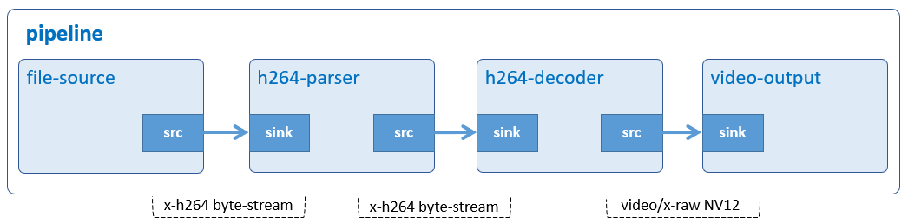

# Video Play

Play an H.264 video file.



## Development Environment

GStreamer: 1.16.3 (edited by Renesas).

## Application Content

+ [`main.c`](main.c)

### Walkthrought
>Note that this tutorial only discusses the important points of this application. For the rest of source code, please refer to section [Audio Play](01_gst-audioplay/README.md).
#### Command-line argument
```c
if ((argc > ARG_COUNT) || (argc == 1)) {
  g_print ("Error: Invalid arugments.\n");
  g_print ("Usage: %s <path to H264 file> \n", argv[ARG_PROGRAM_NAME]);
  return -1;
}
```
This application accepts a command-line argument which points to an H.264 file.

#### Create elements
```c
if ((strcasecmp ("264", ext) || (strcasecmp ("h264", ext) == 0)) {
  parser = gst_element_factory_make ("h264parse", "h264-parser");
  decoder = gst_element_factory_make ("omxh264dec", "h264-decoder");
}

pipeline = gst_pipeline_new ("video-play");
source = gst_element_factory_make ("filesrc", "file-source");
sink = gst_element_factory_make ("waylandsink", "video-output");
```
To play an H.264 video file, the following elements are used:
-    Element filesrc reads data from a local file.
-	 Element h264parse parses H.264 stream to AVC format which omxh264dec can recognize and process.
-	 Element omxh264dec decompresses H.264 stream to raw NV12-formatted video.
-	 Element waylandsink creates its own window and renders the decoded video frames to that.


#### Set element’s properties
```c
g_object_set (G_OBJECT (source), "location", input_file, NULL);
  g_object_set (G_OBJECT (sink), "position-x", main_screen->x, "position-y",
      main_screen->y, NULL);
```
-	 The location property of filesrc element which points to an H.264 video file.
-	 The position-x and position-y are properties of waylandsink element which point to (x,y) coordinate of wayland desktop.


#### Build pipeline
```c
gst_bin_add_many (GST_BIN (pipeline), source, parser, decoder, sink, NULL);

/*Not display video in full-screen*/
gst_element_link_many (source, parser, decoder, sink, NULL);
```
>Note that the order counts, because links must follow the data flow (this is, from source elements to sink elements).

## How to Build and Run GStreamer Application

This section shows how to cross-compile and deploy GStreamer _video play_ application.

### How to Extract Renesas SDK
Please refer to _hello word_ [How to Extract Renesas SDK section](/00_gst-helloworld/README.md#how-to-extract-renesas-sdk) for more details.

### How to Build and Run GStreamer Application

***Step 1***.	Go to gst-videoplay directory:
```sh
$   cd $WORK/02_gst-videoplay
```
***Step 2***.	Cross-compile:
```sh
$   make
```
***Step 3***.	Copy all files inside this directory to _/usr/share_ directory on the target board:
```sh
$   scp -r $WORK/02_gst-videoplay/ <username>@<board IP>:/usr/share/
```
***Step 4***.	Run the application:

Download the input file [vga1.h264](https://www.renesas.com/jp/ja/img/products/media/auto-j/microcontrollers-microprocessors/rz/rzg/doorphone-videos/vga1.h264) and place it in _/home/media/videos_.
```sh
$   /usr/share/02_gst-videoplay/gst-videoplay /home/media/videos/vga1.h264
```
> RZ/G2L & RZ/V2L platform maximum support Full HD video.
