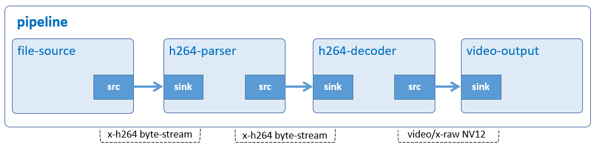

# Video Play

Play an H.264/H.265 video file.
>H.265 is only for MPU(s) support `omxh265dec` and `omxh265enc`.



## Development Environment

### Linux kernel version 5.10 and Yocto version 3.1 (Dunfell)

GStreamer: 1.16.3 (edited by Renesas).

### Linux kernel version 6.1 and Yocto version 5.0 (Scrathgap)

GStreamer: 1.22.12 (edited by Renesas).

## Application Content

+ [`main.c`](main.c)
+ [`Makefile`](Makefile)

### Walkthrough: [`main.c`](main.c)
>Note that this tutorial only discusses the important points of this application. For the rest of source code, please refer to section [Audio Play](../01_gst-audioplay/README.md).

#### UserData structure
```c
typedef struct tag_user_data
{
  GstElement *pipeline;
  GstElement *source;
  GstElement *parser;
  GstElement *decoder;
  GstElement *sink;

  const gchar *input_file;
  struct screen_t *main_screen;
} UserData;
```
This structure contains:
- Gstreamer element variables: `pipeline`, `source`, `parser`, `decoder`, `sink`. These variables will be used to create pipeline and elements as section [Create elements](#create-elements).
- Variable `input_file (const gchar)` to represent H.264/H.265 video input file.
- Variable `main_screen (screen_t)` is a pointer to screen_t structure to contain monitor information, such as: (x, y), width, and height.

#### Command-line argument
```c
if ((argc > ARG_COUNT) || (argc == 1)) {
  g_print ("Error: Invalid arugments.\n");
  g_print ("Usage: %s <path to H.264/H.265 file> \n", argv[ARG_PROGRAM_NAME]);
  return -1;
}
```
This application accepts a command-line argument which points to an H.264/H.265 file.

#### Create elements
```c
if (check_video_extension (ext, H264_supported_exts)) {
  user_data.parser = gst_element_factory_make ("h264parse", "h264-parser");
  user_data.decoder = gst_element_factory_make ("omxh264dec", "h264-decoder");
} else if ((check_video_extension (ext, H265_supported_exts)) &&
    ((board == RZV2N_RZV2H) || (board == RZG3E))) {
  user_data.parser = gst_element_factory_make ("h265parse", "h265-parser");
  user_data.decoder = gst_element_factory_make ("omxh265dec", "h265-decoder");
}

user_data.source = gst_element_factory_make ("filesrc", "file-source");
user_data.sink = gst_element_factory_make ("waylandsink", "video-output");
```
To play an H.264 video file, the following elements are used:
-  Element `filesrc` reads data from a local file.
-	 Element `h264parse` parses H.264 stream to AVC format which `omxh264dec` can recognize and process.
-	 Element `h265parse` parses H.265 stream to HEVC format which `omxh265dec` can recognize and process.
-	 Element `omxh264dec` decompresses H.264 stream to raw NV12-formatted video.
-  Element `omxh265dec` decompresses H.265 stream to raw NV12-formatted video.
-	 Element `waylandsink` creates its own window and renders the decoded video frames to that.


#### Set element’s properties
```c
g_object_set (G_OBJECT (data->sink), "position-x", data->main_screen->x,
    "position-y", data->main_screen->y, NULL);

g_object_set (G_OBJECT (data->source), "location", data->input_file,
    NULL);
```
-	 The position-x and position-y are properties of waylandsink element which point to (x,y) coordinate of wayland desktop.
-	 The location property of filesrc element which points to an H.264/H.265 video file.

#### Build pipeline
```c
gst_bin_add_many (GST_BIN (data->pipeline), data->source,
    data->parser, data->decoder, data->sink, NULL);

if (gst_element_link_many (data->source, data->parser,
        data->decoder, data->sink, NULL) != TRUE) {
  g_printerr ("Elements could not be linked.\n");
  return FALSE;
}
```
>Note that the order counts, because links must follow the data flow (this is, from `source` elements to `sink` elements).

## How to Build and Run GStreamer Application

This section shows how to cross-compile and deploy GStreamer _video play_ application.

### How to Extract Renesas SDK
***Step 1***.	Install toolchain on a Host PC:
* RZ/G2L SMARC Evaluation Kit:
  ```sh
  $   sudo sh ./poky-glibc-x86_64-core-image-weston-aarch64-smarc-rzg2l-toolchain-*.sh
  ```
  Note:
  > This step installs the RZ/G2L toolchain in the environment VLP 3.0.x. If you want to install the RZ/G2L toolchain in the environment VLP 4.0.x, please use `./rz-vlp-glibc-x86_64-core-image-weston-cortexa55-smarc-rzg2l-toolchain-*.sh` instead.

* RZ/V2L SMARC Evaluation Kit:
  ```sh
  $   sudo sh ./poky-glibc-x86_64-core-image-weston-aarch64-smarc-rzv2l-toolchain-*.sh
  ```

* RZ/V2N Evaluation Board Kit:
  ```sh
  $   sudo sh ./poky-glibc-x86_64-core-image-weston-aarch64-rzv2n-evk-toolchain-*.sh
  ```
  Note:
  > This step installs the RZ/V2N toolchain in the environment AI SDK 5.xx. If you want to install the RZ/V2N toolchain in the environment AI SDK 6.xx, please use `./rz-vlp-glibc-x86_64-core-image-weston-cortexa55-rzv2n-evk-toolchain-*.sh` instead.

* RZ/V2H Evaluation Board Kit:
  ```sh
  $   sudo sh ./poky-glibc-x86_64-core-image-weston-aarch64-rzv2h-evk-ver1-toolchain-*.sh
  ```

* RZ/G3E SMARC Evaluation Kit:
  ```sh
  $   sudo sh ./rz-vlp-glibc-x86_64-core-image-weston-cortexa55-smarc-rzg3e-toolchain-*.sh
  ```
Note:
> Sudo is optional in case user wants to extract SDK into a restricted directory (such as: _/opt/_)

***Step 2***.	Set up cross-compile environment:
* Linux kernel version 5.10 and Yocto version 3.1 (Dunfell):
  ```sh
  $   source /<Location in which SDK is extracted>/environment-setup-aarch64-poky-linux
  ```
* Linux kernel version 6.1 and Yocto version 5.0 (Scrathgap):
  ```sh
  $   source /<Location in which SDK is extracted>/environment-setup-cortexa55-poky-linux
  ```
Note:
>User needs to run the above command once for each login session.

### How to Build and Run GStreamer Application

***Step 1***.	Go to gst-videoplay directory:
```sh
$   cd $WORK/02_gst-videoplay
```
***Step 2***.	Cross-compile:
```sh
$   make
```
***Step 3***.	Copy all files inside this directory to _/usr/share_ directory on the target board:
```sh
$   scp -r $WORK/02_gst-videoplay/ <username>@<board IP>:/usr/share/
```
***Step 4***.	Run the application:

Download the input file `vga1.h264` from _Renesas/videos_ in media repository [(github.com/renesas-rz/media)](https://github.com/renesas-rz/media) and then place it in _/home/media/videos_.
```sh
$   /usr/share/02_gst-videoplay/gst-videoplay /home/media/videos/vga1.h264
```
>RZ/V2N, RZ/V2H and RZ/G3E MPUs maximum support 4K video.

>RZ/G2L and RZ/V2L MPUs maximum support Full HD video.
