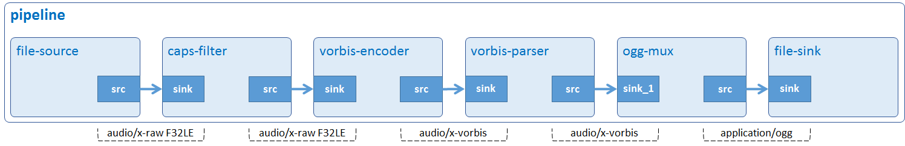

# Audio Encode

Encode audio data from F32LE raw format to Ogg/Vorbis format.



## Development Environment

GStreamer: 1.16.3 (edited by Renesas).

## Application Content

+ [`main.c`](main.c)

### Walkthrought
>Note that this tutorial only discusses the important points of this application. For the rest of source code, please refer to section [Audio Play](01_gst-audioplay/README.md).

#### Input/output location
```c
#define INPUT_FILE       "/home/media/audios/Rondo_Alla_Turka_F32LE_44100_stereo.raw"
#define OUTPUT_FILE      "/home/media/audios/ENCODE_Rondo_Alla_Turka.ogg"
```
Note:
> You can create input file by following section [Special Instruction](#special-instruction)
#### Create elements
```c
source = gst_element_factory_make ("filesrc", "file-source");
capsfilter = gst_element_factory_make ("capsfilter", "caps-filter");
encoder = gst_element_factory_make ("vorbisenc", "vorbis-encoder");
parser = gst_element_factory_make ("vorbisparse", "vorbis-parser");
muxer = gst_element_factory_make ("oggmux", "OGG-muxer");
sink = gst_element_factory_make ("filesink", "file-output");
```
To encode an audio file to Vorbis format, the following elements are used:
-	 Element filesrc reads data from a local file.
-	 Element capsfilter specifies raw audio format, channel, and bitrate.
-	 Element vorbisenc encodes raw float audio into a Vorbis stream.
-	 Element vorbisparse parses the header packets of the Vorbis stream and put them as the stream header in the caps.
-	 Element oggmux merges streams (audio and/or video) into Ogg files. In this case, only audio stream is available.
-	 Element filesink writes incoming data to a local file.

#### Set element’s properties
```c
g_object_set (G_OBJECT (source), "location", input_file, NULL);
g_object_set (G_OBJECT (encoder), "bitrate", BITRATE, NULL);
g_object_set (G_OBJECT (sink), "location", output_file, NULL);
```
The _g_object_set()_ function is used to set some element’s properties, such as:
-	 The location property of filesrc element which points to a raw audio file.
-	 The bitrate property of vorbisenc element which is set to 128 Kbps. Note that this value is just for demonstration purpose only. Users can define other value which will affect output quality.
-	 The location property of filesink element which points to an output file.
```c
caps = gst_caps_new_simple ("audio/x-raw", "format", G_TYPE_STRING, FORMAT,
                                 "rate", G_TYPE_INT, SAMPLE_RATE, "channels", G_TYPE_INT, CHANNEL, NULL);

g_object_set (G_OBJECT (capsfilter), "caps", caps, NULL);
gst_caps_unref (caps);
```
A capsfilter is needed between filesrc and vorbisenc because the vorbisenc element needs to know what raw audio format, sample rate, and channels of the incoming data stream are. In this application, audio file is formatted to F32LE, has sample rate 44.1 kHz and stereo audio.\
The _gst_caps_new_simple()_ function creates a new cap which holds these values. This cap is then added to caps property of capsfilter element (g_object_set).
>Note that the caps should be freed with _gst_caps_unref()_ if it is not used anymore.

## How to Build and Run GStreamer Application

This section shows how to cross-compile and deploy GStreamer _audio encode_ application.

### How to Extract Renesas SDK
Please refer to _hello word_ [How to Extract Renesas SDK section](/00_gst-helloworld/README.md#how-to-extract-renesas-sdk) for more details.

### How to Build and Run GStreamer Application

***Step 1***.	Go to gst-audioencode directory:
```sh
$   cd $WORK/03_gst-audioencode
```
***Step 2***.	Cross-compile:
```sh
$   make
```
***Step 3***.	Copy all files inside this directory to _/usr/share_ directory on the target board:
```sh
$   scp -r $WORK/03_gst-audioencode/ <username>@<board IP>:/usr/share/
```
***Step 4***.	Run the application:
```sh
$   /usr/share/03_gst-audioencode/gst-audioencode
```
### Special instruction:
#### Prepare raw audio file:
1.	Download the input file [Rondo_Alla_Turka.ogg](https://upload.wikimedia.org/wikipedia/commons/b/bd/Rondo_Alla_Turka.ogg)(128 Kbps, 44.1 kHz, stereo audio, and Vorbis audio format) and place it in _/home/media/audios_.
2. Run this command (on board) to convert this file to raw audio format (F32LE, 44.1 kHz, and stereo audio).
```sh
$ gst-launch-1.0 -e filesrc location=/home/media/audios/Rondo_Alla_Turka.ogg ! oggdemux ! vorbisdec ! audio/x-raw, format=F32LE, rate=44100, channels=2 ! filesink location=/home/media/audios/Rondo_Alla_Turka_F32LE_44100_stereo.raw
```
>Note that this process will take a while depending on the file size and processor speed.
#### To check the output file:

Option 1: VLC media player (https://www.videolan.org/vlc/index.html).

Option 2: Tool gst-launch-1.0 (on board):
```sh
$ gst-launch-1.0 filesrc location=/home/media/audios/ENCODE_Rondo_Alla_Turka.ogg ! oggdemux ! vorbisdec ! audioconvert ! audio/x-raw, format=S16LE ! alsasink
```