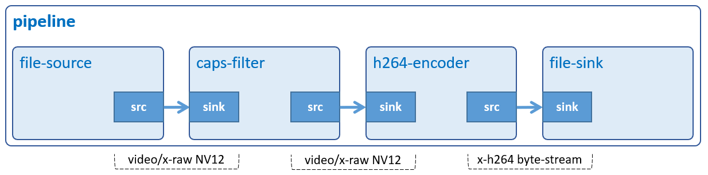

# Video Encode

Encode video data from NV12 raw format to H.264 format.



## Development Environment

GStreamer: 1.16.3 (edited by Renesas).

## Application Content

+ [`main.c`](main.c)
+ [`Makefile`](Makefile)

### Walkthrough: [`main.c`](main.c)
>Note that this tutorial only discusses the important points of this application. For the rest of source code, please refer to section [Video Play](../02_gst-videoplay/README.md).

#### UserData structure
```c
typedef struct tag_user_data
{
  GstElement *pipeline;
  GstElement *source;
  GstElement *capsfilter;
  GstElement *encoder;
GstElement *sink;
} UserData;
```
This structure contains:
- Gstreamer element variables: `pipeline`, `source`, `capsfilter`, `encoder`, `sink`. These variables will be used to create pipeline and elements as section [Create elements](#create-elements).

#### Input/output location
```c
#define INPUT_FILE       "/home/media/videos/sintel_trailer-720p.yuv"
#define OUTPUT_FILE      "/home/media/videos/ENCODE_h264-720p.264"
```
> You can create input file by following section [Special Instruction](#special-instruction)

#### Create elements
```c
user_data.source = gst_element_factory_make ("filesrc", "file-source");
user_data.capsfilter = gst_element_factory_make ("capsfilter",
                           "caps-filter");
user_data.encoder = gst_element_factory_make ("omxh264enc", "H264-encoder");
user_data.sink = gst_element_factory_make ("filesink", "file-output");
```
To encode a raw video file to H.264 video format, the following elements are used:
-	 Element `filesrc` reads data from a local file.
-	 Element `capsfilter` specifies raw video format, framerate, and resolution.
-	 Element `omxh264enc` encodes raw video into H.264 compressed data.
-	 Element `filesink` writes incoming data to a local file.

#### Set element’s properties
```c
g_object_set (G_OBJECT (data->source), "location", INPUT_FILE, NULL);
g_object_set (G_OBJECT (data->source), "blocksize", BLOCKSIZE, NULL);
g_object_set (G_OBJECT (data->encoder), "control-rate", CONTROL_RATE, NULL);
g_object_set (G_OBJECT (data->encoder), "target-bitrate", BITRATE, NULL);
g_object_set (G_OBJECT (data->sink), "location", OUTPUT_FILE, NULL);
```
The `g_object_set()` function is used to set some element’s properties, such as:
-	 The `location` property of filesrc and filesink elements which points to input and output file.
-	 The `blocksize` property of filesrc element which is calculated by multiplying 1.5 (NV12) x 800 (frame width) x 480 (frame height).
-	 The `control-rate` property of omxh264enc element which enables low latency video.
-	 The `target-bitrate` property of omxh264enc element which is set to 10 Mbps. The higher bitrate, the better quality.

```c
  caps =
      gst_caps_new_simple ("video/x-raw",
      "format", G_TYPE_STRING, VIDEO_FORMAT,
      "framerate", GST_TYPE_FRACTION, FRAMERATE, TYPE_FRACTION,
      "width", G_TYPE_INT, LVDS_WIDTH, "height", G_TYPE_INT, LVDS_HEIGHT,
      NULL);

  g_object_set (G_OBJECT (data->capsfilter), "caps", caps, NULL);
  gst_caps_unref (caps);
```
A `capsfilter` is needed between filesrc and omxh264enc because omxh264enc element needs to know what raw video format, frame rate, and resolution of the incoming data stream are. In this application, the output video is NV12 formatted, has 30 FPS, and resolution 800x480.\
The `gst_caps_new_simple()` function creates a new cap which holds these values. This cap is then added to caps property of capsfilter element `(g_object_set)`.
>Note that the caps should be freed with `gst_caps_unref()` if it is not used anymore.

## How to Build and Run GStreamer Application

This section shows how to cross-compile and deploy GStreamer _video encode_ application.

### How to Extract Renesas SDK
***Step 1***. Install toolchain on a Host PC:
```sh
$   sudo sh ./poky-glibc-x86_64-core-image-weston-aarch64-rzv2h-evk-ver1-toolchain-*.sh
```
Note:
> This step installs the RZV2H toolchain.\
> Sudo is optional in case user wants to extract SDK into a restricted directory (such as: _/opt/_)

***Step 2***. Set up cross-compile environment:
```sh
$   source /<Location in which SDK is extracted>/environment-setup-aarch64-poky-linux
```
Note:
>User needs to run the above command once for each login session.

### How to Build and Run GStreamer Application

***Step 1***. Go to gst-videoencode directory:
```sh
$   cd $WORK/04_gst-videoencode
```

***Step 2***. Cross-compile:
```sh
$   make
```
***Step 3***. All files inside this directory to _/usr/share_ directory on the target board:
```sh
$   scp -r $WORK/04_gst-videoencode/ <username>@<board IP>:/usr/share/
```
***Step 4***. Run the application:
```sh
$   /usr/share/04_gst-videoencode/gst-videoencode
```
### Special instruction:
#### Prepare raw video file:
   1. Download the input file `sintel_trailer-720p.mp4` as described in _Sintel_trailer/README.md_ file in media repository [(github.com/renesas-rz/media)](https://github.com/renesas-rz/media) and then place it in _/home/media/videos_.\
   2. Run this command (on board) to convert this file to raw video format (NV12):
   ```sh
   $ gst-launch-1.0 -e filesrc num-buffers=120 location=/home/media/videos/sintel_trailer-720p.mp4 ! qtdemux ! h264parse ! omxh264dec no-copy=false ! filesink location=/home/media/videos/sintel_trailer-720p.yuv
   ```
   3. Finally, the pipeline will create the input file `sintel_trailer-720p.yuv` at location _/home/media/videos/_

   Note:
   >Please remove `num-buffers` property if you would like to decode the whole video.

#### To check the output file:
Run this command on board:
```sh
$ gst-launch-1.0 filesrc location=/home/media/videos/ENCODE_h264-720p.264 ! h264parse ! omxh264dec ! waylandsink
```