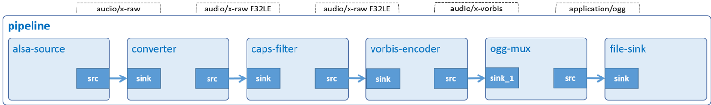

# Audio Record

Record raw data from USB microphone, then store it in Ogg container.



## Development Environment

GStreamer: 1.16.3 (edited by Renesas).

## Application Content

+ [`main.c`](main.c)
+ [`Makefile`](Makefile)
+ [`detect_microphone.sh`](detect_microphone.sh)

### Walkthrough: [`main.c`](main.c)
>Note that this tutorial only discusses the important points of this application. For the rest of source code, please refer to section [Audio Play](../01_gst-audioplay/README.md).

#### UserData structure
```c
typedef struct tag_user_data
{
  GstElement *pipeline;
  GstElement *source;
  GstElement *converter;
  GstElement *convert_capsfilter;
  GstElement *encoder;
  GstElement *muxer;
  GstElement *sink;

  const gchar *device;
} UserData;
```
This structure contains:
- Gstreamer element variables: `pipeline`, `source`, `converter`, `convert_capsfilter`, `encoder`, `muxer`, `sink`. These variables will be used to create pipeline and elements as section [Create elements](#create-elements).
- Variable `device (gchar)`: A pointer to a microphone device.

#### Output location
```c
#define OUTPUT_FILE  "RECORD_microphone-mono.ogg"
```
#### Command-line argument
```c
if (argc != ARG_COUNT) {
  g_print ("Error: Invalid arugments.\n");
  g_print ("Usage: %s <microphone device> \n", argv[ARG_PROGRAM_NAME]);
  return -1;
}
```
This application accepts a command-line argument which points to a microphone (hw:1,0, for example).

>Note: You can find this value by following section [Special Instruction](#special-instruction)

#### Create elements
```c
user_data.source = gst_element_factory_make ("alsasrc", "alsa-source");
user_data.converter = gst_element_factory_make ("audioconvert",
                          "audio-converter");
user_data.convert_capsfilter = gst_element_factory_make ("capsfilter",
                                   "convert_caps");
user_data.encoder = gst_element_factory_make ("vorbisenc", "vorbis-encoder");
user_data.muxer = gst_element_factory_make ("oggmux", "ogg-muxer");
user_data.sink = gst_element_factory_make ("filesink", "file-output");
```
To record raw data from microphone then store it in Ogg container, the following elements are used:
-	 Element `alsasrc` reads data from an audio card using the ALSA API.
-	 Element `audioconvert` converts raw audio buffers to a format (such as: F32LE) which is understood by vorbisenc.
-	 Element `vorbisenc` encodes raw audio into a Vorbis stream.
-	 Element `oggmux` merges audio stream to Ogg container.
-	 Element `filesink` writes incoming data to a local file.

#### Set element’s properties
```c
g_object_set (G_OBJECT (data->source), "device", data->device, NULL);
g_object_set (G_OBJECT (data->encoder), "bitrate", BITRATE, NULL);
g_object_set (G_OBJECT (data->sink), "location", OUTPUT_FILE, NULL);
```
The `g_object_set()` function is used to set some element’s properties, such as:
-	 The `device` property of alsasrc element which points to a microphone device. Users will pass the device card as a command line argument to this application. Please refer to section [Special Instruction](#special-instruction) to find the value.
-	 The `bitrate` property of vorbisenc element is used to specify encoding bit rate. The higher bitrate, the better quality.
-	 The `location` property of filesink element which points to the output file.

```c
caps =
    gst_caps_new_simple ("audio/x-raw",
    "format", G_TYPE_STRING, FORMAT,
    "channels", G_TYPE_INT, CHANNEL, "rate", G_TYPE_INT, SAMPLE_RATE, NULL);

g_object_set (G_OBJECT (data->convert_capsfilter), "caps", caps, NULL);
gst_caps_unref (caps);
```
Capabilities (short: `caps`) describe the type of data which is streamed between two pads. This data includes raw audio format, channel, and sample rate.\
The `gst_caps_new_simple()` function creates new caps which holds these values. These caps are then added to `caps` property of capsfilter elements `(g_object_set)`.
>Note that both caps should be freed with `gst_caps_unref()` if they are not used anymore.

#### Build pipeline
```c
gst_bin_add_many (GST_BIN (data->pipeline), data->source, data->converter,
    data->convert_capsfilter, data->encoder, data->muxer, data->sink, NULL);
if (gst_element_link_many (data->source, data->converter,
        data->convert_capsfilter, data->encoder, NULL) != TRUE) {
  g_printerr ("Elements could not be linked.\n");
  return FALSE;
}
if (gst_element_link (data->muxer, data->sink) != TRUE) {
  g_printerr ("Elements could not be linked.\n");
  return FALSE;
}
```
The reason for the separation is that the sink pad of oggmux `(muxer)` cannot be created automatically but is only created on demand. This application uses self-defined function `link_to_muxer()` to link the sink pad to source pad of vorbisenc `(encoder)`. That’s why its sink pad is called Request Pad.
>Note that the order counts, because links must follow the data flow (this is, from source elements to sink elements).

#### Link request pads

```c
if (link_to_muxer (data->encoder, data->muxer) != TRUE){
  g_printerr ("Failed to link to muxer.\n");
  return FALSE;
}
```
This block calls `link_to_muxer()` to link the source pad of vorbisenc `(encoder)` to the sink pad of oggmux `(muxer)`.

```c
static int
link_to_muxer (GstElement *up_element, GstElement *muxer)
{
  src_pad = gst_element_get_static_pad (up_element, "src");

  req_pad = gst_element_get_compatible_pad (muxer, src_pad, NULL);
  gst_pad_link (src_pad, req_pad);

  gst_object_unref (GST_OBJECT (src_pad));
  gst_object_unref (GST_OBJECT (req_pad));
}
```
This function gets the source pad `(src_pad)` of upstream element (encoder) then calls `gst_element_get_compatible_pad()` to request a sink pad `(req_pad)` which is compatible with the source pad `(src_pad)` of oggmux `(muxer)`, then calls `gst_pad_link()` to link them together.
>Note that the pads should be freed with `gst_object_unref()` if they are not used anymore.

### Play pipeline
```c
gst_element_set_state (user_data.pipeline, GST_STATE_PLAYING);
```

Every pipeline has an associated [state](https://gstreamer.freedesktop.org/documentation/plugin-development/basics/states.html). To start audio recording, the `pipeline` needs to be set to PLAYING state.

```c
signal (SIGINT, signalHandler);
```
This application will stop recording if user presses Ctrl-C. To do so, it uses `signal()` to bind `SIGINT` (interrupt from keyboard) to `signalHandler()`.
To know how this function is implemented, please refer to the following lines of code:

```c
void signalHandler (int signal)
{
  if (signal == SIGINT) {
    gst_element_send_event (user_data.pipeline, gst_event_new_eos ());
  }
}
```
It calls `gst_element_send_event()` to send EOS (End-of-Stream) signal `(gst_event_new_eos)` to the `pipeline`. This makes `gst_bus_timed_pop_filtered()` return. Finally, the program cleans up GStreamer objects and exits.

## How to Build and Run GStreamer Application

This section shows how to cross-compile and deploy GStreamer _audio record_ application.

### How to Extract Renesas SDK
***Step 1***.	Install toolchain on a Host PC:
```sh
$   sudo sh ./poky-glibc-x86_64-core-image-weston-aarch64-rzv2h-evk-ver1-toolchain-*.sh
```
Note:
> This step installs the RZV2H toolchain.\
> Sudo is optional in case user wants to extract SDK into a restricted directory (such as: _/opt/_)

***Step 2***.	Set up cross-compile environment:
```sh
$   source /<Location in which SDK is extracted>/environment-setup-aarch64-poky-linux
```
Note:
>User needs to run the above command once for each login session.

### How to Build and Run GStreamer Application

***Step 1***.	Go to gst-audiorecord directory:
```sh
$   cd $WORK/05_gst-audiorecord
```

***Step 2***.	Cross-compile:
```sh
$   make
```
***Step 3***.	Copy all files inside this directory to _/usr/share_ directory on the target board:
```sh
$   scp -r $WORK/05_gst-audiorecord/ <username>@<board IP>:/usr/share/
```
***Step 4***.	Run the application:

```sh
$   /usr/share/05_gst-audiorecord/gst-audiorecord $(/usr/share/05_gst-audiorecord/detect_microphone.sh)
```
For more details about `detect_microphone.sh` script at [Find microphone device card](#run-the-following-script-to-find-microphone-device-card).
### Special instruction:
#### Run the following script to find microphone device card:
```sh
$ ./detect_microphone.sh
```
Basically, this script analyzes the `/proc/asound/cards` file to get sound cards.
>Note: This script can be used in combination with gst-audiorecord application.

For further information on how this script is implemented, please refer to the following lines of code:
```sh
ALSA_DEV_FILE="/proc/asound/cards"

CMD_GET_SND="cat $ALSA_DEV_FILE | awk '{ print \$0 }'"

CMD_GET_SND_INDICES="$CMD_GET_SND | awk '{ print \$1 }'"

SND_INDICES="$( eval $CMD_GET_SND_INDICES )"
if [ ! -z "$SND_INDICES" ]
then
    for TEMP_INDEX in $SND_INDICES
    do
        HAS_MIC="$( amixer -D hw:$TEMP_INDEX scontrols | grep "Mic" )"

        if [ "$HAS_MIC" != "" ]
        then
            SND_INDEX=$TEMP_INDEX
            DEVICE_NUMBER=${HAS_MIC: -1}
            echo "hw:$SND_INDEX,$DEVICE_NUMBER"

            amixer cset name='Aux Switch' on > /dev/null
            amixer cset name='Mixin Left Aux Left Switch' on > /dev/null
            amixer cset name='Mixin Right Aux Right Switch' on > /dev/null
            amixer cset name='ADC Switch' on > /dev/null
            amixer cset name='Mixout Right Mixin Right Switch' off > /dev/null
            amixer cset name='Mixout Left Mixin Left Switch' off > /dev/null
            amixer cset name='Headphone Volume' 50% > /dev/null
            amixer cset name='Headphone Switch' on > /dev/null
            amixer cset name='Mixout Left DAC Left Switch' on > /dev/null
            amixer cset name='Mixout Right DAC Right Switch' on > /dev/null
            amixer cset name='DAC Left Source MUX' 'DAI Input Left' > /dev/null
            amixer cset name='DAC Right Source MUX' 'DAI Input Right' > /dev/null
            amixer sset 'Mic 1 Amp Source MUX' 'MIC_P' > /dev/null
            amixer sset 'Mic 2 Amp Source MUX' 'MIC_P' > /dev/null
            amixer sset 'Mixin Left Mic 1' on > /dev/null
            amixer sset 'Mixin Right Mic 2' on > /dev/null
            amixer sset 'Mic 1' 100% on > /dev/null
            amixer sset 'Mic 2' 100% on > /dev/null
            amixer sset 'Lineout' 100% on > /dev/null
            amixer set 'Headphone' 100% on > /dev/null
            amixer set 'DVC In',0 100% > /dev/null
            amixer cset name='Mixin PGA Volume' 2 > /dev/null
            amixer cset name='Mixin PGA Switch' on > /dev/null
            amixer cset name='ADC Volume' 67% > /dev/null
            break
        fi
    done
fi
```
#### To check the output file:
Option 1: VLC media player (https://www.videolan.org/vlc/index.html).
Option 2: Tool gst-launch-1.0 (on board):
```sh
$ gst-launch-1.0 filesrc location=RECORD_microphone-mono.ogg ! oggdemux ! vorbisdec ! audioconvert ! audioresample ! autoaudiosink
```
