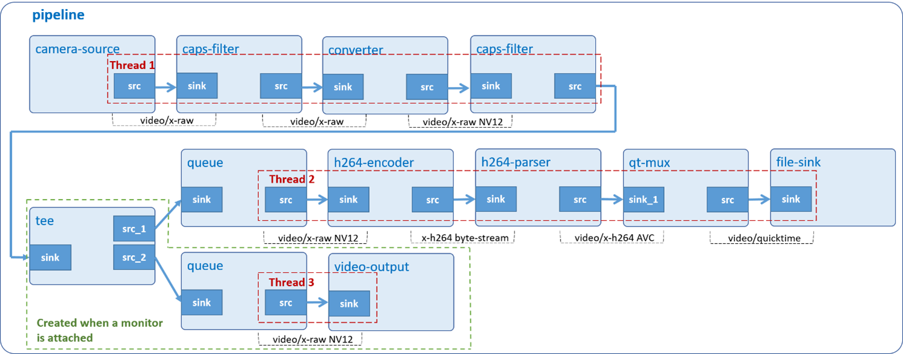

# Video Record

Display and encode raw data from USB/MIPI camera to H.264 format, then store it in MP4 container when user presses Ctrl-C.



## Development Environment

GStreamer: 1.16.3 (edited by Renesas).

## Application Content

+ [`main.c`](main.c)
+ [`Makefile`](Makefile)
+ [`setup_MIPI_camera.sh`](setup_MIPI_camera.sh)
+ [`detect_camera.sh`](detect_camera.sh)

### Walkthrough: [`main.c`](main.c)
>Note that this tutorial only discusses the important points of this application. For the rest of source code, please refer to section [Video Play](../02_gst-videoplay/README.md).

#### UserData structure
```c
typedef struct tag_user_data
{
  GstElement *pipeline;
  GstElement *source;
  GstElement *camera_capsfilter;
  GstElement *converter;
  GstElement *convert_capsfilter;
  GstElement *queue1;
  GstElement *encoder;
  GstElement *parser;
  GstElement *muxer;
  GstElement *decoder;
  GstElement *filesink;
  GstElement *tee;
  GstElement *queue2;
  GstElement *waylandsink;

  const gchar *device;
  enum  camera_type camera;
  int width;
  int height;
  bool display_video;
} UserData;
```
This structure contains:
- Gstreamer element variables: `pipeline`, `source`, `camera_capsfilter`, `converter`, `convert_capsfilter`, `queue1`, `encoder`, `parser`, `muxer`, `decoder`, `filesink`, `tee`, `queue2`, `waylandsink`. These variables will be used to create pipeline and elements as section [Create elements](#create-elements).
- Variable `device (const gchar)`: A pointer to a camera device file.
- Variable `camera (camera_type)`: A enum variable to specify camera types.
- Variables `width (int)` and `height (int)`: These variables to specify width and height of video.
- Variable `display_video (bool)` to represent screen that available or not.

#### Output location
```c
#define OUTPUT_FILE        "RECORD-camera.mp4"
```
#### Command-line argument
```c
if (argc != ARG_COUNT) {
  g_print ("Error: Invalid arugments.\n");
  g_print ("Usage: %s <camera device> [width] [height]\n",
      argv[ARG_PROGRAM_NAME]);
  return -1;
}
user_data.camera = check_camera_type (argv[ARG_DEVICE]);
```
This application accepts a command-line argument which points to camera’s device file (/dev/video9, for example). The type of camera is determined by function check_camera_type. Note: You can find this value by following section [Special Instruction](#special-instruction)\
User can enter width and height options to set camera’s resolution.

#### Create elements
```c
user_data.source = gst_element_factory_make ("v4l2src", "camera-source");
user_data.camera_capsfilter = gst_element_factory_make ("capsfilter",
                                  "camera_caps");
user_data.convert_capsfilter = gst_element_factory_make ("capsfilter",
                                   "convert_caps");
user_data.queue1 = gst_element_factory_make ("queue", "queue1");
user_data.encoder = gst_element_factory_make ("omxh264enc", "video-encoder");
user_data.parser = gst_element_factory_make ("h264parse", "h264-parser");
user_data.muxer = gst_element_factory_make ("qtmux", "mp4-muxer");
user_data.filesink = gst_element_factory_make ("filesink", "file-output");

if (user_data.camera == MIPI_CAMERA) {
  user_data.converter = gst_element_factory_make ("vspmfilter",
                            "video-converter");
} else {
  user_data.converter = gst_element_factory_make ("videoconvert",
                            "video-converter");
}
```
```c
data->tee = gst_element_factory_make ("tee", "tee");
data->queue2 = gst_element_factory_make ("queue", "queue2");
data->waylandsink = gst_element_factory_make ("waylandsink",
                        "video-output");
```
To display and record camera then store it in MP4 container, the following elements are used:
-	 Element `v4l2src` captures video from V4L2 devices.
-	 Element `capsfilter` specifies raw video format, framerate, and resolution.
-	 Element `videoconvert` (used for USB camera) and element `vspmfilter` (used for MIPI camera) convert video frames to a format (such as: NV12) understood by `omxh264enc`.
-	 Element `tee` splits (video) data to multiple pads.
-	 Element `queue` (`queue1` and `queue2`) queues data until one of the limits specified by the max-size-buffers, max-size-bytes, and/or max-size-time properties has been reached. Any attempt to push more buffers into the queue will block the pushing thread until more space becomes available.
-	 Element `omxh264enc` encodes raw video into H.264 compressed data.
-	 Element `h264parse` connects `omxh264enc` to `qtmux`.
-	 Element `qtmux` merges H.264 byte stream to MP4 container.
-	 Element `filesink` writes incoming data to a local file.
-	 Element `waylandsink` creates its own window and renders the decoded video frames to that.

#### Set element’s properties
```c
g_object_set (G_OBJECT (data->source), "device", data->device, NULL);
g_object_set (G_OBJECT (data->filesink), "location", OUTPUT_FILE, NULL);

/*MIPI camera*/
g_object_set (G_OBJECT (data->converter), "dmabuf-use", true, NULL);
/* Set properties of the encoder element - omxh264enc */
g_object_set (G_OBJECT (data->encoder),
    "target-bitrate", MIPI_BITRATE_OMXH264ENC,
    "control-rate", VARIABLE_RATE, "interval_intraframes", 14,
    "periodicty-idr", 2, "use-dmabuf", true, NULL);

/*USB camera*/
g_object_set (G_OBJECT (data->encoder),
    "target-bitrate", USB_BITRATE_OMXH264ENC, "control-rate",
    VARIABLE_RATE, NULL);
```
The `g_object_set()` function is used to set some element’s properties, such as:
-	 The `device` property of v4l2src element which points to a camera device file. Users will pass the device file as a command line argument to this application. Please refer to section [Special Instruction](#special-instruction) to find the value.
-	 The `location` property of filesink element which points to MP4 output file.
-	 The `dmabuf-use` property of vspmfilter element which is set to true. This disallows dmabuf to be output buffer. If it is not set, waylandsink will display broken video frames.
-	 The `target-bitrate` property of omxh264enc element is used to specify encoding bit rate. The higher bitrate, the better quality.
-	 The `control-rate` property of omxh264enc element is used to specify birate control method which is variable bitrate method in this case.
-	 The `interval_intraframes` property of omxh264enc element is used to specify interval of coding intra frames.
-	 The `periodicty-idr` property of omxh264enc is used to specify periodicity of IDR frames.
```c
  /*MIPI camera*/
  camera_caps =
      gst_caps_new_simple ("video/x-raw", "format", G_TYPE_STRING, "UYVY",
          "width", G_TYPE_INT, data->width, "height", G_TYPE_INT,
          data->height, NULL);

  /*USB camera*/
    camera_caps =
        gst_caps_new_simple ("video/x-raw", "width", G_TYPE_INT, data->width,
            "height", G_TYPE_INT, data->height, NULL);

convert_caps =
    gst_caps_new_simple ("video/x-raw", "format", G_TYPE_STRING, "NV12",
    NULL);

g_object_set (G_OBJECT (data->camera_capsfilter), "caps", camera_caps, NULL);
g_object_set (G_OBJECT (data->convert_capsfilter), "caps", convert_caps,
    NULL);

gst_caps_unref (camera_caps);
gst_caps_unref (convert_caps);
```
Capabilities (short: `caps`) describe the type of data which is streamed between two pads. This data includes raw video format, resolution, and framerate.\
In this application, two caps are required, one specifies video resolution captured from v4l2src, the other specifies video format (NV12) generated from converter.\
The `gst_caps_new_simple()` function creates new caps which holds these values. These caps are then added to caps property of capsfilter elements `(g_object_set)`.
>Note that both camera_caps and `convert_caps` should be freed with `gst_caps_unref()` if they are not used anymore.

#### Build pipeline
```c
gst_bin_add_many (GST_BIN (data->pipeline),
    data->source, data->camera_capsfilter, data->converter,
    data->convert_capsfilter, data->queue1, data->encoder, data->parser,
    data->muxer, data->filesink, NULL);

/*Not display video on monitor*/
gst_element_link_many (data->source, data->camera_capsfilter,
    data->converter, data->convert_capsfilter, data->queue1,
    data->encoder, data->parser, NULL)

/*Display video on monitor*/
gst_bin_add_many (GST_BIN (data->pipeline),
    data->tee, data->queue2, data->waylandsink, NULL);
gst_element_link_many (data->source, data->camera_capsfilter,
    data->converter, data->convert_capsfilter, data->tee,
    NULL)
gst_element_link_many (data->tee, data->queue1, data->encoder,
    data->parser, NULL)
gst_element_link_many (data->tee, data->queue2, data->waylandsink,
    NULL)

gst_element_link (data->muxer, data->filesink);
```
In case of not displaying video on monitor, these lines of code adds elements to pipeline and then links them into separated groups as below:
-	 Group #1: `source, camera_capsfilter, converter, convert_capsfilter, queue1, encoder and parser`.
-	 Group #2: `muxer and filesink`.

The reason for the separation is that the sink pad of qtmux `(muxer)` cannot be created automatically but is only created on demand. This application uses self-defined function `link_to_muxer()` to link the sink pad to source pad of h264parse `(parser)`. That’s why its sink pad is called Request Pad.
>Note that the order counts, because links must follow the data flow (this is, from source elements to sink elements).

In case of displaying video on monitor, this lines of code adds elements to pipeline and then links them into separated groups as below:
-	 Group #1: `source, camera_capsfilter, converter, convert_capsfilter and tee`.
-	 Group #2: `queue1, encoder and parser`.
-	 Group #3: `muxer and filesink`.
-	 Group #4: `queue2 and waylandsink`.
>Note that the order counts, because links must follow the data flow (this is, from source elements to sink elements).

### Link request pads
```c
if (link_to_muxer (data->parser, data->muxer) != TRUE) {
  g_printerr ("Failed to link to muxer.\n");
  return FALSE;
}
```
This block calls `link_to_muxer()` to link the source pad of h264parse `(parser)` to the sink pad of oggmux `(muxer)`.

```c
static int
link_to_muxer (GstElement *up_element, GstElement *muxer)
{
  src_pad = gst_element_get_static_pad (up_element, "src");

  req_pad = gst_element_get_compatible_pad (muxer, src_pad, NULL);
  gst_pad_link (src_pad, req_pad);

  gst_object_unref (GST_OBJECT (src_pad));
  gst_object_unref (GST_OBJECT (req_pad));
}
```
This function gets the source pad `(src_pad)` of upstream element (parser) then calls `gst_element_get_compatible_pad()` to request a sink pad `(req_pad)` which is compatible with the source pad `(src_pad)` of oggmux `(muxer)`, then calls `gst_pad_link()` to link them together.
>Note that the pads should be freed with `gst_object_unref()` if they are not used anymore.

### Play pipeline
```c
gst_element_set_state (user_data.pipeline, GST_STATE_PLAYING);
```
Every pipeline has an associated [state](https://gstreamer.freedesktop.org/documentation/plugin-development/basics/states.html). To start webcam recording, the `pipeline` needs to be set to PLAYING state.

```c
signal (SIGINT, signalHandler);
```
This application will stop recording if user presses Ctrl-C. To do so, it uses `signal()` to bind `SIGINT` (interrupt from keyboard) to `signalHandler()`.

To know how this function is implemented, please refer to the following lines of code:

```c
void signalHandler (int signal)
{
  if (signal == SIGINT) {
    gst_element_send_event (pipeline, gst_event_new_eos ());
  }
}
```
It calls `gst_element_send_event()` to send EOS (End-of-Stream) signal `(gst_event_new_eos)` to the `pipeline`. This makes `gst_bus_timed_pop_filtered()` return. Finally, the program cleans up GStreamer objects and exits.

## How to Build and Run GStreamer Application

This section shows how to cross-compile and deploy GStreamer _video record_ application.

### How to Extract Renesas SDK
***Step 1***.	Install toolchain on a Host PC:
```sh
$   sudo sh ./poky-glibc-x86_64-core-image-weston-aarch64-rzv2n-evk-toolchain-*.sh
```
Note:
> This step installs the RZV2N toolchain.\
> Sudo is optional in case user wants to extract SDK into a restricted directory (such as: _/opt/_)

***Step 2***.	Set up cross-compile environment:
```sh
$   source /<Location in which SDK is extracted>/environment-setup-aarch64-poky-linux
```
Note:
>User needs to run the above command once for each login session.

### How to Build and Run GStreamer Application

***Step 1***.	Go to gst-videorecord directory:
```sh
$   cd $WORK/06_gst-videorecord
```
***Step 2***.	Cross-compile:
```sh
$   make
```
***Step 3***.	Copy all files inside this directory to _/usr/share_ directory on the target board:
```sh
$   scp -r $WORK/06_gst-videorecord/ <username>@<board IP>:/usr/share/
```
***Step 4***.  Setup MIPI camera (With USB camera you can skip this step):
```sh
$   /usr/share/06_gst-videorecord/setup_MIPI_camera.sh <width>x<height>
```
For more detail about `setup_MIPI_camera.sh` script at [Initialize MIPI camera](#run-the-following-script-to-initialize-mipi-camera)
>Note: Only 3 resolutions are supported by MIPI camera (e-CAM22_CURZH camera): 640x480, 1280x720, 1920x1080.

***Step 5***.	Run the application:
```sh
$   /usr/share/06_gst-videorecord/gst-videorecord $(/usr/share/06_gst-videorecord/detect_camera.sh) <width> <height>
```
For more details about `detect_camera.sh` script at [Find camera device file](#run-the-following-script-to-find-camera-device-file)
>Note: Please enter the output width and height same as the resolution when initializing MIPI camera.
### Special instruction:
#### Reference USB Camera:
Logitech USB HD Webcam C270 (model: V-U0018), Logitech USB HD 1080p, Webcam C930E and Logitech USB UHD Webcam BRIO.
#### Reference MIPI Camera:
e-CAM22_CURZH camera provided by [e-con Systems](https://www.e-consystems.com/renesas/sony-starvis-imx462-ultra-low-light-camera-for-renesas-rz-v2h.asp).
#### Run the following script to find camera device file:
```sh
$   ./detect_camera.sh
```
Basically, this script uses `v4l2-ctl` tool to read all information of device files (/dev/video8, for example) and find out if the device file has “Crop Capability Video Capture”. If the string is exist, the device file is available to use.
>This script can be used in combination with gst-videorecord application.
```sh
$   ./gst-videorecord $( ./detect_camera.sh ) <width> <height>
```
For further information on how this script is implemented, please refer to the following lines of code:
```sh
#!/bin/bash

ERR_NO_CAMERA=1
PROG_SUCCESS_CODE=0

PROG_STAT=$PROG_SUCCESS_CODE

for DEV_NAME in $( ls -v /dev/video* )

do
  CHECK_CAMERA=$( v4l2-ctl -d $DEV_NAME --all | grep "Video Capture:" )

  if [ ! -z "$CHECK_CAMERA" ]
  then
    CAMERA_DEV=$DEV_NAME
    echo $CAMERA_DEV
    break
  fi
done

if [ -z $CAMERA_DEV ]
then
  PROG_STAT=$ERR_NO_CAMERA
fi

exit $PROG_STAT
```
#### Run the following script to initialize MIPI camera:

```sh
./setup_MIPI_camera.sh <width>x<height>
```
Basically, this script uses `media-ctl` tool to set up format of e-CAM22_CURZH camera. This camera only support 3 resolutions are 640x480, 1280x720, 1920x1080.

For further information on how this script is implemented, please refer to the following lines of code:

```sh
#!/bin/bash

if [[ $# -ne 1 ]]; then
  echo "Invalid or missing argument!"
  echo -e "Usage:\n\t./setup_MIPI_camera.sh <resolution>"
  echo -e "\n\tValid resolutions: 640x480, 1280x720 and 1920x1080"
  echo -e "Example:\n\t./setup_MIPI_camera.sh 1920x1080"
  exit -1
fi

if [[ $1 != "640x480" ]] && [[ $1 != "1280x720" ]] && [[ $1 != "1920x1080" ]]; then
  echo "RZV2N only support 3 camera resolutions with MIPI camera"
  echo -e "1. 640x480\n2. 1280x720\n3. 1920x1080"
else
  media=$(ls /sys/class/video4linux/video*/device/ | grep -m1 "media")
  cru=$(cat /sys/class/video4linux/video*/name | grep -m1 "CRU")
  csi2=$(cat /sys/class/video4linux/v4l-subdev*/name | grep -m1 "csi2")
  imx462=$(cat /sys/class/video4linux/v4l-subdev*/name | grep -m1 "imx462")

  media-ctl -d /dev/$media -r
  media-ctl -d /dev/$media -l "'$csi2':1 -> '$cru':0 [1]"
  media-ctl -d /dev/$media -V "'$csi2':1 [fmt:UYVY8_2X8/$1 field:none]"
  media-ctl -d /dev/$media -V "'$imx462':0 [fmt:UYVY8_2X8/$1 field:none]"

  echo "/dev/$media is configured successfully with resolution "$1""
fi
```
#### To check the output file:

Option 1: VLC media player (https://www.videolan.org/vlc/index.html).

Option 2: Tool gst-launch-1.0 (on board):
```sh
$ gst-launch-1.0 filesrc location=RECORD-camera.mp4 ! qtdemux ! h264parse ! omxh264dec ! waylandsink
```