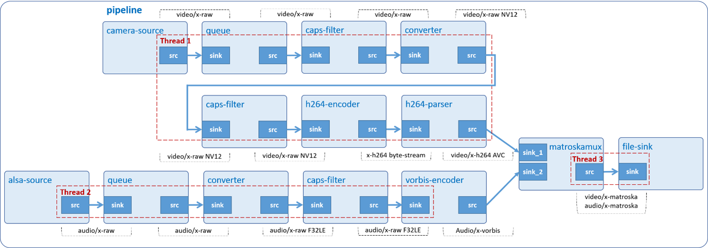

# Audio Video Record

Record raw data from USB microphone and MIPI camera or USB webcam at the same time, then store them in MKV container.



## Development Environment

GStreamer: 1.16.3 (edited by Renesas).

## Application Content

+ [`main.c`](main.c)
+ [`Makefile`](Makefile)
+ [`setup_MIPI_camera.sh`](setup_MIPI_camera.sh)
+ [`detect_camera.sh`](detect_camera.sh)
+ [`detect_microphone.sh`](detect_microphone.sh)

### Walkthrough: [`main.c`](main.c)

#### UserData structure
```c
typedef struct tag_user_data
{
  GstElement *pipeline;
  GstElement *cam_src;
  GstElement *cam_queue;
  GstElement *cam_capsfilter;
  GstElement *video_converter;
  GstElement *video_conv_capsfilter;
  GstElement *video_encoder;
  GstElement *video_parser;
  GstElement *audio_src;
  GstElement *audio_queue;
  GstElement *audio_converter;
  GstElement *audio_conv_capsfilter;
  GstElement *audio_encoder;
  GstElement *muxer;
  GstElement *filesink;

  const gchar *device_camera;
  const gchar *device_microphone;
  enum  camera_type camera;
  int width;
  int height;
} UserData;
```
This structure contains:
- Gstreamer element variables: `pipeline`, `cam_src`, `cam_queue`, `cam_capsfilter`, `video_converter`, `video_conv_capsfilter`, `video_encoder`, `video_parser`, `audio_src`, `audio_queue`, `audio_converter`, `audio_conv_capsfilter`, `audio_encoder`, `muxer`, `filesink`. These variables will be used to create pipeline and elements as section [Create elements](#create-elements).
- Variable `device_camera (const gchar)`: A pointer to a camera device file.
- Variable `device_microphone (const gchar)`: A pointer to a microphone device file.
- Variable `camera (camera_type)`: A enum variable to specify camera types.
- Variables `width (int)` and `height (int)`: These variables to specify width and height of video.
- Variable `display_video (bool)` to represent screen that available or not.

#### Output location
```c
#define OUTPUT_FILE        "RECORD_Multimedia.mkv"
const gchar *output_file = OUTPUT_FILE;
```
#### Command-line argument
```c
if (argc != ARG_COUNT) {
  g_print ("Error: Invalid arugments.\n");
  g_print ("Usage: %s <microphone device> <camera device> [width] [height]\n", argv[ARG_PROGRAM_NAME]);
  return -1;
}
```
This application accepts 2 command-line argument:
- The first points to USB microphone device card (hw:1,0, for example). Note: You can find this value by following section [Special Instruction](/05_gst-audiorecord/README.md#special-instruction).
- The second points to USB camera/MIPI camera device file (/dev/video9, for example). Note: You can find this value by following section [Special Instruction](/06_gst-videorecord/README.md#special-instruction).

#### Create elements
```c
user_data.cam_src = gst_element_factory_make ("v4l2src", "cam-src");
  user_data.cam_queue = gst_element_factory_make ("queue", "cam-queue");
  user_data.cam_capsfilter = gst_element_factory_make ("capsfilter", "cam_caps");
  user_data.video_conv_capsfilter =
      gst_element_factory_make ("capsfilter", "video-conv-caps");
  user_data.video_encoder = gst_element_factory_make ("omxh264enc", "video-encoder");
  user_data.video_parser = gst_element_factory_make ("h264parse", "h264-parser");

  if (user_data.camera == MIPI_CAMERA) {
    user_data.video_converter = gst_element_factory_make ("vspmfilter", "video-converter");
  } else {
    user_data.video_converter = gst_element_factory_make ("videoconvert", "video-converter");
  }

  user_data.audio_src = gst_element_factory_make ("alsasrc", "audio-src");
  user_data.audio_queue = gst_element_factory_make ("queue", "audio-queue");
  user_data.audio_converter = gst_element_factory_make ("audioconvert", "audio-conv");
  user_data.audio_conv_capsfilter =
      gst_element_factory_make ("capsfilter", "audio-conv-caps");
  user_data.audio_encoder = gst_element_factory_make ("vorbisenc", "audio-encoder");

  user_data.muxer = gst_element_factory_make ("matroskamux", "mkv-muxer");
  user_data.filesink = gst_element_factory_make ("filesink", "file-output");

```
To record raw data from USB microphone and USB webcam or MIPI camera at the same time, then store them in MKV container, the following elements are used:
-	 Element `v4l2src` captures video from V4L2 devices.
-	 Element `queue` (`cam_queue` and `audio_queue`) queues data until one of the limits specified by the max-size-buffers, max-size-bytes, and/or max-size-time properties has been reached. Any attempt to push more buffers into the queue will block the pushing thread until more space becomes available.
-	 Element `capsfilter` specifies raw video format, framerate, and resolution.
-	 Element `videoconvert` (used for USB camera) and element `vspmfilter` (used for MIPI camera) converts video frames to a format (such as: NV12) understood by omxh264enc.
-	 Element `omxh264enc` encodes raw video into H.264 compressed data.
-	 Element `h264parse` connects `omxh264enc` to qtmux.
-	 Element `alsasrc` reads data from an audio card using the ALSA API.
-	 Element `audioconvert` converts raw audio buffers to a format (such as: F32LE) understood by `vorbisenc`.
-	 Element `vorbisenc` encodes raw audio into a Vorbis stream.
-	 Element `matroskamux` merges audio stream and video stream to MKV container.
-	 Element `filesink` writes incoming data to a local file.

#### Set element’s properties
```c
g_object_set (G_OBJECT (data->video_converter), "dmabuf-use", true, NULL);
g_object_set (G_OBJECT (data->video_encoder), "target-bitrate", MIPI_BITRATE_OMXH264ENC,
    "control-rate", VARIABLE_RATE, "interval_intraframes", 14, "periodicty-idr", 2, NULL);
g_object_set (G_OBJECT (data->video_encoder), "target-bitrate", USB_BITRATE_OMXH264ENC,
    "control-rate", VARIABLE_RATE, NULL);
g_object_set (G_OBJECT (data->cam_src), "device", argv[ARG_CAMERA], NULL);

g_object_set (G_OBJECT (data->audio_src), "device", argv[ARG_MICROPHONE], NULL);
g_object_set (G_OBJECT (data->audio_encoder), "bitrate", BITRATE_ALSASRC, NULL);

g_object_set (G_OBJECT (data->filesink), "location", output_file, NULL);
```
The `g_object_set()` function is used to set some element’s properties, such as:
-	 The `device` property of v4l2src element which points to `camera’s device` file. Users will pass the device file as a command line argument to this application. Please refer to section [Video Record Special Instruction](/06_gst-videorecord/README.md#special-instruction) to find the value.
-	 The `location` property of filesink element which points to MKV output file.
-	 The `dmabuf-use` property of vspmfilter element which is set to true. This disallows dmabuf to be output buffer. If it is not set, the output file will be broken.
-	 The `target-bitrate` property of omxh264enc element is used to specify encoding bit rate. The higher bitrate, the better quality.
-	 The `control-rate` property of omxh264enc element is used to specify birate control method which is variable bitrate method in this case.
-	 The `interval_intraframes` property of omxh264enc element is used to specify interval of coding intra frames.
-	 The `periodicty-idr` property of omxh264enc is used to specify periodicity of IDR frames.
-	 The `device` property of alsasrc element which points to a `microphone device`. Users will pass the device card as a command line argument to this application. Please refer to section [Audio record Special Instruction](/05_gst-audiorecord/README.md#special-instruction) to find the value.
-  The `bitrate` property of vorbisenc element is used to specify encoding bit rate. The higher bitrate, the better quality.
```c
/* MIPI camera*/
camera_caps = gst_caps_new_simple ("video/x-raw", "format", G_TYPE_STRING, "UYVY",
            "width", G_TYPE_INT, width, "height", G_TYPE_INT, height, NULL);
/* USB camera */
camera_caps = gst_caps_new_simple ("video/x-raw", "width", G_TYPE_INT, width,
          "height", G_TYPE_INT, height, NULL);

video_convert_caps = gst_caps_new_simple ("video/x-raw", "format", G_TYPE_STRING, F_NV12, NULL);
audio_convert_caps = gst_caps_new_simple ("audio/x-raw", "format", G_TYPE_STRING, F_F32LE,
    "channels", G_TYPE_INT, CHANNEL, "rate", G_TYPE_INT, SAMPLE_RATE, NULL);

g_object_set (G_OBJECT (data->cam_capsfilter), "caps", camera_caps, NULL);
g_object_set (G_OBJECT (data->video_conv_capsfilter), "caps", video_convert_caps,NULL);
g_object_set (G_OBJECT (data->audio_conv_capsfilter), "caps", audio_convert_caps, NULL);

gst_caps_unref (camera_caps);
gst_caps_unref (video_convert_caps);
gst_caps_unref (audio_convert_caps);
```
Capabilities (short: `caps`) describe the type of data which is streamed between two pads.\
The `gst_caps_new_simple()` function creates new caps which holds these values. These caps are then added to caps property of capsfilter elements (`g_object_set`).
>Note that both caps should be freed with `gst_caps_unref()` if they are not used anymore.

#### Build pipeline
```c
gst_bin_add_many (GST_BIN (data->pipeline),
    data->cam_src, data->cam_queue, data->cam_capsfilter, data->video_converter,
    data->video_conv_capsfilter, data->video_encoder, data->video_parser,data->audio_src,
    data->audio_queue, data->audio_converter, data->audio_conv_capsfilter, data->audio_encoder,
    data->muxer, data->filesink, NULL);

gst_element_link_many (data->cam_src, data->cam_queue, data->cam_capsfilter,
    data->video_converter, data->video_conv_capsfilter,
    data->video_encoder, data->video_parser,NULL);

gst_element_link_many (data->audio_src, data->audio_queue, data->audio_converter,
    data->audio_conv_capsfilter, data->audio_encoder, NULL);

gst_element_link (data->muxer, data->filesink);
```
The reason for the separation is that the sink pad of matroskamux `(muxer)` cannot be created automatically but is only created on demand. This application uses self-defined function `link_to_muxer() `to link the sink pad to source pad of vorbisenc `(encoder)` and h264parse `(parser)`. That’s why its sink pad is called Request Pad.
>Note that the order counts, because links must follow the data flow (this is, from source elements to sink elements).

### Link request pads
When oggdemux `(demuxer)` finally has enough information to start producing data, it will create source pads, and trigger the pad-added signal. At this point our callback will be called:
```c
if (link_to_muxer (data->video_parser, muxer) != TRUE) {
  g_printerr ("Failed to link to muxer.\n");
  return FALSE;
}
```
This block calls `link_to_muxer()` to link the source pad of h264parse `(parser)` to the sink pad of oggmux `(muxer)`.
```c
if (link_to_muxer (data->audio_encoder, muxer) != TRUE){
  g_printerr ("Failed to link to muxer.\n");
  return FALSE;
}

```
This block calls `link_to_muxer()` to link the source pad of vorbisenc `(encoder)` to the sink pad of oggmux `(muxer)`.

```c
static int
link_to_muxer (GstElement *up_element, GstElement *muxer)
{
  gchar *src_name, *sink_name;
  GstPad *src_pad, *req_pad;

  src_pad = gst_element_get_static_pad (up_element, "src");

  src_name = gst_pad_get_name (src_pad);
  req_pad = gst_element_get_compatible_pad (muxer, src_pad, NULL);
  if (!req_pad) {
    g_print ("Request pad can not be found.\n");
    return FALSE;
  }
  sink_name = gst_pad_get_name (req_pad);
  /* Link the source pad and the new request pad */
  gst_pad_link (src_pad, req_pad);
  g_print ("Request pad %s was created and linked to %s\n", sink_name, src_name);

  gst_object_unref (GST_OBJECT (src_pad));
  gst_object_unref (GST_OBJECT (req_pad));
  g_free (src_name);
  g_free (sink_name);

  return TRUE;
}
```
This function gets the source pad `(src_pad)` of upstream element (encoder and parser) then calls `gst_element_get_compatible_pad()` to request a sink pad `(req_pad)` which is compatible with the source pad `(src_pad)` of oggmux `(muxer)`, then calls `gst_pad_link()` to link them together.
>Note that the pads should be freed with `gst_object_unref()` if they are not used anymore.

### Play pipeline
```c
gst_element_set_state (user_data.pipeline, GST_STATE_PLAYING);
```
Every pipeline has an associated [state](https://gstreamer.freedesktop.org/documentation/plugin-development/basics/states.html). To start audio video recording, the pipeline needs to be set to PLAYING state.
```c
signal (SIGINT, signalHandler);
```
This application will stop recording if user presses Ctrl-C. To do so, it uses `signal()` to bind `SIGINT` (interrupt from keyboard) to `signalHandler()`.\
To know how this function is implemented, please refer to the following lines of code:
```c
void signalHandler (int signal)
{
  if (signal == SIGINT) {
    gst_element_send_event (user_data.pipeline, gst_event_new_eos ());
  }
}
```
It calls `gst_element_send_event()` to send EOS (End-of-Stream) signal `(gst_event_new_eos)` to the `pipeline`. This makes `gst_bus_timed_pop_filtered()` return. Finally, the program cleans up GStreamer objects and exits.

## How to Build and Run GStreamer Application

This section shows how to cross-compile and deploy GStreamer _audio video play_ application.

### How to Extract Renesas SDK
***Step 1***.	Install toolchain on a Host PC:
```sh
$   sudo sh ./poky-glibc-x86_64-core-image-weston-aarch64-rzv2n-evk-toolchain-*.sh
```
Note:
> This step installs the RZV2N toolchain.\
> Sudo is optional in case user wants to extract SDK into a restricted directory (such as: _/opt/_)

***Step 2***.	Set up cross-compile environment:
```sh
$   source /<Location in which SDK is extracted>/environment-setup-aarch64-poky-linux
```
Note:
>User needs to run the above command once for each login session.

### How to Build and Run GStreamer Application

***Step 1***.	Go to gst-audiovideorecord directory:
```sh
$   cd $WORK/07_gst-audiovideorecord
```
***Step 2***.	Cross-compile:
```sh
$   make
```
***Step 3***.	Copy all files inside this directory to _/usr/share_ directory on the target board:
```sh
$   scp -r $WORK/07_gst-audiovideorecord/ <username>@<board IP>:/usr/share/
```
***Step 4***.  Setup MIPI camera (With USB camera you can skip this step):
```sh
$   /usr/share/07_gst-audiovideorecord/setup_MIPI_camera.sh <width>x<height>
```
For more detail about `setup_MIPI_camera.sh` script at [Initialize MIPI camera](#run-the-following-script-to-initialize-mipi-camera).
>Note: Only 3 resolutions are supported by MIPI camera (e-CAM22_CURZH camera): 640x480, 1280x720, 1920x1080.

***Step 5***.	Run the application:
```sh
$   /usr/share/07_gst-audiovideorecord/gst-audiovideorecord $(/usr/share/07_gst-audiovideorecord/detect_microphone.sh) $(/usr/share/07_gst-audiovideorecord/detect_camera.sh) <width> <height>
```
For more details about `detect_microphone.sh` and `detect_camera.sh` script. Please refer to [Find microphone device card](#run-the-following-script-to-find-microphone-device-card) and [Find camera device file](#run-the-following-script-to-find-camera-device-file).
### Special instruction:
#### Run the following script to find microphone device card:
```sh
$ ./detect_microphone.sh
```
Basically, this script analyzes the `/proc/asound/cards` file to get sound cards.
>Note: This script can be used in combination with gst-audiovideorecord application.

For further information on how this script is implemented, please refer to the following lines of code:
```sh
ALSA_DEV_FILE="/proc/asound/cards"

CMD_GET_SND="cat $ALSA_DEV_FILE | awk '{ print \$0 }'"

CMD_GET_SND_INDICES="$CMD_GET_SND | awk '{ print \$1 }'"

SND_INDICES="$( eval $CMD_GET_SND_INDICES )"
if [ ! -z "$SND_INDICES" ]
then
    for TEMP_INDEX in $SND_INDICES
    do
        HAS_MIC="$( amixer -D hw:$TEMP_INDEX scontrols | grep "Mic" )"

        if [ "$HAS_MIC" != "" ]
        then
            SND_INDEX=$TEMP_INDEX
            DEVICE_NUMBER=${HAS_MIC: -1}
            echo "hw:$SND_INDEX,$DEVICE_NUMBER"

            amixer cset name='Aux Switch' on > /dev/null
            amixer cset name='Mixin Left Aux Left Switch' on > /dev/null
            amixer cset name='Mixin Right Aux Right Switch' on > /dev/null
            amixer cset name='ADC Switch' on > /dev/null
            amixer cset name='Mixout Right Mixin Right Switch' off > /dev/null
            amixer cset name='Mixout Left Mixin Left Switch' off > /dev/null
            amixer cset name='Headphone Volume' 50% > /dev/null
            amixer cset name='Headphone Switch' on > /dev/null
            amixer cset name='Mixout Left DAC Left Switch' on > /dev/null
            amixer cset name='Mixout Right DAC Right Switch' on > /dev/null
            amixer cset name='DAC Left Source MUX' 'DAI Input Left' > /dev/null
            amixer cset name='DAC Right Source MUX' 'DAI Input Right' > /dev/null
            amixer sset 'Mic 1 Amp Source MUX' 'MIC_P' > /dev/null
            amixer sset 'Mic 2 Amp Source MUX' 'MIC_P' > /dev/null
            amixer sset 'Mixin Left Mic 1' on > /dev/null
            amixer sset 'Mixin Right Mic 2' on > /dev/null
            amixer sset 'Mic 1' 100% on > /dev/null
            amixer sset 'Mic 2' 100% on > /dev/null
            amixer sset 'Lineout' 100% on > /dev/null
            amixer set 'Headphone' 100% on > /dev/null
            amixer set 'DVC In',0 100% > /dev/null
            amixer cset name='Mixin PGA Volume' 2 > /dev/null
            amixer cset name='Mixin PGA Switch' on > /dev/null
            amixer cset name='ADC Volume' 67% > /dev/null
            break
        fi
    done
fi
```
#### Recommended USB cameras:
Option 1: Logitech USB HD Webcam C270 (model: V-U0018).

Option 2: Logitech USB HD 1080p Webcam C930E.

Option 3: Logitech USB UHD Webcam BRIO.

#### Recommended MIPI camera:
e-CAM22_CURZH camera provided by [e-con Systems](https://www.e-consystems.com/renesas/sony-starvis-imx462-ultra-low-light-camera-for-renesas-rz-v2h.asp).

#### Run the following script to find camera device file:
```sh
$   ./detect_camera.sh
```
Basically, this script uses `v4l2-ctl` tool to read all information of device files (/dev/video8, for example) and find out if the device file has “Crop Capability Video Capture”. If the string is exist, the device file is available to use.
>This script can be used in combination with gst-audiovideorecord application.

For further information on how this script is implemented, please refer to the following lines of code:
```sh
#!/bin/bash

ERR_NO_CAMERA=1
PROG_SUCCESS_CODE=0

PROG_STAT=$PROG_SUCCESS_CODE

for DEV_NAME in $( ls -v /dev/video* )

do
  CHECK_CAMERA=$( v4l2-ctl -d $DEV_NAME --all | grep "Video Capture:" )

  if [ ! -z "$CHECK_CAMERA" ]
  then
    CAMERA_DEV=$DEV_NAME
    echo $CAMERA_DEV
    break
  fi
done

if [ -z $CAMERA_DEV ]
then
  PROG_STAT=$ERR_NO_CAMERA
fi

exit $PROG_STAT
```
#### Run the following script to initialize MIPI camera:

```sh
./setup_MIPI_camera.sh <width>x<height>
```
Basically, this script uses `media-ctl` tool to set up format of e-CAM22_CURZH camera. This camera only support 3 resolutions are 640x480, 1280x720, 1920x1080.

For further information on how this script is implemented, please refer to the following lines of code:

```sh
#!/bin/bash

if [[ $# -ne 1 ]]; then
  echo "Invalid or missing argument!"
  echo -e "Usage:\n\t./setup_MIPI_camera.sh <resolution>"
  echo -e "\n\tValid resolutions: 640x480, 1280x720 and 1920x1080"
  echo -e "Example:\n\t./setup_MIPI_camera.sh 1920x1080"
  exit -1
fi

if [[ $1 != "640x480" ]] && [[ $1 != "1280x720" ]] && [[ $1 != "1920x1080" ]]; then
  echo "RZV2N only support 3 camera resolutions with MIPI camera"
  echo -e "1. 640x480\n2. 1280x720\n3. 1920x1080"
else
  media=$(ls /sys/class/video4linux/video*/device/ | grep -m1 "media")
  cru=$(cat /sys/class/video4linux/video*/name | grep -m1 "CRU")
  csi2=$(cat /sys/class/video4linux/v4l-subdev*/name | grep -m1 "csi2")
  imx462=$(cat /sys/class/video4linux/v4l-subdev*/name | grep -m1 "imx462")

  media-ctl -d /dev/$media -r
  media-ctl -d /dev/$media -l "'$csi2':1 -> '$cru':0 [1]"
  media-ctl -d /dev/$media -V "'$csi2':1 [fmt:UYVY8_2X8/$1 field:none]"
  media-ctl -d /dev/$media -V "'$imx462':0 [fmt:UYVY8_2X8/$1 field:none]"

  echo "/dev/$media is configured successfully with resolution "$1""
fi
```
### To check the output file:
Option 1: VLC media player (https://www.videolan.org/vlc/index.html).

Option 2: Tool gst-launch-1.0 (on board):

```sh
$ gst-launch-1.0 filesrc location=RECORD_Multimedia.mkv ! matroskademux name=d d. ! queue max-size-time=10000000000 ! vorbisdec ! audioconvert ! audioresample ! autoaudiosink d. ! queue ! h264parse ! omxh264dec ! waylandsink
```