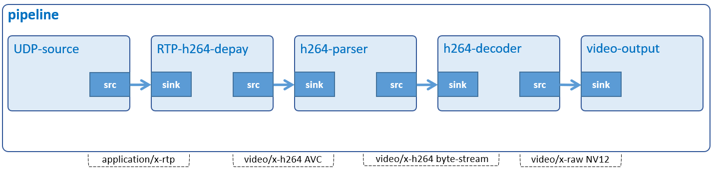

# Receive Streaming Video

Receive and display streaming video.



## Development Environment

GStreamer: 1.16.3 (edited by Renesas).

## Application Content

+ [`main.c`](main.c)
+ [`Makefile`](Makefile)

### Walkthrough: [`main.c`](main.c)
>Note that this tutorial only discusses the important points of this application. For the rest of source code, please refer to section [Audio Play](../01_gst-audioplay/README.md) and section [Video Play](../02_gst-videoplay/README.md)

#### UserData structure
```c
typedef struct tag_user_data
{
  GstElement *pipeline;
  GstElement *source;
  GstElement *depayloader;
  GstElement *parser;
  GstElement *decoder;
  GstElement *sink;

  struct screen_t *main_screen;
} UserData;
```
This structure contains:
- Gstreamer element variables: `pipeline`, `source`, `depayloader`, `parser`, `decoder`, `sink`. These variables will be used to create pipeline and elements as section [Create elements](#create-elements).
- Variable `main_screen (screen_t)` is a pointer to screen_t structure to contain monitor information, such as: (x, y), width, and height.

#### Create event loop
```c
main_loop = g_main_loop_new (NULL, FALSE);
```
Function `g_main_loop_new()` creates a new [GMainLoop](https://developer.gnome.org/glib/stable/glib-The-Main-Event-Loop.html) structure with default context `(GMainContext)`.\
Basically, the main event loop manages all the available sources of events. To allow multiple independent sets of sources to be handled in different threads, each source is associated with a `GMainContext`. A `GMainContext` can only be running in a single thread, but sources can be added to it and removed from it from other threads.

#### Create elements
```c
user_data.source = gst_element_factory_make ("udpsrc", "udp-src");
user_data.depayloader = gst_element_factory_make ("rtph264depay",
                            "h264-depay");
user_data.parser = gst_element_factory_make ("h264parse", "h264-parser");
user_data.decoder = gst_element_factory_make ("omxh264dec", "h264-decoder");
user_data.sink = gst_element_factory_make ("waylandsink", "video-sink");
```
To receive and display streaming video, the following elements are used:
-	 Element `udpsrc` reads UDP packets from the network.
-	 Element `rtph264depay` extracts H.264 video from RTP packets.
-	 Element `h264parse` parses H.264 video from byte stream format to AVC format which omxh264dec can process.
-	 Element `omxh264dec` decompresses H.264 stream to raw NV12-formatted video.
-	 Element `waylandsink` creates its own window and renders the decoded video frames to that.

#### Set element’s properties
```c
caps = gst_caps_new_empty_simple ("application/x-rtp");

g_object_set (G_OBJECT (data->source), "port", PORT, "caps", caps, NULL);
g_object_set (G_OBJECT (data->sink), "max-lateness", -1, "qos", FALSE, NULL);
g_object_set (G_OBJECT (data->sink), "position-x", data->main_screen->x,
    "position-y", data->main_screen->y, NULL);
```
The `g_object_set()` function is used to set some element’s properties, such as:
-	 The `port` property of udpsrc element which is set to port 5000.
-	 The `caps` property of udpsrc element which specifies streaming format RTP (application/x-rtp).
-	 The `max-lateness` property of waylandsink element which specifies maximum number of nanoseconds that a buffer can be late before it is dropped. This means setting -1 to this property will cause waylandsink to wait the buffer forever.
-	 The `qos` property of waylandsink element which disable Quality-of-Service events upstream.
-	 The `position-x` and `position-y` are properties of waylandsink element which point to (x,y) coordinate of wayland desktop.

#### Add bus watch and handle messages (GstMessage)
```c
bus = gst_element_get_bus (user_data.pipeline);
bus_watch_id = gst_bus_add_watch (bus, bus_call, main_loop);
gst_object_unref (bus);
```
The `gst_element_get_bus()` function returns the bus of the pipeline.\
Basically, `bus` is the object responsible for delivering messages (`GstMessage`) generated by the elements, in order and to the application thread. This last point is important, because the actual streaming of media is done in another thread than the application.\
In this application, the messages will be extracted from the bus asynchronously, using self-defined function `bus_call()`. Note that the bus should be freed with `gst_caps_unref()` if it is not used anymore.\
To know how `bus_call()` is implemented, please refer to the following lines of code:
```c
static gboolean
bus_call (GstBus * bus, GstMessage * msg, gpointer data)
{
  GMainLoop *loop = (GMainLoop *) data;

  switch (GST_MESSAGE_TYPE (msg)) {
    case GST_MESSAGE_ERROR:{
      gchar *debug;
      GError *error;

      gst_message_parse_error (msg, &error, &debug);
      g_free (debug);

      g_printerr ("Error: %s\n", error->message);
      g_error_free (error);

      g_main_loop_quit (loop);
      break;
    }
    default:
      /* Don't care other message */
      break;
  }
  return TRUE;
}
```
This function will be called when a message is received. If an error occurs, it will call `g_main_loop_quit()` to stop `GMainLoop`. This makes `g_main_loop_run()` return. Finally, the application cleans up GStreamer objects and exits.

### Play pipeline
```c
gst_element_set_state (user_data.pipeline, GST_STATE_PLAYING);
```

Every pipeline has an associated [state](https://gstreamer.freedesktop.org/documentation/plugin-development/basics/states.html). To start audio playback, the `pipeline` needs to be set to PLAYING state.

### Stop pipeline
```c
signal (SIGINT, signalHandler);
```
The application uses `signal()` to bind `SIGINT` (interrupt from keryboard) to `signalHandler()` function.\
To know how this function is implemented, please refer to the following lines of code:
```c
void signalHandler (int signal)
{
  if (signal == SIGINT) {
    g_main_loop_quit (main_loop);
    g_print ("\n");
  }
}

```
### Run main loop
```c
g_main_loop_run (main_loop);
```
This function runs main loop until `g_main_loop_quit()` is called on the loop (context NULL). In other words, it will make the context check if anything it watches for has happened. For example, when a message has been posted on the bus (`gst_element_get_bus`), the default main context will automatically call `bus_call()` to notify the message.

## How to Build and Run GStreamer Application

This section shows how to cross-compile and deploy GStreamer _receive streaming video_ application.

### How to Extract Renesas SDK
***Step 1***.	Install toolchain on a Host PC:
```sh
$   sudo sh ./poky-glibc-x86_64-core-image-weston-aarch64-smarc-rzg2l-toolchain-3.1.17.sh
```
Note:
> This step installs the RZG2L toolchain. If you want to install the RZV2L toolchain, please use `poky-glibc-x86_64-core-image-weston-aarch64-smarc-rzv2l-toolchain-3.1.17.sh` instead.\
> Sudo is optional in case user wants to extract SDK into a restricted directory (such as: _/opt/_)

If the installation is successful, the following messages will appear:
```sh
SDK has been successfully set up and is ready to be used.
Each time you wish to use the SDK in a new shell session, you need to source the environment setup script e.g.
$ . /opt/poky/3.1.17/environment-setup-aarch64-poky-linux
$ . /opt/poky/3.1.17/environment-setup-armv7vet2hf-neon-vfpv4-pokymllib32-linux-gnueabi
```
***Step 2***.	Set up cross-compile environment:
```sh
$   source /<Location in which SDK is extracted>/environment-setup-aarch64-poky-linux
```
Note:
>User needs to run the above command once for each login session.

### How to Build and Run GStreamer Application

***Step 1***.	Go to gst-receivestreamingvideo directory:
```sh
$   cd $WORK/08_gst-receivestreamingvideo
```

***Step 2***.	Cross-compile:
```sh
$   make
```
***Step 3***.	Copy all files inside this directory to _/usr/share_ directory on the target board:
```sh
$   scp -r $WORK/08_gst-receivestreamingvideo/ <username>@<board IP>:/usr/share/
```

***Step 4***.  Configure IPv4 address (as below) before running this application:
```sh
$   ifconfig <Ethernet Interface> <IPv4 address>
```
- For example:
  ```sh
  $   ifconfig eth0 192.168.5.237
  ```

***Step 5***.	Run the application:
```sh
$   /usr/share/08_gst-receivestreamingvideo/gst-receivestreamingvideo
```
### Special instruction:
>The application might drop frames when receiving high-bitrate videos.