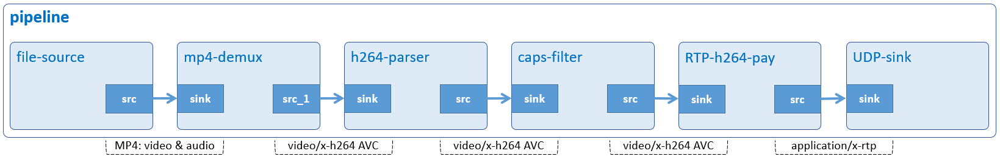

# Send Streaming Video

Stream video.



## Development Environment

GStreamer: 1.16.3 (edited by Renesas).

## Application Content

+ [`main.c`](main.c)
+ [`Makefile`](Makefile)

### Walkthrough: [`main.c`](main.c)
>Note that this tutorial only discusses the important points of this application. For the rest of source code, please refer to section [Audio Play](/01_gst-audioplay/README.md).
#### Command-line argument
```c
if (argc != ARG_COUNT) {
  g_print ("Invalid arugments.\n");
  g_print ("Format: %s <IP address> <path to MP4>.\n", argv[ARG_PROGRAM_NAME]);

  return -1;
}

if (!isValidIpAddress (argv[ARG_IP_ADDRESS])) {
  g_print ("IP is not valid\n");
  return -1;
}
```
This application accepts two command-line arguments as below:
-	 IPv4 address: If invalid, the application prints error and exits. Please refer to [Step 4](#how-to-build-and-run-gstreamer-application) to set and pass the address to it.
-	 A MP4 file’s location.

#### Create elements
```c
source = gst_element_factory_make ("filesrc", "file-src");
demuxer = gst_element_factory_make ("qtdemux", "mp4-demuxer");
parser = gst_element_factory_make ("h264parse", "h264-parser");
parser_capsfilter = gst_element_factory_make ("capsfilter", "parser-capsfilter");
payloader = gst_element_factory_make ("rtph264pay", "h264-payloader");
sink = gst_element_factory_make ("udpsink", "stream-output");
```
To stream H.264 video, the following elements are used:
-	 Element `filesrc` reads data from a local file.
-	 Element `qtdemux` de-multiplexes an MP4 file into audio and video stream.
-	 Element `h264parse` parses H.264 video from byte-stream format to AVC format.
-	 Element `capsfilter` specifies video format video/x-h264, AVC, and au alignment.
-	 Element `rtph264pay` payload-encodes H264 video into RTP packets.
-	 Element `udpsink` sends UDP packets to the network

#### Set element’s properties
```c
g_object_set (G_OBJECT (source), "location", input_file, NULL);
g_object_set (G_OBJECT (payloader), "pt", PAYLOAD_TYPE, "config-interval", TIME, NULL);
g_object_set (G_OBJECT (sink), "host", argv[ARG_IP_ADDRESS], "port", PORT, NULL);
```
The `g_object_set()` function is used to set some element’s properties, such as:
-	 The `location` property of filesrc element which points to an MP4 file.
-	 The `pt` property of rtph264pay element which is the payload type of the packets. Because the input stream is H.264 AVC, this property must be in dynamic range from 96 to 127. For reference purpose, it is set to 96.
-	 The `config-interval` property of rtph264pay element which is the interval time to insert [SPS and PPS](https://www.quora.com/What-are-SPS-and-PPS-in-video-codecs). They contain data that are required by H.264 decoder. If lost, the receiver (such as: [Receive Streaming Video](/08_gst-receivestreamingvideo/README.md)) cannot reconstruct video frames. To avoid this issue, SPS and PPS will be sent for every 3 seconds.
-	 The host and port properties of udpsink element which are the IPv4 address and port to send the packets to. In this application, the port is hard-coded to 5000 while the address is provided by users.

```c
parser_caps = gst_caps_new_simple ("video/x-h264", "stream-format", G_TYPE_STRING,
                                          "avc", "alignment", G_TYPE_STRING, "au", NULL);

g_object_set (G_OBJECT (parser_capsfilter), "caps", parser_caps, NULL);
gst_caps_unref (parser_caps);
```
Capabilities (short: `caps`) describe the type of data which is streamed between two pads.\
This application creates new cap `(gst_caps_new_simple)` which specifies data format video/x-h264, AVC, and au alignment. This cap is then added to caps property of capsfilter element `(g_object_set)`.\
Next, capsfilter is linked between h264parse and rtph264pay to negotiate the data format flowing through these 2 elements.
>Note that the cap should be freed with `gst_caps_unref()` if it is not used anymore.

## How to Build and Run GStreamer Application

This section shows how to cross-compile and deploy GStreamer _send streaming video_ application.

### How to Extract Renesas SDK
Please refer to _hello word_ [How to Extract Renesas SDK section](/00_gst-helloworld/README.md#how-to-extract-renesas-sdk) for more details.

### How to Build and Run GStreamer Application

***Step 1***.	Go to gst-sendstreamingvideo directory:
```sh
$   cd $WORK/09_gst-sendstreamingvideo
```

***Step 2***.	Cross-compile:
```sh
$   make
```
***Step 3***.	Copy all files inside this directory to _/usr/share_ directory on the target board:
```sh
$   scp -r $WORK/09_gst-sendstreamingvideo/ <username>@<board IP>:/usr/share/
```
***Step4***.  Please configure IPv4 address (as below) before running this application:
```sh
$   ifconfig <Ethernet Interface> <IP address>
```

***Step 5***.	Run the application:
```sh
$   /usr/share/09_gst-sendstreamingvideo/gst-sendstreamingvideo <IP address> <path to MP4>
```
-  Input an IP address (192.168.5.237, for example) to which you would like to stream video like below:
   ```sh
   $   /usr/share/09_gst-sendstreamingvideo/gst-sendstreamingvideo 192.168.5.237 /home/media/videos/sintel_trailer-720p.mp4
   ```
   - Download the input file [sintel_trailer-720p.mp4](https://download.blender.org/durian/trailer/sintel_trailer-720p.mp4) and place it in _/home/media/videos_.