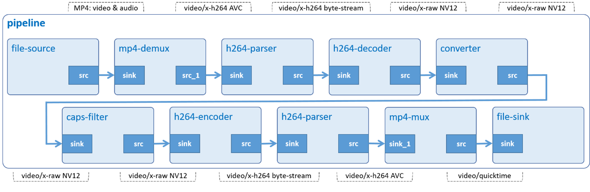

# 2.2.10	Video Scale

Scale down an H.264 video, then store it in MP4 container.



## Development Environment

GStreamer: 1.16.3 (edited by Renesas).

## Application Content

+ [`main.c`](main.c)

### Walkthrought
>Note that this tutorial only discusses the important points of this application. For the rest of source code, please refer to section [Video Record](/06_gst-videorecord/README.md) and [Audio Play](/01_gst-audioplay/README.md).
#### Command-line argument
```c
if (argc != ARG_COUNT)
{
  g_print ("Invalid arugments.\n");
  g_print ("Usage: %s <MP4 file> <width> <>height \n", argv[ARG_PROGRAM_NAME]);
  return -1;
}
```
This application accepts two command-line arguments as below:
-	 width/height: output resolution.
-	 An MP4 file’s location.

#### Create elements
```c
source = gst_element_factory_make ("filesrc", "video-src");
demuxer = gst_element_factory_make ("qtdemux", "mp4-demuxer");
parser1 = gst_element_factory_make ("h264parse", "h264-parser-1");
decoder = gst_element_factory_make ("omxh264dec", "video-decoder");
filter = gst_element_factory_make ("vspmfilter", "video-filter");
capsfilter = gst_element_factory_make ("capsfilter", "capsfilter");
encoder = gst_element_factory_make ("omxh264enc", "video-encoder");
parser2 = gst_element_factory_make ("h264parse", "h264-parser-2");
muxer = gst_element_factory_make ("qtmux", "mp4-muxer");
sink = gst_element_factory_make ("filesink", "file-output");
```
To scale down an H.264 video and store it in MP4 container, the following elements are needed:
-	 Element filesrc reads data from a local file.
-	 Element qtdemux de-multiplexes an MP4 file into audio and video stream.
-	 Element omxh264dec decompresses H.264 stream to raw NV12-formatted video.
-	 Element vspmfilter handles video scaling.
-	 Element capsfilter contains resolution so that vspfilter will scale video frames based on this value.
-	 Element omxh264enc encodes raw video into H.264 compressed data.
-	 Element h264parse parses H.264 video from byte stream format to AVC format which omxh264dec can process.
-	 Element qtmux merges H.264 byte stream to MP4 container.
-	 Element filesink writes incoming data to a local file.

#### Set element’s properties
```c
g_object_set (G_OBJECT (source), "location", input_file, NULL);
g_object_set (G_OBJECT (filter), "dmabuf-use", TRUE, NULL);
g_object_set (G_OBJECT (encoder), "target-bitrate", BITRATE_OMXH264ENC, "control-rate", 1, NULL;
g_object_set (G_OBJECT (sink), "location", output_file, NULL);
```
The _g_object_set()_ function is used to set some element’s properties, such as:
-	 The location property of filesrc element which points to an MP4 input file.
-	 The dmabuf-use property of vspmfilter element, This disallows dmabuf to be output buffer. If it is not set, waylandsink will display broken video frames.
-	 The target-bitrate property of omxh264enc element which is set to 40 Mbps. The higher bitrate, the better quality.
-	 The control-rate property of omxh264enc element is used to specify birate control method which is variable bitrate method in this case.
-	 The location property of filesink element which points to MP4 output file.
```c
scale_caps =
    gst_caps_new_simple ("video/x-raw", "width", G_TYPE_INT, scaled_width, "height",
    G_TYPE_INT, scaled_height, NULL);

g_object_set (G_OBJECT (puser_data->capsfilter), "caps", scale_caps, NULL);
gst_caps_unref (scale_caps);
```
Capabilities (short: caps) describe the type of data which is streamed between two pads. This data includes raw video format, resolution, and framerate.

The _gst_caps_new_simple()_ function creates a new cap (conv_caps) which holds output’s resolution. This cap is then added to caps property of capsfilter (g_object_set) so that vspfilter will use these values to resize video frames.

>Note that the scale_caps should be freed with _gst_caps_unref()_ if it is not used anymore.
#### Get input file’s information
```c
new_pad_caps = gst_pad_query_caps (pad, NULL);
new_pad_struct = gst_caps_get_structure (new_pad_caps, 0);

gst_structure_get_int (new_pad_struct, "width", &width);
gst_structure_get_int (new_pad_struct, "height", &height);
```
This code block gets the capabilities of pad, finds the structure in new_pad_caps then gets resolution of video.

## How to Build and Run GStreamer Application

This section shows how to cross-compile and deploy GStreamer _video scale_ application.

### How to Extract SDK
Please refer to _hello word_ [How to Extract SDK section](/00_gst-helloworld/README.md#how-to-extract-sdk) for more details.

### How to Build and Run GStreamer Application

***Step 1***.	Go to gst-videoscale directory:
```sh
$   cd $WORK/10_gst-videoscale
```

***Step 2***.	Cross-compile:
```sh
$   make
```
***Step 3***.	Copy all files inside this directory to /usr/share directory on the target board:
```sh
$   scp -r $WORK/10_gst-videoscale/ <username>@<board IP>:/usr/share/
```
***Step 4***.	Run the application:
> RZG2L and RZV2L do not support scale up.
```sh
$   /usr/share/10_gst-videoscale/gst-videoscale <MP4 file> <width> <height>
```
- In this case, a 640x360 MP4 file will be generated after running this application.

  Download the input file at: [sintel_trailer-720p.mp4](https://download.blender.org/durian/trailer/sintel_trailer-720p.mp4).
  ```sh
  $   /usr/share/10_gst-videoscale/gst-videoscale /home/media/videos/sintel_trailer-720p.mp4 640 360
  ```
  >Note that it does not have audio and if the output’s resolution is abnormal, this application will not work