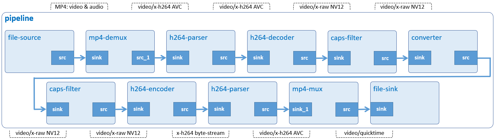

# Video Scale

Scale an H.264 video, then store it in MP4 container.



## Development Environment

### Linux kernel version 5.10 and Yocto version 3.1 (Dunfell)

GStreamer: 1.16.3 (edited by Renesas).

### Linux kernel version 6.1 and Yocto version 5.0 (Scrathgap)

GStreamer: 1.22.12 (edited by Renesas).

## Application Content

+ [`main.c`](main.c)
+ [`Makefile`](Makefile)

### Walkthrough: [`main.c`](main.c)
>Note that this tutorial only discusses the important points of this application. For the rest of source code, please refer to section [Video Record](../06_gst-videorecord/README.md) and [Audio Play](/01_gst-audioplay/README.md).

#### UserData structure
```c
typedef struct tag_user_data
{
  GstElement *pipeline;
  GstElement *source;
  GstElement *demuxer;
  GstElement *parser1;
  GstElement *decoder;
  GstElement *decoder_capsfilter;
  GstElement *filter;
  GstElement *filter_capsfilter;
  GstElement *encoder;
  GstElement *parser2;
  GstElement *muxer;
  GstElement *sink;

  const gchar *input_file;
  int scaled_width;
  int scaled_height;
  enum board_name board;
} UserData;
```
This structure contains:
- Gstreamer element variables: `pipeline`, `source`, `demuxer`, `parser1`, `decoder`, `decoder_capsfilter`, `filter`, `filter_capsfilter`, `encoder`, `parser2`, `muxer`, `sink`. These variables will be used to create pipeline and elements as section [Create elements](#create-elements).
- Variable `input_file (const gchar)` to represent MP4 video input file.
- Variable `scaled_width (int)` and `scaled_height (int)` are width and height of video after scale down.
- Variable `board (enum board_name)` represents the MPU in use.

#### Command-line argument
```c
if (argc != ARG_COUNT)
{
  g_print ("Invalid arugments.\n");
  g_print ("Usage: %s <MP4 file> <width> <>height \n", argv[ARG_PROGRAM_NAME]);
  return -1;
}
```
This application accepts two command-line arguments as below:
-	 width/height: output resolution.
-	 An MP4 file’s location.

#### Create elements
```c
user_data.source = gst_element_factory_make ("filesrc", "video-src");
user_data.demuxer = gst_element_factory_make ("qtdemux", "mp4-demuxer");
user_data.parser1 = gst_element_factory_make ("h264parse", "h264-parser-1");
user_data.decoder = gst_element_factory_make ("omxh264dec", "video-decoder");
user_data.decoder_capsfilter = gst_element_factory_make ("capsfilter", "decoder-capsfilter");
user_data.filter = gst_element_factory_make ("vspmfilter", "video-filter");
user_data.filter_capsfilter = gst_element_factory_make ("capsfilter", "filter-capsfilter");
user_data.encoder = gst_element_factory_make ("omxh264enc", "video-encoder");
user_data.parser2 = gst_element_factory_make ("h264parse", "h264-parser-2");
user_data.muxer = gst_element_factory_make ("qtmux", "mp4-muxer");
user_data.sink = gst_element_factory_make ("filesink", "file-output");
```
To scale down an H.264 video and store it in MP4 container, the following elements are needed:
-	 Element `filesrc` reads data from a local file.
-	 Element `qtdemux` de-multiplexes an MP4 file into audio and video stream.
-	 Element `omxh264dec` decompresses H.264 stream to raw NV12-formatted video.
-	 Element `vspmfilter` handles video scaling.
-	 Element `capsfilter` contains decode resolution and scale resolution that decoder and vspmfilter use based on these values.
-	 Element `omxh264enc` encodes raw video into H.264 compressed data.
-	 Element `h264parse` parses H.264 video from byte stream format to AVC format which `omxh264dec` can process.
-	 Element `qtmux` merges H.264 byte stream to MP4 container.
-	 Element `filesink` writes incoming data to a local file.

#### Set element’s properties
```c
g_object_set (G_OBJECT (data->source), "location", data->input_file, NULL);
g_object_set (G_OBJECT (data->filter), "dmabuf-use", TRUE, NULL);
g_object_set (G_OBJECT (data->encoder), "target-bitrate", BITRATE_OMXH264ENC,
    "control-rate", 1, NULL);
g_object_set (G_OBJECT (data->sink), "location", OUTPUT_FILE, NULL);
```
The `g_object_set()` function is used to set some element’s properties, such as:
-	 The `location` property of filesrc element which points to an MP4 input file.
-	 The `dmabuf-use` property of vspmfilter element, This disallows dmabuf to be output buffer. If it is not set, waylandsink will display broken video frames.
-	 The `target-bitrate` property of omxh264enc element which is set to 40 Mbps. The higher bitrate, the better quality.
-	 The `control-rate` property of omxh264enc element is used to specify birate control method which is variable bitrate method in this case.
-	 The `location` property of filesink element which points to MP4 output file.
```c
decode_caps =
    gst_caps_new_simple ("video/x-raw", "width", G_TYPE_INT, width,
    "height", G_TYPE_INT, height, NULL);
scale_caps =
    gst_caps_new_simple ("video/x-raw", "width", G_TYPE_INT, scaled_width,
    "height", G_TYPE_INT, scaled_height, NULL);

g_object_set (G_OBJECT (puser_data->decoder_capsfilter), "caps", decode_caps, NULL);
g_object_set (G_OBJECT (puser_data->filter_capsfilter), "caps", scale_caps, NULL);

gst_caps_unref (decode_caps);
gst_caps_unref (scale_caps);
```
Capabilities (short: `caps`) describe the type of data which is streamed between two pads. This data includes raw video format, resolution, and framerate.\
The `gst_caps_new_simple()` function creates new caps (decode_caps and scale_caps) which hold output’s resolutions. These caps are then added to caps property of decode_capsfilter and filter_capsfilter `(g_object_set)` so that decoder and vspmfilter will use these values to decode and resize video frames.

>Note that the `decode_caps` and `scale_caps` should be freed with `gst_caps_unref()` if it is not used anymore.
#### Get input file’s information
```c
new_pad_caps = gst_pad_query_caps (pad, NULL);
new_pad_struct = gst_caps_get_structure (new_pad_caps, 0);

gst_structure_get_int (new_pad_struct, "width", &width);
gst_structure_get_int (new_pad_struct, "height", &height);
```
Above lines of code get the capabilities of pad, finds the structure in `new_pad_caps` then gets resolution of video.

## How to Build and Run GStreamer Application

This section shows how to cross-compile and deploy GStreamer _video scale_ application.

### How to Extract Renesas SDK
***Step 1***.	Install toolchain on a Host PC:
* RZ/G2L SMARC Evaluation Kit:
  ```sh
  $   sudo sh ./poky-glibc-x86_64-core-image-weston-aarch64-smarc-rzg2l-toolchain-*.sh
  ```
  Note:
  > This step installs the RZ/G2L toolchain in the environment VLP 3.0.x. If you want to install the RZ/G2L toolchain in the environment VLP 4.0.x, please use `./rz-vlp-glibc-x86_64-core-image-weston-cortexa55-smarc-rzg2l-toolchain-*.sh` instead.

* RZ/V2L SMARC Evaluation Kit:
  ```sh
  $   sudo sh ./poky-glibc-x86_64-core-image-weston-aarch64-smarc-rzv2l-toolchain-*.sh
  ```
  Note:
  > This step installs the RZ/V2L toolchain in the environment VLP 3.0.x. If you want to install the RZ/V2L toolchain in the environment AI SDK 7.xx, please use `./rz-vlp-glibc-x86_64-core-image-weston-cortexa55-smarc-rzv2l-toolchain-*.sh` instead.

* RZ/V2N Evaluation Board Kit:
  ```sh
  $   sudo sh ./poky-glibc-x86_64-core-image-weston-aarch64-rzv2n-evk-toolchain-*.sh
  ```
  Note:
  > This step installs the RZ/V2N toolchain in the environment AI SDK 5.xx. If you want to install the RZ/V2N toolchain in the environment AI SDK 6.xx, please use `./rz-vlp-glibc-x86_64-core-image-weston-cortexa55-rzv2n-evk-toolchain-*.sh` instead.

* RZ/V2H Evaluation Board Kit:
  ```sh
  $   sudo sh ./poky-glibc-x86_64-core-image-weston-aarch64-rzv2h-evk-ver1-toolchain-*.sh
  ```
  Note:
  > This step installs the RZ/V2H toolchain in the environment AI SDK 5.xx. If you want to install the RZ/V2H toolchain in the environment AI SDK 6.xx, please use `./rz-vlp-glibc-x86_64-core-image-weston-cortexa55-rzv2h-evk-toolchain-*.sh` instead.

* RZ/G3E SMARC Evaluation Kit:
  ```sh
  $   sudo sh ./rz-vlp-glibc-x86_64-core-image-weston-cortexa55-smarc-rzg3e-toolchain-*.sh
  ```
Note:
> Sudo is optional in case user wants to extract SDK into a restricted directory (such as: _/opt/_)

***Step 2***.	Set up cross-compile environment:
* Linux kernel version 5.10 and Yocto version 3.1 (Dunfell):
  ```sh
  $   source /<Location in which SDK is extracted>/environment-setup-aarch64-poky-linux
  ```
* Linux kernel version 6.1 and Yocto version 5.0 (Scrathgap):
  ```sh
  $   source /<Location in which SDK is extracted>/environment-setup-cortexa55-poky-linux
  ```
Note:
>User needs to run the above command once for each login session.

### How to Build and Run GStreamer Application

***Step 1***.	Go to gst-videoscale directory:
```sh
$   cd $WORK/10_gst-videoscale
```

***Step 2***.	Cross-compile:
```sh
$   make
```
***Step 3***.	Copy all files inside this directory to _/usr/share_ directory on the target board:
```sh
$   scp -r $WORK/10_gst-videoscale/ <username>@<board IP>:/usr/share/
```
***Step 4***.	Run the application:
> Since the RZ/G2L, RZ/V2L, RZ/V2N, and RZ/V2H MPUs do not support scale up, the application will terminate and an error message will be shown if a scaling-up operation is attempted.
```sh
$   /usr/share/10_gst-videoscale/gst-videoscale <MP4 file> <width> <height>
```
- In this case, a 640x360 MP4 file will be generated after running this application.

  Download the input file `sintel_trailer-720p.mp4` as described in _Sintel_trailer/README.md_ file in media repository [(github.com/renesas-rz/media)](https://github.com/renesas-rz/media) and then place it in _/home/media/videos_.
  ```sh
  $   /usr/share/10_gst-videoscale/gst-videoscale /home/media/videos/sintel_trailer-720p.mp4 640 360
  ```
  >Note that output does not have audio. If it's resolution is abnormal, this application will not work.