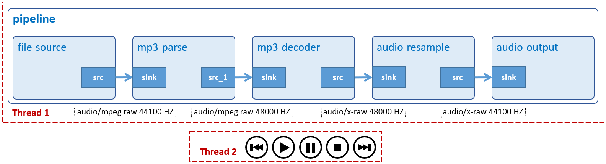

# Audio Player
A simple text-based audio player that can play Ogg/Vorbis files. Supported features: play, pause, stop, resume, seek, and display audio file(s). You can input a single file or a whole directory.



## Development Environment

GStreamer: 1.16.3 (edited by Renesas).

## Application Content

+ [`main.c`](main.c)
+ [`Makefile`](Makefile)
+ [`player.c`](player.c)
+ [`player.h`](player.h)

### Walkthrough: [`main.c`](main.c)
> Note that this tutorial only discusses the important points of this application. For the rest of source code, please refer to section [File Play](/14_gst-fileplay/README.md) and [Audio Play](/01_gst-audioplay/README.md).

#### Include player.h
```c
#include "player.h"             /* player UI APIs */
```
Header file `player.h` contains functions that allow us to retrieve Ogg/Vorbis file path(s) from program parameter argv[1].
```c
#define SKIP_POSITION               (gint64) 5000000000       /* 5s */
#define NORMAL_PLAYING_RATE         (gdouble) 1.0
```
The `SKIP_POSITION` macro defines the time interval (in nanosecond) to seek audio backwards and forwards.
```c
#define NORMAL_PLAYING_RATE         (gdouble) 1.0
```
GStreamer pipeline also supports changing audio playback speed. By default, the speed is set normal `(1.0)`.
#### UserData structure
```c
typedef struct tag_user_data
{
  GMainLoop *loop;
  GstElement *pipeline;
  GstElement *source;
  GstElement *demuxer;
  GstElement *decoder;
  GstElement *converter;
  GstElement *capsfilter;
  GstElement *sink;
  gint64 audio_length;
} UserData;
```
This structure contains:
-	 Variable `loop (GMainLoop)`: An opaque data type to represent the main event loop of a Glib application.
-	 Variable `pipeline (GstElement)`: A pointer to GStreamer pipeline which contains connected audio elements.
-	 Variable `source (GstElement)`: A GStreamer element to read data from a local file.
-	 Variable `demuxer (GstElement)`: A GStreamer element to de-multiplex Ogg/Vorbis files into their encoded audio and video components. In this case, only audio stream is available.
-	 Variable `decoder (GstElement)`: A GStreamer element to decompress a Vorbis stream to raw audio.
-	 Variable `converter (GstElement)`: A GStreamer element to convert raw audio buffers between various possible formats depending on the given source pad and sink pad it links to.
-	 Variable `capsfilter (GstElement)`: A GStreamer element to specify raw audio format S16LE.
-	 Variable `sink (GstElement)`: A GStreamer element to automatically detect an appropriate audio sink, in this case alsasink.
-	 Variable `audio_length (qint64)`: An 8-byte integer variable to represent audio duration.
#### Thread IDs
```c
pthread_t id_ui_thread = 0;
pthread_t id_autoplay_thread = 0;
```
Variable `id_ui_thread` contains ID of text-based UI thread which handles inputs from user.\
Variable `id_autoplay_thread` contains ID of auto-play thread which automatically plays the next audio file if the current one has just finished.
#### Validate user input
```c
if (argc != 2) {
  g_printerr ("Usage: %s <Ogg/Vorbis filename or directory>\n", argv[0]);
  return -1;
}
```
This application accepts one command-line argument which points to an Ogg/Vorbis file or a whole directory.
#### Process user input
```c
if (!inject_dir_path_to_player (argv[1])) {
  return -1;
}
```
This function retrieves an absolute path of the Ogg/Vorbis file or directory.

#### Audio pipeline
```c
source = gst_element_factory_make ("filesrc", "file-source");
demuxer = gst_element_factory_make ("oggdemux", "ogg-demuxer");
decoder = gst_element_factory_make ("vorbisdec", "vorbis-decoder");
conv = gst_element_factory_make ("audioconvert", "converter");
capsfilter = gst_element_factory_make ("capsfilter", "conv_capsfilter");
sink = gst_element_factory_make ("alsasink", "audio-output");

gst_bin_add_many (GST_BIN (pipeline), source, demuxer, decoder, conv, capsfilter, sink, NULL);
gst_element_link (source, demuxer);
gst_element_link_many (decoder, conv, capsfilter, sink, NULL);

user_data.loop = loop;
user_data.pipeline = pipeline;
user_data.source = source;
user_data.demuxer = demuxer;
user_data.decoder = decoder;
user_data.converter = conv;
user_data.capsfilter = capsfilter;
user_data.sink = sink;
user_data.audio_length = 0;

g_signal_connect (demuxer, "pad-added", G_CALLBACK (on_pad_added), &user_data);

bus = gst_pipeline_get_bus (GST_PIPELINE (pipeline));
bus_watch_id = gst_bus_add_watch (bus, bus_call, &user_data);
gst_object_unref (bus);
```
Basically, this pipeline is just like Audio Play except it uses `gst_bus_add_watch()` instead of `gst_bus_timed_pop_filtered()` to receive messages (such as: error or EOS (End-of-Stream)) from `bus_call()` asynchronously.

#### Audio duration
```c
user_data.audio_length = 0;
```
At this point, the pipeline is not running (NULL), so it is not safe to query audio duration. Let’s just assign `audio_length` to 0 for now. We will find its value in `sync_to_play_new_file()` when the pipeline is in PLAYING state.

#### Process user input (cont.)
```c
update_file_list ();
```

If the input is a path to a directory, these lines of code will get the number of files of which extension is .ogg inside the directory.
```c
if (try_to_update_file_path ()) {
  sync_to_play_new_file (&user_data, FALSE);
}
```
The `try_to_update_file_path()` function will find the first audio file to play. If successful, it will call `sync_to_play_new_file()` (with argument `user_data`) to set the pipeline to PLAYING state, then retrieves audio duration.

#### Start text-based UI thread
```c
if (pthread_create (&id_ui_thread, NULL, check_user_command_loop, &user_data)) {
  LOGE ("pthread_create failed\n");
  goto exit;
}
```
The `pthread_create()` function starts a new thread. Note that the new thread will handle UI inputs from users (such as: play, pause, stop, resume, seek, and display audio files). It starts execution by invoking `check_user_command_loop()`. Note that user_data is passed as the sole argument of this function.

#### Start auto-play thread
```c
if (pthread_create (&id_autoplay_thread, NULL, auto_play_thread_func, (UserData *) data)) {
  LOGE ("pthread_create autoplay failed\n");
}
```
The `id_autoplay_thread` thread will be executed when the current song receives EOS (End-of-Stream) signal.
#### Clean up
```c
pthread_join (id_ui_thread, NULL);
pthread_join (id_autoplay_thread, NULL);
```
The `pthread_join()` function waits for both `id_ui_thread` and `id_autoplay_thread` to terminate. If that thread has already terminated, it will return immediately.
### Play audio pipeline
```c
void
play_new_file (UserData * data, gboolean refresh_console_message)
{
  /* Seek to start and flush all old data */
  gst_element_seek_simple (data->pipeline, GST_FORMAT_TIME, GST_SEEK_FLAG_FLUSH, 0);
  gst_element_set_state (data->pipeline, GST_STATE_READY);

  /* Wait until the changing is complete */
  gst_element_get_state (data->pipeline, NULL, NULL, GST_CLOCK_TIME_NONE);

  decoder = gst_bin_get_by_name (GST_BIN (data->pipeline), "vorbis-decoder");
  gst_bin_remove (GST_BIN (data->pipeline), data->decoder);

  converter = gst_bin_get_by_name (GST_BIN (data->pipeline), "converter");
  gst_bin_remove (GST_BIN (data->pipeline), data->converter);

  capsfilter = gst_bin_get_by_name (GST_BIN (data->pipeline), "conv_capsfilter");
  gst_bin_remove (GST_BIN (data->pipeline), data->capsfilter);

  sink = gst_bin_get_by_name (GST_BIN (data->pipeline), "audio-output");
  gst_bin_remove (GST_BIN (data->pipeline), data->sink);

  /* Update file location */
  g_object_set (G_OBJECT (data->source), "location", get_current_file_path (), NULL);

  /* Set the pipeline to "playing" state */
  print_current_selected_file (refresh_console_message);

  gst_element_set_state (data->pipeline, GST_STATE_PLAYING);
}
```

This function seeks pipeline to the beginning of playback position and changes its state to READY to prepare for the next audio file (`get_current_file_path`).\
Next, it removes audio elements from pipeline, such as: vorbisdec `(decoder)`, audioconvert `(converter)`, `capsfilter`, and autoaudiosink `(sink)` from pipeline everytime location property of filesrc `(source)` changes (`g_object_set`). After this step, the pipeline only contains upstream elements, such as: filesrc and oggdemux.\
Finally, the pipeline is set to PLAYING state. This will later call `on_pad_added()` asynchronously.

Note:
>We need to call `gst_bin_get_by_name()` to keep the elements existing after we call `get_bin_remove()`.

#### Function on_pad_added()
```c
static void on_pad_added (GstElement * element, GstPad * pad, gpointer data)
{
  gst_bin_add_many (GST_BIN (puser_data->pipeline),
      puser_data->decoder, puser_data->converter, puser_data->capsfilter, puser_data->sink, NULL);

  gst_element_link_many (puser_data->decoder, puser_data->converter,
          puser_data->capsfilter, puser_data->sink, NULL)

  /* Link demuxer and decoder */
  sinkpad = gst_element_get_static_pad (puser_data->decoder, "sink");
  if (GST_PAD_LINK_OK != gst_pad_link (pad, sinkpad)) {
    g_print ("Link Failed");
  }
  gst_object_unref (sinkpad);

  /* Change newly added element to ready state is required */
  gst_element_set_state (puser_data->decoder, GST_STATE_PLAYING);
  gst_element_set_state (puser_data->converter, GST_STATE_PLAYING);
  gst_element_set_state (puser_data->capsfilter, GST_STATE_PLAYING);
  gst_element_set_state (puser_data->sink, GST_STATE_PLAYING);
}
```
This function adds and links (again) these audio elements to pipeline. Note that their states should be in PLAYING state to synchronize with upstream elements.

#### Function bus_call()
```c
static gboolean bus_call (GstBus * bus, GstMessage * msg, gpointer data)
{
  GMainLoop *loop = ((UserData *) data)->loop;
  switch (GST_MESSAGE_TYPE (msg)) {
    case GST_MESSAGE_ERROR:{
      g_main_loop_quit (loop);
      break;
    }
    case GST_MESSAGE_EOS:{
      gboolean ret = request_update_file_path (1);
      if (ret) {
        if (pthread_create (&id_autoplay_thread, NULL, auto_play_thread_func, (UserData *) data)) {
          LOGE ("pthread_create autoplay failed\n");
        }
      }
      break;
    }
    default:
      break;
  }
  return TRUE;
}
```

This function will be called when a message is received from bus.\
If the message is `GST_MESSAGE_ERROR`, the application will call `g_main_loop_quit()` to stop loop. This makes `g_main_loop_run()` return. Finally, the application cleans up GStreamer objects and exits.\
If the message is `GST_MESSAGE_EOS`, the application will execute `id_autoplay_thread` thread `(pthread_create)` to play the next audio file `(request_update_file_path)` automatically.

#### Thread handler auto_play_thread_func()
```c
static void * auto_play_thread_func (void *data)
{
  sync_to_play_new_file ((UserData *) data, TRUE);
  pthread_exit (NULL);
  return NULL;
}
```
Basically, it will call `sync_to_play_new_file() `and exit.

Note:
>`The bus_call()` function cannot call `sync_to_play_new_file()` directly because it is blocking the pipeline. This makes it unable to play new audio file.\
This is the reason why we have to call `sync_to_play_new_file()` from another thread to avoid deadlock.

#### Playing pipeline
```c
void sync_to_play_new_file (UserData * data, gboolean refresh_console_message)
{
  play_new_file (data, refresh_console_message);

  gst_element_get_state (data->pipeline, NULL, NULL, GST_CLOCK_TIME_NONE);
  gst_element_query_duration (data->pipeline, GST_FORMAT_TIME, &(data->audio_length));
}
```
This function reconfigures and runs existing pipeline `(play_new_file)` to play next audio file, then gets audio duration when the pipeline is in PLAYING state.

#### Text-based UI thread handler
```c
static void * check_user_command_loop (void *data)
{
  GstElement *pipeline;
  gint64 audio_length;
  GstState current_state;

  while (!ui_thread_die) {
    pipeline = ((UserData *) data)->pipeline;
    current_state = wait_for_state_change_completed (pipeline);
    audio_length = ((UserData *) data)->audio_length;

    UserCommand cmd = get_user_command ();
    switch (cmd) {}
  }
}
```
This handler waits for `(get_user_command)` and executes input commands from user.
```c
case QUIT:
  g_main_loop_quit (((UserData *) data)->loop);
  pthread_exit (NULL);
  return NULL;
  break;
```
Command `QUIT` calls `g_main_loop_quit()` to stop the loop and UI thread from running. This makes `g_main_loop_run()` return. Finally, the application cleans up GStreamer objects, and exits.
```c
case PAUSE_PLAY:
  if (GST_STATE_PLAYING == current_state) {
    gst_element_set_state (pipeline, GST_STATE_PAUSED);
  } else if (GST_STATE_PAUSED == current_state) {
    gst_element_set_state (pipeline, GST_STATE_PLAYING);
  } else {
    g_print ("Cannot PAUSE/PLAY\n");
  }
  break;
```
Command `PAUSE_PLAY` calls `gst_element_set_state()` to toggle the pipeline between PLAYING and PAUSED state.
```c
case STOP:{
  if (GST_STATE_PLAYING == current_state) {
    gst_element_set_state (pipeline, GST_STATE_PAUSED);
  }
  if (seek_to_time (pipeline, 0)) {
    g_print ("STOP\n");
  }
  break;
}
```
Command `STOP` sets the pipeline to `PAUSED`, then seeks it to the beginning of playback position.
```c
case REPLAY:
  if (seek_to_time (pipeline, 0)) {
    if (GST_STATE_PAUSED == current_state) {
      gst_element_set_state (pipeline, GST_STATE_PLAYING);
    }
    g_print ("REPLAYED!\n");
  }
  break;
```
Command `REPLAY` seeks the pipeline to beginning of playback position. Also, it will resume the audio if it is pausing.
```c
case FORWARD:{
  gint64 pos = get_current_play_position (pipeline);

  pos = pos + SKIP_POSITION;
  if (pos >= audio_length) {
    pos = audio_length;
  }
  if (seek_to_time (pipeline, pos)) {
    g_print ("current: %02d:%02d\n",
        (int) (GET_SECOND_FROM_NANOSEC (pos) / TIME),
        (int) (GET_SECOND_FROM_NANOSEC (pos) % TIME));
  }
  break;
}
```
Command `FORWARD` adds 5 seconds (defined in `SKIP_POSITION`) to the current position and seeks forwards.
```c
case REWIND:{
  gint64 pos = get_current_play_position (pipeline);
  pos = pos - SKIP_POSITION;
  if (pos < 0) {
    pos = 0;
  }
  if (seek_to_time (pipeline, pos)) {
    g_print ("current: %02d:%02d\n",
        (int) (GET_SECOND_FROM_NANOSEC (pos) / TIME),
        (int) (GET_SECOND_FROM_NANOSEC (pos) % TIME));
  }
  break;
}
```
Command `REWIND` removes 5 seconds (defined in `SKIP_POSITION`) from the current position and seeks backwards.
```c
case LIST:{
  update_file_list ();
  break;
}
```
Command `LIST` calls `update_file_list()` to update the number of Ogg/Vorbis files.
```c
case PREVIOUS:{
  gboolean ret = request_update_file_path (-1);
  if (ret) {
    sync_to_play_new_file ((UserData *) data, FALSE);
  }
  break;
}
```
Command `PREVIOUS` retrieves the location of previous audio file, then plays it.
```c
case NEXT:{
  gboolean ret = request_update_file_path (1);
  if (ret) {
    sync_to_play_new_file ((UserData *) data, FALSE);
  }
  break;
}
```
Command `NEXT` retrieves the location of next audio file, then plays it.
```c
case PLAYFILE:{
  gboolean ret = request_update_file_path (0);
  if (ret) {
    sync_to_play_new_file ((UserData *) data, FALSE);
  }
  break;
}
```
Command `PLAYFILE` repeats the current file.
```c
case HELP:
  print_supported_command ();
  break;
```
Command `HELP` displays a short option summary.


### Walkthrough: [`player.c`](player.c) and [`player.h`](player.h)
#### Macros
```c
#define FILE_SUFFIX 		".ogg"
```
The `FILE_SUFFIX` macro defines the file extension that is supported by the pipeline. In this application, it only accepts audio files whose extension are `.ogg`.
```c
#define DEBUG_LOG
```
If `DEBUG_LOG` is defined, the application will print out debugging messages.

#### Static variables
```c
static gchar dir_path[PATH_MAX];
```
It contains an absolute path to the directory inputted by user. The value is retrieved by calling `inject_dir_path_to_player()`.
```c
static gchar file_path[PATH_MAX];
```
It contains an absolute path to the file inputted by user or to the current file in the list. The value is retrieved by calling `inject_dir_path_to_player()`.
```c
static guint32 current_file_no = 0;
```
It is an index which points to the current audio file (in the playlist). The value will be updated by calling `request_update_file_path()`.

>Note that this index starts from 1 and will always be 1 if user inputs an Ogg/Vorbis audio file, not a whole directory.
```c
static guint32 last_file_count = 0;
```
It contains the number of Ogg/Vorbis files. The value is retrieved by `update_file_list()`.
>Note that this variable will always be 1 if user inputs an Ogg/Vorbis audio file, not a whole directory.

#### APIs
```c
gchar *get_current_file_path (void);
```
This function returns variable file_path (see above).
```c
gboolean inject_dir_path_to_player (const gchar * path);
```
If the input is a file, this function will get and store its absolute path in file_path and dir_path variables.\
If the input is a directory, this function will get and store its absolute path in dir_path variable.
```c
void update_file_list (void);
```
This function gets the number of Ogg/Vorbis files and stores them in last_file_count variable.
```c
gboolean try_to_update_file_path (void);
```
This function gets file path without scanning variable dir_path. It can help the program play
audio immediately if user inputs an Ogg/Vorbis file.
```c
gboolean request_update_file_path (gint32 offset_file);
```
If the `offset_file` is 0, this function will get an absolute path of the current audio file.\
If the `offset_file` is -1, this function will get an absolute path of the previous audio file.\
If the `offset_file` is 1, this function will get an absolute path of the next audio file.
```c
UserCommand get_user_command (void);
```
This function waits for and then executes input commands from user, or plays audio based on the order of audio files in the playlist.
```c
void print_supported_command (void);
```
This function displays a short option summary.
```c
void print_current_selected_file (gboolean refresh_console_message);
```
This function prints a name and index of the current audio file.

## How to Build and Run GStreamer Application

This section shows how to cross-compile and deploy GStreamer _audio player_ application.

### How to Extract Renesas SDK
***Step 1***.	Install toolchain on a Host PC:
```sh
$   sudo sh ./poky-glibc-x86_64-core-image-weston-aarch64-smarc-rzg2l-toolchain-3.1.17.sh
```
Note:
> This step installs the RZG2L toolchain. If you want to install the RZV2L toolchain, please use `poky-glibc-x86_64-core-image-weston-aarch64-smarc-rzv2l-toolchain-3.1.17.sh` instead.\
> Sudo is optional in case user wants to extract SDK into a restricted directory (such as: _/opt/_)

If the installation is successful, the following messages will appear:
```sh
SDK has been successfully set up and is ready to be used.
Each time you wish to use the SDK in a new shell session, you need to source the environment setup script e.g.
$ . /opt/poky/3.1.17/environment-setup-aarch64-poky-linux
$ . /opt/poky/3.1.17/environment-setup-armv7vet2hf-neon-vfpv4-pokymllib32-linux-gnueabi
```
***Step 2***.	Set up cross-compile environment:
```sh
$   source /<Location in which SDK is extracted>/environment-setup-aarch64-poky-linux
```
Note:
>User needs to run the above command once for each login session.

### How to Build and Run GStreamer Application

***Step 1***.	Go to gst-audioplayer directory:
```sh
$   cd $WORK/11_gst-audioplayer
```

***Step 2***.	Cross-compile:
```sh
$   make
```
***Step 3***.	Copy all files inside this directory to _/usr/share_ directory on the target board:
```sh
$   scp -r $WORK/11_gst-audioplayer/ <username>@<board IP>:/usr/share/
```
***Step 4***.	Run the application:
>Download the input file `Rondo_Alla_Turka.ogg` from [commons.wikimedia.org/wiki/File:Rondo_Alla_Turka.ogg](https://commons.wikimedia.org/wiki/File:Rondo_Alla_Turka.ogg) and place it in _/home/media/audios_.
```sh
$   /usr/share/11_gst-audioplayer/gst-audioplayer /home/media/audios
```