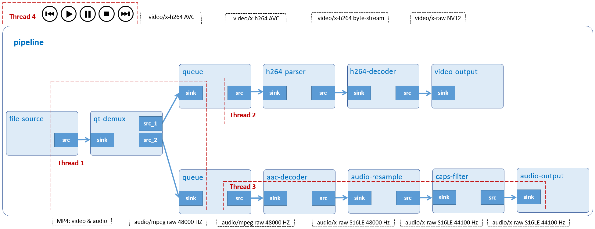

# Video Player

A simple text-based video player that can play MP4 files. Supported features: play, pause, stop, resume, and seek video files. You can input a single file or a whole directory.



## Development Environment

GStreamer: 1.16.3 (edited by Renesas).

## Application Content

+ [`main.c`](main.c)
+ [`Makefile`](Makefile)
+ [`player.c`](player.c)
+ [`player.h`](player.h)

### Walkthrough: [`main.c`](main.c)
>Note that this tutorial only discusses the important points of this application. For the rest of source code, please refer to section [Audio Player](/11_gst-audioplayer/README.md) and [File Play](/14_gst-fileplay/README.md).
#### User data structure
```c
typedef struct tag_user_data
{
  GMainLoop *loop;
  GstElement *pipeline;
  GstElement *source;
  GstElement *demuxer;
  GstElement *audio_queue;
  GstElement *audio_decoder;
  GstElement *audio_resample;
  GstElement *audio_capsfilter;
  GstElement *audio_sink;
  GstElement *video_queue;
  GstElement *video_parser;
  GstElement *video_decoder;
  GstElement *video_filter;
  GstElement *video_capsfilter;
  GstElement *video_sink;
  gint64 media_length;
  struct screen_t *main_screen;
  bool fullscreen;
} UserData;
```
This structure contains:
-	 Variable `loop (GMainLoop)`: An opaque data type to represent the main event loop of a Glib application.
-	 Variable `pipeline (GstElement)`: A GStreamer pipeline which contains connected video elements.
-	 Variable `source (GstElement)`: A GStreamer element to read data from a local file.
-	 Variable `demuxer (GstElement)`: A GStreamer element to de-multiplex an MP4 file into audio and video streams.
-	 Variable `audio_queue` and `video_queue` (GstElement): A GStreamer element to queue data until one of the limits specified by the max-size-buffers, max-size-bytes, and/or max-size-time properties has been reached. Any attempt to push more buffers into the queue will block the pushing thread until more space becomes available.
-	 Variable `audio_decoder (GstElement)`: A GStreamer element to decompress MPEG-2/4 AAC stream to raw S16LE-formatted audio.
-	 Variable `audio_resample (GstElement)`: A GStreamer element to resample raw audio buffers to different sample rates using a configurable windowing function to enhance quality.
-	 Variable `audio_capsfilter (GstElement)`: A GStreamer element to contain target sample rate 44.1 kHz. Variable audio_resample will resample audio based on this value.
-	 Variable `audio_sink (GstElement)`: A GStreamer element to render audio samples using the ALSA audio API.
-	 Variable `video_parser (GstElement)`: A GStreamer element to parse H.264 stream to AVC format which omxh264dec can recognize and process.
-	 Variable `video_decoder (GstElement)`: A GStreamer element to decompress H.264 stream to raw NV12-formatted video.
-	 Variable `video_filter (GstElement)`: A GStreamer element to handle video scaling.
-	 Variable `video_capfilter (GstElement)`: A GStreamer element to contain screen resolution.
-	 Variable `video_sink (GstElement)`: A GStreamer element to create its own window and renders the decoded video frames to that.
-	 Variable `media_length (qint64)`: An 8-byte integer variable to represent video duration.
-	 Variable `main_screen (screen_t)`: A pointer to screen_t structure to contain monitor information, such as: (x, y), width, and height.
-	 Variable `fullscreen (bool)`: A boolean variable to enable full-screen mode.

#### Video pipeline
```c
source = gst_element_factory_make ("filesrc", "file-source");
demuxer = gst_element_factory_make ("qtdemux", "qt-demuxer");
video_queue = gst_element_factory_make ("queue", "video-queue");
video_sink = NULL;

audio_queue = gst_element_factory_make ("queue", "audio-queue");
audio_decoder = gst_element_factory_make ("faad", "aac-decoder");
audio_resample = gst_element_factory_make("audioresample", "audio-resample");
audio_capsfilter = gst_element_factory_make ("capsfilter", "audio-capsfilter");
audio_sink = gst_element_factory_make ("alsasink", "audio-output");

caps = gst_caps_new_simple ("audio/x-raw", "rate", G_TYPE_INT, AUDIO_SAMPLE_RATE, NULL);

g_object_set (G_OBJECT (audio_capsfilter), "caps", caps, NULL);
gst_caps_unref (caps);

gst_bin_add_many (GST_BIN (pipeline), source, demuxer,
    video_queue, audio_queue, audio_decoder,
    audio_resample, audio_capsfilter, audio_sink, NULL);

gst_element_link (source, demuxer)

/* Construct user data */
user_data.loop = loop;
user_data.pipeline = pipeline;
user_data.source = source;
user_data.demuxer = demuxer;
user_data.audio_queue = audio_queue;
user_data.audio_decoder = audio_decoder;
user_data.audio_resample = audio_resample;
user_data.audio_capsfilter = audio_capsfilter;
user_data.audio_sink = audio_sink;
user_data.video_queue = video_queue;
user_data.video_parser = NULL;
user_data.video_decoder = NULL;
user_data.video_sink = video_sink;
user_data.media_length = 0;
user_data.main_screen = &main_screen;

if (user_data.fullscreen) {
  user_data.video_filter = NULL;
  user_data.video_capsfilter = NULL;
}

/* Set up the pipeline */
/* we add a message handler */
bus = gst_pipeline_get_bus (GST_PIPELINE (pipeline));
bus_watch_id = gst_bus_add_watch (bus, bus_call, &user_data);
gst_object_unref (bus);

g_signal_connect (demuxer, "pad-added", G_CALLBACK (on_pad_added), &user_data);
g_signal_connect (demuxer, "no-more-pads", G_CALLBACK (no_more_pads), NULL);
```
Basically, this pipeline is just like File Play except it uses `gst_bus_add_watch()` instead of `gst_bus_timed_pop_filtered()` to receive messages (such as: error or EOS (End-of-Stream)) from `bus_call()` asynchronously.

Note:
>The video_parser, video_decoder, waylandsink, vspmfilter and capsfilter element will be created at runtime and removed right before playing new video file to reset their settings. If not, the pipeline cannot play the video.\
That’s why they are not created in `main()`.

#### Function on_pad_added()
```c
static void on_pad_added (GstElement * element, GstPad * pad, gpointer data)
{  if (g_str_has_prefix (new_pad_type, "audio")) {
    gst_element_set_state (puser_data->audio_queue, GST_STATE_PAUSED);
    gst_element_set_state (puser_data->audio_decoder, GST_STATE_PAUSED);
    gst_element_set_state (puser_data->audio_resample, GST_STATE_PAUSED);
    gst_element_set_state (puser_data->audio_capsfilter, GST_STATE_PAUSED);
    gst_element_set_state (puser_data->audio_sink, GST_STATE_PAUSED);

    /* Add back audio_queue, audio_decoder, audio_resample, audio_capsfilter, and audio_sink */
    gst_bin_add_many (GST_BIN (puser_data->pipeline),
        puser_data->audio_queue, puser_data->audio_decoder,
        puser_data->audio_resample, puser_data->audio_capsfilter,
        puser_data->audio_sink, NULL);

    /* Link audio_queue +++ audio_decoder +++ audio_resample +++ audio_capsfilter +++ audio_sink */
    gst_element_link_many (puser_data->audio_queue,
        puser_data->audio_decoder, puser_data->audio_resample,
        puser_data->audio_capsfilter, puser_data->audio_sink, NULL);

    /* In case link this pad with the AAC-decoder sink pad */
    sinkpad = gst_element_get_static_pad (puser_data->audio_queue, "sink");
    if (GST_PAD_LINK_OK != gst_pad_link (pad, sinkpad)) {
      g_print ("Audio link failed\n");
    } else {
      LOGD ("Audio pad linked!\n");
    }

    gst_object_unref (sinkpad);
    if (new_pad_caps != NULL)
       gst_caps_unref (new_pad_caps);

    /* Change the pipeline to PLAYING state */
    gst_element_set_state (puser_data->pipeline, GST_STATE_PLAYING);
}
```
If the pad is an audio pad, the application will set all audio elements, such as: `audio_queue` (queue), `audio_decoder` (faad), `audio_resample` (audioresample), `audio_capsfilter` (capsfilter), and `audio_sink` (alsasink) to PAUSED state, then link, and add them to the pipeline.
>Note that we have to link `demuxer` (qtdemux) to `audio_queue` (queue) manually (gst_pad_link) just like [File Play](/14_gst-fileplay/README.md).

Finally, the application sets the pipeline to PLAYING state.
```c
static void on_pad_added (GstElement * element, GstPad * pad, gpointer data)
{
  if (g_str_has_prefix (new_pad_type, "video")) {
    /* Recreate waylandsink */
    puser_data->video_sink = gst_element_factory_make ("waylandsink", "video-output");

    g_object_set (G_OBJECT (puser_data->video_sink), "position-x", main_screen->x,
                                                               "position-y", main_screen->y, NULL);

  if (g_str_has_prefix (new_pad_type, "video/x-h264")) {
    /* Recreate video-parser */
    puser_data->video_parser = gst_element_factory_make ("h264parse", "h264-parser");
    /* Recreate video-decoder */
    puser_data->video_decoder = gst_element_factory_make ("omxh264dec", "omxh264-decoder");
  } else {
      g_print("Unsupported video format\n");
      g_main_loop_quit (puser_data->loop);
  }

  /* Recreate vspmfilter and capsfilter in case of scaling full screen */
  if (puser_data->fullscreen) {
    puser_data->video_filter = gst_element_factory_make ("vspmfilter", "video-filter");
    g_object_set (G_OBJECT (puser_data->video_filter), "dmabuf-use", TRUE, NULL);

    puser_data->video_capsfilter = gst_element_factory_make ("capsfilter", "video-capsfilter");
    video_caps = gst_caps_new_simple ("video/x-raw",
         "width", G_TYPE_INT, main_screen->width,
         "height", G_TYPE_INT, main_screen->height, NULL);    g_object_set (G_OBJECT (puser_data->video_capsfilter), "caps", video_caps, NULL);
    gst_caps_unref (video_caps);
  }

  /* Need to set Gst State to PAUSED before change state from NULL to PLAYING */
  gst_element_set_state (puser_data->video_queue, GST_STATE_PAUSED);
  gst_element_set_state (puser_data->video_parser, GST_STATE_PAUSED);
  gst_element_set_state (puser_data->video_decoder, GST_STATE_PAUSED);
  if (puser_data->fullscreen) {
    gst_element_set_state (puser_data->video_filter, GST_STATE_PAUSED);
    gst_element_set_state (puser_data->video_capsfilter, GST_STATE_PAUSED);
  }
  gst_element_set_state (puser_data->video_sink, GST_STATE_PAUSED);

  gst_bin_add_many (GST_BIN (puser_data->pipeline), puser_data->video_queue,
    puser_data->video_parser, puser_data->video_decoder, puser_data->video_sink, NULL);

  /* Add back video_filter and video_capsfilter in case of scaling full screen */
  if (puser_data->fullscreen) {
    gst_bin_add_many (GST_BIN (puser_data->pipeline),
        puser_data->video_filter, puser_data->video_capsfilter, NULL);
  }

  if (puser_data->fullscreen) {
    if (gst_element_link_many (puser_data->video_queue, puser_data->video_parser,
            puser_data->video_decoder, puser_data->video_filter, puser_data->video_capsfilter,
            puser_data->video_sink, NULL) != TRUE) {
      g_print ("video_queue, video_parser, video_decoder, video_filter, video_capsfilter, and "q
                 "video_sink could not be linked.\n");
    }
  } else {
    if (gst_element_link_many (puser_data->video_queue, puser_data->video_parser,
            puser_data->video_decoder, puser_data->video_sink, NULL) != TRUE) {
      g_print ("video_queue, video_parser, video_decoder and video_sink could not be linked.\n");
    }
  }

  /* In case link this pad with the decoder sink pad */
  sinkpad = gst_element_get_static_pad (puser_data->video_queue, "sink");
  if (GST_PAD_LINK_OK != gst_pad_link (pad, sinkpad)) {
    g_print ("Video link failed\n");
  } else {
    LOGD ("Video pad linked!\n");
  }

  gst_object_unref (sinkpad);
  if (new_pad_caps != NULL)
    gst_caps_unref (new_pad_caps);

  /* Change the pipeline to PLAYING state */
  gst_element_set_state (puser_data->pipeline, GST_STATE_PLAYING);
}
```
If the pad is a video pad, the application will create and configure `video_parser (h264parse)`, `video_decoder (omxh264dec)`, `video_filter (vspmfilter)`, `video_capsfilter (capsfilter)` (`video_filter` and `video_capsfilter` are optional) for the new video file. Then, it sets them along with other video elements, such as: `video_queue` (queue), and `video_sink` (waylandsink) to PAUSED state. Next, it will link and add these elements to the pipeline.

>Note that we have to link `demuxer` (qtdemux) to `video_queue` (queue) manually (gst_pad_link) just like [File Play](/14_gst-fileplay/README.md).

Finally, the application sets the pipeline to PLAYING state.

### Walkthrough: [`player.c`](player.c) and [`player.h`](player.h)
>Note that this tutorial only discusses the important points of this application. For the rest of source code, please refer to section [Audio Player](/11_gst-audioplayer/README.md).
#### Macro
```c
#define FILE_SUFFIX		  ".mp4"
```
The FILE_SUFFIX macro defines the file extension that is supported by the pipeline. In this application, it only accepts video files whose extension are `.mp4`.

## How to Build and Run GStreamer Application

This section shows how to cross-compile and deploy GStreamer _video player_ application.

### How to Extract Renesas SDK
***Step 1***.	Install toolchain on a Host PC:
```sh
$   sudo sh ./poky-glibc-x86_64-core-image-weston-aarch64-smarc-rzg2l-toolchain-3.1.17.sh
```
Note:
> This step installs the RZG2L toolchain. If you want to install the RZV2L toolchain, please use `poky-glibc-x86_64-core-image-weston-aarch64-smarc-rzv2l-toolchain-3.1.17.sh` instead.\
> Sudo is optional in case user wants to extract SDK into a restricted directory (such as: _/opt/_)

If the installation is successful, the following messages will appear:
```sh
SDK has been successfully set up and is ready to be used.
Each time you wish to use the SDK in a new shell session, you need to source the environment setup script e.g.
$ . /opt/poky/3.1.17/environment-setup-aarch64-poky-linux
$ . /opt/poky/3.1.17/environment-setup-armv7vet2hf-neon-vfpv4-pokymllib32-linux-gnueabi
```
***Step 2***.	Set up cross-compile environment:
```sh
$   source /<Location in which SDK is extracted>/environment-setup-aarch64-poky-linux
```
Note:
>User needs to run the above command once for each login session.

### How to Build and Run GStreamer Application

***Step 1***.	Go to gst-videoplayer directory:
```sh
$   cd $WORK/12_gst-videoplayer
```

***Step 2***.	Cross-compile:
```sh
$   make
```
***Step 3***.	Copy all files inside this directory to _/usr/share_ directory on the target board:
```sh
$   scp -r $WORK/12_gst-videoplayer/ <username>@<board IP>:/usr/share/
```
***Step 4***.	Run the application:

Download the input files [sintel_trailer-720p.mp4](https://download.blender.org/durian/trailer/sintel_trailer-720p.mp4)
 and [renesas-bigideasforeveryspace.mp4](https://www.renesas.com/jp/ja/img/products/media/auto-j/microcontrollers-microprocessors/rz/rzg/qt-videos/renesas-bigideasforeveryspace.mp4) then place all it in _/home/media/videos_.
```sh
$   /usr/share/12_gst-videoplayer/gst-videoplayer /home/media/videos
```
>RZ/G2L and RZ/V2L can maximum support Full HD video.
