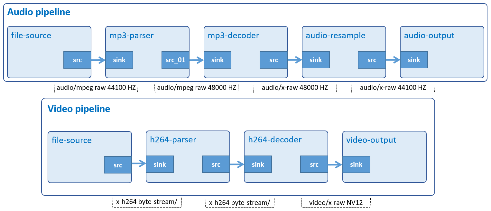

# Audio Video Play

Play H.264 video and Ogg/Vorbis audio file independently.



## Development Environment

GStreamer: 1.16.3 (edited by Renesas).

## Application Content

+ [`main.c`](main.c)
+ [`Makefile`](Makefile)

### Walkthrough: [`main.c`](main.c)
>Note that this tutorial only discusses the important points of this application. For the rest of source code, please refer to section [Audio Play](/01_gst-audioplay/README.md) and [Video Play](/02_gst-videoplay/README.md).

#### Command-line argument
```c
  if (argc != ARG_COUNT){
    g_printerr ("Error: Invalid arugments.\n");
    g_printerr ("Usage: %s <OGG file> <H264 file> \n", argv[ARG_PROGRAM_NAME]);
    return -1;
  }
```
This application accepts 2 command-line arguments which point to an Ogg/Vorbis file and a H.264 file.

#### CustomData structure
```c
typedef struct _CustomData
{
  GMainLoop *loop;
  int loop_reference;
  GMutex mutex;
  const char *video_ext;
  struct wayland_t *wayland_handler;
  struct screen_t *main_screen;
} CustomData;
```
This structure contains:
-	 Variable `loop (GMainLoop)`: An opaque data type to represent the main [event loop](https://en.wikipedia.org/wiki/Event_loop) of a Glib application.
-	 Variable `loop_reference (int)`: An integer variable to represent the number of PLAYING pipelines available. It is managed by mutex structure which controls GStreamer object release and program termination.
-	 Variable `mutex (GMutex)`: An opaque data type to represent [mutex](https://en.wikipedia.org/wiki/Lock_(computer_science)) (mutual exclusion). It can be used to protect data from critical section.
-	 Variable `video_ext (char)`: A string variable to represent video extension.
-	 Variable `wayland_handler (wayland_t)`: A pointer to wayland_t structure to contain list of monitors.
-	 Variable `main_screen (screen_t)`: A pointer to screen_t structure to contain monitor information, such as: (x, y), width, and height.
-	 Variable `fullscreen (qint64)`: A boolean variable to enable full-screen mode.

#### Initialize CustomData structure
```c
shared_data.loop = g_main_loop_new (NULL, FALSE);
```
This function creates a new [GMainLoop](https://docs.gtk.org/glib/main-loop.html) structure with default (NULL) context `(GMainContext)`.\
Basically, the main event loop manages all the available sources of events. To allow multiple independent sets of sources to be handled in different threads, each source is associated with a `GMainContext`. A `GMainContext` can only be running in a single thread, but sources can be added to it and removed from it from other threads.\
The application will use GMainLoop to catch events and signals from 2 independent GStreamer pipelines. One plays a video and the other plays an Ogg/Vorbis audio file.
```c
shared_data.loop_reference = 0;
```
At this point, variable `loop_reference` is set to 0 to indicate that there are no running pipelines available.
```c
g_mutex_init (&shared_data.mutex);
```
This function initializes a [GMutex](https://docs.gtk.org/glib/union.Mutex.html) so that it can be used. The structure protects loop_reference from read/write access of GStreamer threads.\
Please use [g_mutex_clear()](https://docs.gtk.org/glib/method.Mutex.clear.html) if the mutex is no longer needed.
```c
shared_data.video_ext = video_ext;
```
Variable `video_ext` contains the extension of video input file to create suitable `video_parser` and `video_decoder`
```c
shared_data.main_screen = main_screen;
```
Variable `main_screen` contains the resolution of screen to scale video to full-sreen.
#### Audio pipeline
```c
guint create_audio_pipeline (GstElement** p_audio_pipeline, const gchar* input_file, CustomData* data);
```
Basically, the audio pipeline is just like [Audio Play](/01_gst-audioplay/README.md) except it uses `gst_bus_add_watch()` instead of `gst_bus_timed_pop_filtered()` to receive messages (such as: error or EOS (End-of-Stream)) from `bus_call()` asynchronously.
```c
bus = gst_pipeline_get_bus (GST_PIPELINE (*p_audio_pipeline));
audio_bus_watch_id = gst_bus_add_watch (bus, bus_call, data);
gst_object_unref (bus);
```
>Note that the bus should be freed with `gst_caps_unref()` if it is not used anymore.

#### Video pipeline
```c
guint create_video_pipeline (GstElement ** p_video_pipeline, const gchar * input_file, CustomData* data)
```
Basically, the video pipeline is just like Video Play except it uses `gst_bus_add_watch()` instead of `gst_bus_timed_pop_filtered()` to receive messages (such as: error or EOS (End-of-Stream)) from `bus_call()` asynchronously.
```c
bus = gst_pipeline_get_bus (GST_PIPELINE (*p_video_pipeline));
video_bus_watch_id = gst_bus_add_watch (bus, bus_call, data);
gst_object_unref (bus);
```
>Note that the bus should be freed with `gst_caps_unref()` if it is not used anymore.
#### Function bus_call()
```c
static gboolean bus_call (GstBus * bus, GstMessage * msg, gpointer data)
```
This function will be called if either audio or video pipeline posts messages to bus.
```c
try_to_quit_loop ((CustomData *) data);
```
>Note that `bus_call()` only processes error and EOS messages. Moreover, no matter what the messages are, it will eventally call `try_to_quit_loop()` to try exiting main loop.

#### Create pipelines
```c
create_audio_pipeline (&audio_pipeline, input_audio_file, &shared_data);
create_video_pipeline (&video_pipeline, input_video_file, &shared_data);
```
Above lines of code create 2 pipelines, one plays Ogg/Vorbis audio and the other displays MP4.

#### Play pipelines
```c
int main (int argc, char *argv[])
{
  play_pipeline (audio_pipeline, &shared_data);
  play_pipeline (video_pipeline, &shared_data);
}
bool play_pipeline (GstElement * pipeline, CustomData * p_shared_data)
{
  g_mutex_lock (&p_shared_data->mutex);
  ++(p_shared_data->loop_reference);
  if (gst_element_set_state (pipeline,
          GST_STATE_PLAYING) == GST_STATE_CHANGE_FAILURE) {
    g_printerr ("Unable to set the pipeline to the playing state.\n");
    --(p_shared_data->loop_reference);
    gst_object_unref (pipeline);
  }
  g_mutex_unlock (&p_shared_data->mutex);
}
```

Basically, this function sets the state of `pipeline` to PLAYING. If successful, it will increases `loop_reference` to indicate that there is 1 more running pipeline. Note that the variable must be 2 for this application to play both audio and video.

#### Run main loop
```c
g_main_loop_run (shared_data.loop);
```
This function runs main loop until `g_main_loop_quit()` is called on the `loop` (context NULL). In other words, it will make the context check if anything it watches for has happened. For example, when a message has been posted on the bus (`gst_element_get_bus`), the default main context will automatically call `bus_call()` to notify the message.

#### Stop pipelines
```c
static void try_to_quit_loop (CustomData * p_shared_data)
{
  g_mutex_lock (&p_shared_data->mutex);
  --(p_shared_data->loop_reference);
  if (0 == p_shared_data->loop_reference) {
    g_main_loop_quit ((p_shared_data->loop));
  }
  g_mutex_unlock (&p_shared_data->mutex);
}
```
The main event loop will stop only if variable `loop_reference` reaches to 0. This means the application will exit when both audio and video pipeline stopped. Also note that mutex is used to prevent GStreamer threads from reading incorrect value of `loop_reference`.

## How to Build and Run GStreamer Application

This section shows how to cross-compile and deploy GStreamer _audio video play_ application.

### How to Extract Renesas SDK
Please refer to _hello word_ [How to Extract Renesas SDK section](/00_gst-helloworld/README.md#how-to-extract-sdk) for more details.

### How to Build and Run GStreamer Application

***Step 1***.	Go to gst-audiovideoplay directory:
```sh
$   cd $WORK/13_gst-audiovideoplay
```

***Step 2***.	Cross-compile:
```sh
$   make
```
***Step 3***.	Copy all files inside this directory to _/usr/share_ directory on the target board:
```sh
$   scp -r $WORK/13_gst-audiovideoplay/ <username>@<board IP>:/usr/share/
```
***Step 4***.	Run the application:

-  Download the input file [Rondo_Alla_Turka.ogg](https://upload.wikimedia.org/wikipedia/commons/b/bd/Rondo_Alla_Turka.ogg) and place it in _/home/media/audios_.
-	 Download the input file [vga1.h264](https://www.renesas.com/jp/ja/img/products/media/auto-j/microcontrollers-microprocessors/rz/rzg/doorphone-videos/vga1.h264) and place it in _/home/media/videos_.
```sh
$   /usr/share/13_gst-audiovideoplay/gst-audiovideoplay /home/media/audios/Rondo_Alla_Turka.ogg /home/media/videos/vga1.h264
```
### Special instruction:
To set the playback volume: please use the alsamixer or amixer tool. Reference https://en.wikipedia.org/wiki/Alsamixer
> A short guide that how to use alsamixer (https://wiki.ubuntu.com/Audio/Alsamixer).
