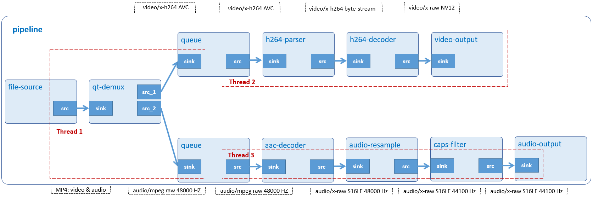

# File Play

Play an MP4 file.



## Development Environment

GStreamer: 1.16.3 (edited by Renesas).

## Application Content

+ [`main.c`](main.c)
+ [`Makefile`](Makefile)

### Walkthrough: [`main.c`](main.c)
>Note that this tutorial only discusses the important points of this application. For the rest of source code, please refer to section [Video Play](/02_gst-videoplay/README.md) and [Audio Play](/01_gst-audioplay/README.md).

#### Command-line argument
```c
if (argc != ARG_COUNT) {
    g_print ("Error: Invalid arugments.\n");
    g_print ("Usage: %s <path to MP4 file> \n", argv[ARG_PROGRAM_NAME]);
    return -1;
}
```
This application accepts a command-line argument which points to a MP4 file.

#### CustomData structure
```c
typedef struct _CustomData
{
  GstElement *pipeline;
  GstElement *video_queue;
  GstElement *video_parser;
  GstElement *video_decoder;
  GstElement *filter;
  GstElement *video_capsfilter;
  GstElement *video_sink;
  GstElement *audio_queue;
  struct screen_t *main_screen;
} CustomData;
```
This structure contains:
-	 Variable `pipeline (GstElement)`: A GStreamer pipeline which contains connected video elements.
-	 Variable `audio_queue` and `video_queue` (GstElement): A GStreamer element to queue data until one of the limits specified by the max-size-buffers, max-size-bytes, and/or max-size-time properties has been reached. Any attempt to push more buffers into the queue will block the pushing thread until more space becomes available.
-	 Variable `video_parser (GstElement)`: A GStreamer element to parse H.264 stream to format which video_decoder can recognize and process.
-	 Variable `video_decoder (GstElement)`: A GStreamer element to decompress H.264 stream to raw NV12-formatted video.
-	 Variable `filter (GstElement)`: A GStreamer element to handle video scaling.
-	 Variable `video_capfilter (GstElement)`: A GStreamer element to contain screen resolution.
-	 Variable `video_sink (GstElement)`: A GStreamer element to create its own window and renders the decoded video frames to that.
-	 Variable `main_screen (screen_t)`: A pointer to screen_t structure to contain monitor information, such as: (x, y), width, and height.

#### Create elements
```c
source = gst_element_factory_make ("filesrc", "file-source");
demuxer = gst_element_factory_make ("qtdemux", "qt-demuxer");
video_queue = gst_element_factory_make ("queue", "video-queue");
video_sink = gst_element_factory_make ("waylandsink", "video-output");

audio_queue = gst_element_factory_make ("queue", "audio-queue");
audio_decoder = gst_element_factory_make ("faad", "aac-decoder");
audio_resample = gst_element_factory_make("audioresample", "audio-resample");
audio_capsfilter = gst_element_factory_make ("capsfilter", "audio-capsfilter");
audio_sink = gst_element_factory_make ("alsasink", "audio-output");

static void on_pad_added (GstElement * element, GstPad * pad, gpointer data) {
  if (g_str_has_prefix (new_pad_type, "video/x-h264")) {
    user_data->video_parser =
         gst_element_factory_make ("h264parse", "h264-parser");
    user_data->video_decoder =
         gst_element_factory_make ("omxh264dec", "omxh264-decoder");
  }

  user_data->filter = gst_element_factory_make ("vspmfilter", "vspm-filter");
  user_data->video_capsfilter = gst_element_factory_make ("capsfilter", "video-capsfilter");
}
```
To play an MP4 video, the following elements are needed:
-	 Element `filesrc` reads data from a local file.
-	 Element `qtdemux` de-multiplexes an MP4 file into audio and video stream.
-	 Element queue (`audio_queue` and `video_queue`) queues data until one of the limits specified by the max-size-buffers, max-size-bytes, and/or max-size-time properties has been reached. Any attempt to push more buffers into the queue will block the pushing thread until more space becomes available.
-	 Element `h264parse` parses H.264 stream to format which `omxh264dec` can recognize and process.
-	 Element `omxh264dec` decompresses H.264 stream to raw NV12-formatted video.
-	 Element `waylandsink` creates its own window and renders the decoded video frames to that.
-	 Element `faad` decompresses MPEG-2/4 AAC stream to raw S16LE-formatted audio.
-	 Element `audioresample` resamples raw audio buffers to different sample rates using a configurable windowing function to enhance quality.
-	 Element `capsfilter` (audio_capfilter) contains target sample rate 44100 Hz so that audioresample can resample audio based on this value.
-	 Element `alsasink` renders audio samples using the ALSA audio API.

#### Set element’s properties
```c
g_object_set (G_OBJECT (source), "location", input_file, NULL);
g_object_set (G_OBJECT (sink), "position-x", main_screen->x, "position-y",
      main_screen->y, NULL);
caps = gst_caps_new_simple ("audio/x-raw", "rate", G_TYPE_INT, AUDIO_SAMPLE_RATE, NULL);
g_object_set (G_OBJECT (audio_capsfilter), "caps", caps, NULL);
gst_caps_unref (caps);
```
The `g_object_set()` function is used to set some element’s properties, such as:
-	 The `location` property of filesrc element which points to an MP4 file.
-	 The `position-x` and `position-y` are properties of waylandsink element which point to (x,y) coordinate of wayland desktop.
-	 The `caps` property of capsfilter `(audio_capsfilter)` element which specifies output audio sample rate 44100 Hz.

#### Link elements
```c
gst_element_link (source, demuxer);
gst_element_link_many (audio_queue, audio_decoder, audio_resample,
                           audio_capsfilter, audio_sink, NULL);

/*Not display video in full-screen*/
gst_element_link_many (user_data->video_queue, user_data->video_parser,
              user_data->video_decoder, user_data->video_sink, NULL);
```
Because `demuxer` (qtdemux) contains no source pads at this point, this element cannot link to either `video_queue` (queue) or `audio_queue` (queue) until its pad-added signal is emitted (see below).

>Note that the order counts, because links must follow the data flow (this is, from source elements to sink elements).

#### Signal
```c
CustomData user_data;
user_data.audio_queue = audio_queue;
user_data.video_queue = video_queue;
g_signal_connect (demuxer, "pad-added", G_CALLBACK (on_pad_added), &user_data);
```
Signals are a crucial point in GStreamer. They allow you to be notified (by means of a callback) when something interesting has happened. Signals are identified by a name, and each element has its own signals.\
In this application, `g_signal_connect()` is used to bind pad-added signal of qtdemux (demuxer) to callback function `on_pad_added()` and user_data pointer. GStreamer does nothing with this pointer, it just forwards it to the callback.

#### Link qtdemux to audio_queue and video_queue

When `qtdemux` (demuxer) element finally has enough information to start producing data, it will create source pads, and trigger the pad-added signal. At this point our callback will be called:
```c
	static void on_pad_added (GstElement * element, GstPad * pad, gpointer data)
```
The `element` parameter is the GstElement which triggered the signal. In this application, it is qtdemux. The first parameter of a signal handler is always the object that has triggered it.\
The `pad` element is the GstPad that has just been added to the qtdemux element. This is usually the pad to which we want to link.\
The `data` element is the user_data pointer which we provided earlier when attaching to the signal.
```c
GstCaps *new_pad_caps = NULL;
GstStructure *new_pad_struct = NULL;
const gchar *new_pad_type = NULL;
new_pad_caps = gst_pad_query_caps (pad, NULL);
new_pad_struct = gst_caps_get_structure (new_pad_caps, INDEX);
new_pad_type = gst_structure_get_name (new_pad_struct);
```
The `gst_pad_query_caps()` function gets the current [capabilities](https://gstreamer.freedesktop.org/documentation/tutorials/basic/media-formats-and-pad-capabilities.html?gi-language=c) of the pad (that is, the kind of data it currently outputs), wrapped in a `GstCaps` structure. A pad can offer many capabilities, and hence `GstCaps` can contain many `GstStructure`, each representing a different capability. The current caps on a pad will always have a single GstStructure and represent a single media format, or if there are no current caps yet, NULL will be returned.\
This application retrieves the first GstStructure with `gst_caps_get_structure()`.\
Finally, `gst_structure_get_name()` recovers the name of the structure, which contains the main description of the format (video/x-h264 or audio/mpeg, for example).
```c
if (g_str_has_prefix (new_pad_type, "audio")) {

  sinkpad = gst_element_get_static_pad (user_data->audio_queue, "sink");
  gst_pad_link (pad, sinkpad);

  gst_object_unref (sinkpad);
  g_print ("Audio pad linked!\n");

} else if (g_str_has_prefix (new_pad_type, "video")) {

  sinkpad = gst_element_get_static_pad (user_data->video_queue, "sink");
  gst_pad_link (pad, sinkpad);

  gst_object_unref (sinkpad);
  g_print ("Video pad linked!\n");
}
```
If the name contains audio, the application retrieves the sink pad of `audio_queue` (queue) using `gst_element_get_static_pad()`, then uses `gst_pad_link()` to connect it to the source pad of qtdemux.\
The procedure is the same if the name contains video.
>Note that `sinkpad` should be freed with `g_st_caps_unref()` if it is not used anymore.
```c
  if (new_pad_caps != NULL) {
    gst_caps_unref (new_pad_caps);
  }
```
Above lines of code un-refer `new_pad_caps` if it exists and is not used anymore.

## How to Build and Run GStreamer Application

This section shows how to cross-compile and deploy GStreamer _file_ play_ application.

### How to Extract Renesas SDK
***Step 1***.	Install toolchain on a Host PC:
```sh
$   sudo sh ./poky-glibc-x86_64-core-image-weston-aarch64-smarc-rzg2l-toolchain-3.1.17.sh
```
Note:
> This step installs the RZG2L toolchain. If you want to install the RZV2L toolchain, please use `poky-glibc-x86_64-core-image-weston-aarch64-smarc-rzv2l-toolchain-3.1.17.sh` instead.\
> Sudo is optional in case user wants to extract SDK into a restricted directory (such as: _/opt/_)

If the installation is successful, the following messages will appear:
```sh
SDK has been successfully set up and is ready to be used.
Each time you wish to use the SDK in a new shell session, you need to source the environment setup script e.g.
$ . /opt/poky/3.1.17/environment-setup-aarch64-poky-linux
$ . /opt/poky/3.1.17/environment-setup-armv7vet2hf-neon-vfpv4-pokymllib32-linux-gnueabi
```
***Step 2***.	Set up cross-compile environment:
```sh
$   source /<Location in which SDK is extracted>/environment-setup-aarch64-poky-linux
```
Note:
>User needs to run the above command once for each login session.

### How to Build and Run GStreamer Application

***Step 1***.	Go to gst-fileplay directory:
```sh
$   cd $WORK/14_gst-fileplay
```

***Step 2***.	Cross-compile:
```sh
$   make
```
***Step 3***.	Copy all files inside this directory to _/usr/share_ directory on the target board:
```sh
$   scp -r $WORK/14_gst-fileplay/ <username>@<board IP>:/usr/share/
```
***Step 4***.	Run the application:

Download the input file `sintel_trailer-720p.mp4` as described in _Sintel_trailer/README.md_ file in media repository and then place it in _/home/media/videos_.\
```sh
$   /usr/share/14_gst-fileplay/gst-fileplay /home/media/videos/sintel_trailer-720p.mp4
```
### Special instruction:
To set the playback volume: please use the alsamixer or amixer tool. Reference: https://en.wikipedia.org/wiki/Alsamixer
> A short guide that how to use alsamixer (https://wiki.ubuntu.com/Audio/Alsamixer).