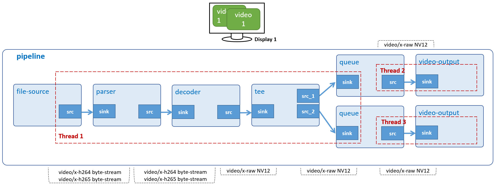

# Multiple Display 1

Display 1 H.264 video simultaneously on HDMI monitor.



## Development Environment

GStreamer: 1.16.3 (edited by Renesas).

## Application Content

+ [`main.c`](main.c)

### Walkthrought
>Note that this tutorial only discusses the important points of this application. For the rest of source code, please refer to section [Video Play](/02_gst-videoplay/README.md).

#### Command-line argument
```
if ((argc > ARG_COUNT) || (argc == 1)) {
    g_print ("Error: Invalid arugments.\n");
    g_print ("Usage: %s <path to H264 file> \n", argv[ARG_PROGRAM_NAME]);
    return -1;
}
```
This application accepts a command-line argument which points to an H.264 file.

#### Create elements
```
source = gst_element_factory_make ("filesrc", "file-source");
tee = gst_element_factory_make ("tee", "tee-element");

queue_1 = gst_element_factory_make ("queue", "queue-1");
video_sink_1 = gst_element_factory_make ("waylandsink", "video-output-1");

queue_2 = gst_element_factory_make ("queue", "queue-2");
video_sink_2 = gst_element_factory_make ("waylandsink", "video-output-2");

if (strcasecmp ("h264", ext) == 0) {
  parser = gst_element_factory_make ("h264parse", "h264-parser");
  decoder = gst_element_factory_make ("omxh264dec", "h264-decoder");
}
```
To play an H.264 video on 2 displays, the following elements are used:
-	 Element filesrc reads data from a local file.
-	 Element h264parse parses H.264 stream to format which omxh264dec can recognize and process.
-	 Element omxh264dec decompresses H.264 stream to raw NV12-formatted video.
-	 Element tee splits (video) data to multiple pads.
-	 Element queue (queue_1 and queue_2) queues data until one of the limits specified by the max-size-buffers, max-size-bytes, and/or max-size-time properties has been reached. Any attempt to push more buffers into the queue will block the pushing thread until more space becomes available.
-	 Element waylandsink (video_sink_1 and video_sink_2) creates its own window and renders the decoded video frames to that.

#### Set element’s properties
```
g_object_set (G_OBJECT (source), "location", input_video_file, NULL);
g_object_set (G_OBJECT (sink), "position-x", screens[PRIMARY_SCREEN_INDEX]->x + PRIMARY_POS_OFFSET,
       "position-y", screens[PRIMARY_SCREEN_INDEX]->y + PRIMARY_POS_OFFSET, NULL);
  g_object_set (G_OBJECT (sink), "position-x", screens[SECONDARY_SCREEN_INDEX]->x + SECONDARY_ POS_OFFSET,
       "position-y", screens[SECONDARY_SCREEN_INDEX]->y + SECONDARY_POS_OFFSET, NULL);
```

The _g_object_set()_ function is used to set some element’s properties, such as:
-	 The location property of filesrc element which points to an H.264 video file.
-	 The position-x and position-y property of  waylandsink element which point to (x,y) coordinate of wayland desktop.

#### Build pipeline
```
gst_bin_add_many (GST_BIN (pipeline), source, parser, decoder, tee,
      queue_1, video_sink_1, queue_2, video_sink_2, NULL);

gst_element_link_many (source, parser, decoder, tee, NULL)

/*Not display video in full-screen*/
gst_element_link_many (queue_1, video_sink_1, NULL);
gst_element_link_many (queue_2, video_sink_2, NULL);
```
This code block adds all elements to pipeline and then links them into separated groups as below:
-	 Group #1: source, parser, decoder, and tee.
-	 Group #2: queue_1, and video_sink_1.
-	 Group #3: queue_2, and video_sink_2.

The reason for the separation is that tee element contains no initial source pads: they need to be requested manually and then tee adds them. That is why these source pads are called Request Pads. In this way, an input stream can be replicated any number of times.

Also, to request (or release) pads in the PLAYING or PAUSED states, you need to take additional cautions (pad blocking) which are not described in this manual. It is safe to request (or release) pads in the NULL or READY states, though.

#### Link source pad (request pads of tee)
```
tee_src_pad_template = gst_element_class_get_pad_template (GST_ELEMENT_GET_CLASS (tee), "src_%u");

/* Get request pad and manually link for Video Display 1 */
req_pad_1 = gst_element_request_pad (tee, tee_src_pad_template, NULL, NULL);

sink_pad = gst_element_get_static_pad (queue_1, "sink");

if (gst_pad_link (req_pad_1, sink_pad) != GST_PAD_LINK_OK) {
  g_print ("tee link failed!\n");
}
gst_object_unref (sink_pad);

/* Get request pad and manually link for Video Display 2 */
req_pad_2 = gst_element_request_pad (tee, tee_src_pad_template, NULL, NULL);

sink_pad = gst_element_get_static_pad (queue_2, "sink");

if (gst_pad_link (req_pad_2, sink_pad) != GST_PAD_LINK_OK) {
  g_print ("tee link failed!\n");
}
gst_object_unref (sink_pad);

/* Get request pad and manually link for Video Display 1 */
req_pad_1 = gst_element_request_pad (tee, tee_src_pad_template, NULL, NULL);

sink_pad = gst_element_get_static_pad (filter_1, "sink");

if (gst_pad_link (req_pad_1, sink_pad) != GST_PAD_LINK_OK) {
  g_print ("tee link failed!\n");
}
gst_object_unref (sink_pad);

/* Get request pad and manually link for Video Display 2 */
req_pad_2 = gst_element_request_pad (tee, tee_src_pad_template, NULL, NULL);

sink_pad = gst_element_get_static_pad (filter_2, "sink");

if (gst_pad_link (req_pad_2, sink_pad) != GST_PAD_LINK_OK) {
  g_print ("tee link failed!\n");
}
gst_object_unref (sink_pad);
```

To link Request Pads, they need to be obtained by “requesting” them from tee element. Note that it might be able to produce different kinds of Request Pads, so, when requesting them, the desired Pad Template name must be provided. In the documentation for the tee element, we see that it has two [pad templates](https://gstreamer.freedesktop.org/documentation/tutorials/basic/media-formats-and-pad-capabilities.html?gi-language=c) named sink (for its sink pads) and src_%u (for the source pad (Request Pads)). We request two source pads from the tee (for video branches) with _gst_element_get_request_pad()_.

We then obtain the sink pads from queue/vspmfilter elements to which these Request Pads need to be linked using _gst_element_get_static_pad()_. Finally, we link the pads with _gst_pad_link()_.

>Note that the sink pads need to be released with _gst_object_unref()_ if they are not used anymore.

#### Free tee element
```
gst_element_release_request_pad (tee, req_pad_1);
gst_element_release_request_pad (tee, req_pad_2);
gst_object_unref (req_pad_1);
gst_object_unref (req_pad_2);
```
The _gst_element_release_request_pad()_ function releases the pads from tee, but it still needs to be un-referenced (freed) with _gst_object_unref()_.

## How to Build and Run GStreamer Application

This section shows how to cross-compile and deploy GStreamer _multiple displays 1_ application.

### How to Extract SDK
Please refer to _hello word_ [README.md](../#00_gst-helloworld/README.md) for more details.

### How to Build and Run GStreamer Application

***Step 1***.	Go to gst-multipledisplays1 directory:
```
$   cd $WORK/15_gst-multipledisplays1
```

***Step 2***.	Cross-compile:
```
$   make
```
***Step 3***.	Copy all files inside this directory to /usr/share directory on the target board:
```
$   scp -r $WORK/15_gst-multipledisplays1/ <username>@<board IP>:/usr/share/
```
***Step 4***.	Run the application:

Download the input file at: [vga1.h264](https://www.renesas.com/jp/ja/img/products/media/auto-j/microcontrollers-microprocessors/rz/rzg/doorphone-videos/vga1.h264) and place it in _/home/media/videos_.

```
$   /usr/share/15_gst-multipledisplays1/gst-multipledisplays1 /home/media/videos/vga1.h264
```
>RZ/G2L and RZ/V2L platform supports playing 2 1920x1080, 30 fps videos