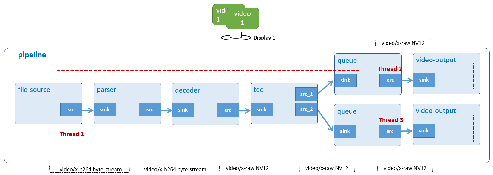

# Multiple Display 1

Display 1 H.264 video simultaneously on HDMI monitor.



## Development Environment

GStreamer: 1.16.3 (edited by Renesas).

## Application Content

+ [`main.c`](main.c)
+ [`Makefile`](Makefile)

### Walkthrough: [`main.c`](main.c)
>Note that this tutorial only discusses the important points of this application. For the rest of source code, please refer to section [Video Play](/02_gst-videoplay/README.md).

#### UserData structure
```c
typedef struct tag_user_data
{
  GstElement *pipeline;
  GstElement *source;
  GstElement *parser;
  GstElement *decoder;
  GstElement *tee;
  GstElement *queue_1;
  GstElement *video_sink_1;
  GstElement *queue_2;
  GstElement *video_sink_2;

  GstPad *req_pad_1;
  GstPad *req_pad_2;

  const char *input_video_file;
  struct screen_t *screens[REQUIRED_SCREEN_NUMBERS];
} UserData;
```
This structure contains:
- Gstreamer element variables: `pipeline`, `source`, `parser`, `decoder`, `tee`, `queue_1`, `video_sink_1`, `queue_2`, `video_sink_2`. These variables will be used to create pipeline and elements as section [Create elements](#create-elements).
- Variable `input_video_file (const gchar)` to represent H.264 video input file.
- Variable `screens (screen_t)` is a pointer to screen_t structure to contain monitors information, such as: (x, y), width, and height.
- Variables `req_pad_1 (GstPad)` and `req_pad_1 (GstPad)` are request source pads from tee. That are used in section [Link source pad (request pads of tee)](#link-source-pad-request-pads-of-tee)

#### Command-line argument
```c
if (argc != ARG_COUNT) {
    g_print ("Error: Invalid arugments.\n");
    g_print ("Usage: %s <path to H264 file> \n", argv[ARG_PROGRAM_NAME]);
    return -1;
}
```
This application accepts a command-line argument which points to a H.264 file.

#### Create elements
```c
if ((strcasecmp ("h264", ext) == 0) || (strcasecmp ("264", ext) == 0)) {
  user_data.parser = gst_element_factory_make ("h264parse", "h264-parser");
  user_data.decoder = gst_element_factory_make ("omxh264dec",
                          "h264-decoder");
}

user_data.source = gst_element_factory_make ("filesrc", "file-source");
user_data.tee = gst_element_factory_make ("tee", "tee-element");
user_data.queue_1 = gst_element_factory_make ("queue", "queue-1");
user_data.video_sink_1 = gst_element_factory_make ("waylandsink",
                             "video-output-1");
user_data.queue_2 = gst_element_factory_make ("queue", "queue-2");
user_data.video_sink_2 = gst_element_factory_make ("waylandsink",
                             "video-output-2");
```
To play an H.264 video on 2 displays, the following elements are used:
-	 Element `filesrc` reads data from a local file.
-	 Element `h264parse` parses H.264 stream to format which omxh264dec can recognize and process.
-	 Element `omxh264dec` decompresses H.264 stream to raw NV12-formatted video.
-	 Element `tee` splits (video) data to multiple pads.
-	 Element `queue (queue_1 and queue_2)` queues data until one of the limits specified by the max-size-buffers, max-size-bytes, and/or max-size-time properties has been reached. Any attempt to push more buffers into the queue will block the pushing thread until more space becomes available.
-	 Element `waylandsink (video_sink_1 and video_sink_2)` creates its own window and renders the decoded video frames to that.

#### Set element’s properties
```c
g_object_set (G_OBJECT (data->source),
      "location", data->input_video_file, NULL);
g_object_set (G_OBJECT (data->video_sink_1),
       "position-x",
       data->screens[PRIMARY_SCREEN_INDEX]->x + PRIMARY_POS_OFFSET,
       "position-y",
       data->screens[PRIMARY_SCREEN_INDEX]->y + PRIMARY_POS_OFFSET, NULL);
g_object_set (G_OBJECT (data->video_sink_2),
       "position-x",
       data->screens[SECONDARY_SCREEN_INDEX]->x + SECONDARY_POS_OFFSET,
       "position-y",
       data->screens[SECONDARY_SCREEN_INDEX]->y + SECONDARY_POS_OFFSET, NULL);
```

The `g_object_set()` function is used to set some element’s properties, such as:
-	 The `location` property of filesrc element which points to an H.264 video file.
-	 The `position-x` and `position-y` are properties of waylandsink element which point to (x,y) coordinate of wayland desktop.

#### Build pipeline
```c
gst_bin_add_many (GST_BIN (data->pipeline),
    data->source, data->parser, data->decoder, data->tee, data->queue_1,
    data->video_sink_1, data->queue_2, data->video_sink_2, NULL);

if (gst_element_link_many (data->source, data->parser, data->decoder,
        data->tee, NULL) != TRUE) {
  g_printerr ("Source elements could not be linked.\n");
  return FALSE;
}
if (gst_element_link_many (data->queue_1, data->video_sink_1,
        NULL) != TRUE) {
  g_printerr ("Elements of Video Display-1 could not be linked.\n");
  return FALSE;
}
if (gst_element_link_many (data->queue_2, data->video_sink_2,
        NULL) != TRUE) {
  g_printerr ("Elements of Video Display-2 could not be linked.\n");
  return FALSE;
}
```
Above lines of code add all elements to pipeline and then links them into separated groups as below:
-	 Group #1: `source, parser, decoder, and tee`.
-	 Group #2: `queue_1, and video_sink_1`.
-	 Group #3: `queue_2, and video_sink_2`.

The reason for the separation is that `tee` element contains no initial source pads: they need to be requested manually and then `tee` adds them. That is why these source pads are called Request Pads. In this way, an input stream can be replicated any number of times.\
Also, to request (or release) pads in the PLAYING or PAUSED states, you need to take additional cautions (pad blocking) which are not described in this manual. It is safe to request (or release) pads in the NULL or READY states, though.

#### Link source pad (request pads of tee)
```c
tee_src_pad_template =
    gst_element_class_get_pad_template (GST_ELEMENT_GET_CLASS (data->tee),
    "src_%u");

/* Get request pad and manually link for Video Display 1 */
data->req_pad_1 = gst_element_request_pad (data->tee, tee_src_pad_template,
                      NULL, NULL);
sink_pad = gst_element_get_static_pad (data->queue_1, "sink");
if (gst_pad_link (data->req_pad_1, sink_pad) != GST_PAD_LINK_OK) {
  g_print ("tee link failed!\n");
}
gst_object_unref (sink_pad);

/* Get request pad and manually link for Video Display 2 */
data->req_pad_2 = gst_element_request_pad (data->tee, tee_src_pad_template,
                  NULL, NULL);
sink_pad = gst_element_get_static_pad (data->queue_2, "sink");
if (gst_pad_link (data->req_pad_2, sink_pad) != GST_PAD_LINK_OK) {
  g_print ("tee link failed!\n");
}
gst_object_unref (sink_pad);
```

To link Request Pads, they need to be obtained by “requesting” them from `tee` element. Note that it might be able to produce different kinds of Request Pads, so, when requesting them, the desired Pad Template name must be provided. In the documentation for the tee element, we see that it has two [pad templates](https://gstreamer.freedesktop.org/documentation/tutorials/basic/media-formats-and-pad-capabilities.html?gi-language=c) named sink (for its sink pads) and src_%u (for the source pad (Request Pads)). We request two source pads from the tee (for video branches) with `gst_element_get_request_pad()`.\
We then obtain the sink pads from queue/vspmfilter elements to which these Request Pads need to be linked using `gst_element_get_static_pad()`. Finally, we link the pads with `gst_pad_link()`.

>Note that the sink pads need to be released with `gst_object_unref()` if they are not used anymore.

#### Free tee element
```c
gst_element_release_request_pad (data->tee, data->req_pad_1);
gst_element_release_request_pad (data->tee, data->req_pad_2);
gst_object_unref (data->req_pad_1);
gst_object_unref (data->req_pad_2);
```
The `gst_element_release_request_pad()` function releases the pads from `tee`, but it still needs to be un-referenced (freed) with `gst_object_unref()`.

## How to Build and Run GStreamer Application

This section shows how to cross-compile and deploy GStreamer _multiple displays 1_ application.

### How to Extract Renesas SDK
***Step 1***.	Install toolchain on a Host PC:
```sh
$   sudo sh ./poky-glibc-x86_64-core-image-weston-aarch64-smarc-rzg2l-toolchain-3.1.17.sh
```
Note:
> This step installs the RZG2L toolchain. If you want to install the RZV2L toolchain, please use `poky-glibc-x86_64-core-image-weston-aarch64-smarc-rzv2l-toolchain-3.1.17.sh` instead.\
> Sudo is optional in case user wants to extract SDK into a restricted directory (such as: _/opt/_)

If the installation is successful, the following messages will appear:
```sh
SDK has been successfully set up and is ready to be used.
Each time you wish to use the SDK in a new shell session, you need to source the environment setup script e.g.
$ . /opt/poky/3.1.17/environment-setup-aarch64-poky-linux
$ . /opt/poky/3.1.17/environment-setup-armv7vet2hf-neon-vfpv4-pokymllib32-linux-gnueabi
```
***Step 2***.	Set up cross-compile environment:
```sh
$   source /<Location in which SDK is extracted>/environment-setup-aarch64-poky-linux
```
Note:
>User needs to run the above command once for each login session.

### How to Build and Run GStreamer Application

***Step 1***.	Go to gst-multipledisplays1 directory:
```sh
$   cd $WORK/15_gst-multipledisplays1
```

***Step 2***.	Cross-compile:
```sh
$   make
```
***Step 3***.	Copy all files inside this directory to _/usr/share_ directory on the target board:
```sh
$   scp -r $WORK/15_gst-multipledisplays1/ <username>@<board IP>:/usr/share/
```
***Step 4***.	Run the application:

Download the input file `vga1.h264` from _Renesas/videos_ in media repository [(github.com/renesas-rz/media)](https://github.com/renesas-rz/media) and then place it in _/home/media/videos_.

```sh
$   /usr/share/15_gst-multipledisplays1/gst-multipledisplays1 /home/media/videos/vga1.h264
```
>RZ/G2L and RZ/V2L platform supports playing 2 1920x1080, 30 fps videos