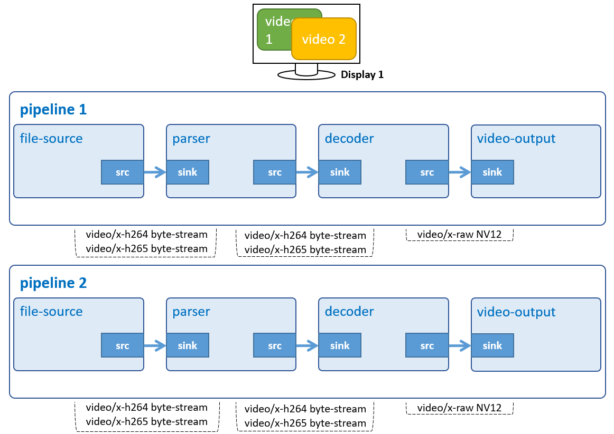

# Multiple Display 2

Display 2 H.264/H.265 video simultaneously on HDMI monitor.
>H.265 is only for MPU(s) support `omxh265dec` and `omxh265enc`.



## Development Environment

### Linux kernel version 5.10 and Yocto version 3.1 (Dunfell)

GStreamer: 1.16.3 (edited by Renesas).

### Linux kernel version 6.1 and Yocto version 5.0 (Scarthgap)

GStreamer: 1.22.12 (edited by Renesas).

## Application Content

+ [`main.c`](main.c)
+ [`Makefile`](Makefile)

### Walkthrough: [`main.c`](main.c)
>Note that this tutorial only discusses the important points of this application. For the rest of source code, please refer to section [Audio Play](../01_gst-audioplay/README.md) and [Audio Video play](../13_gst-audiovideoplay/README.md).

#### Command-line argument
```c
if (argc != ARG_COUNT) {
    g_print ("Error: Invalid arugments.\n");
    g_print ("Usage: %s <path to the first H.264/H.265 file> <path to the second H.264/H.265 file> \n", argv[ARG_PROGRAM_NAME]);
    return -1;
}
```
This application accepts 2 command-line arguments which points to 2 H.264/H.265 files.

#### Video pipeline
```c
guint
create_video_pipeline (GstElement ** p_video_pipeline,
    const gchar * input_file, struct screen_t * screen, CustomData * data)
```
Basically, the pipeline is just like [Video Play](../02_gst-videoplay/README.md) except it uses `gst_bus_add_watch()` instead of `gst_bus_timed_pop_filtered()` to receive messages (such as: error or EOS (End-of-Stream)) from `bus_call()` asynchronously

#### Create elements
```c
create_video_pipeline (&video_pipeline_1, input_video_file_1,
                            screens[PRIMARY_SCREEN_INDEX], &shared_data);

create_video_pipeline (&video_pipeline_2, input_video_file_2,
                            screens[SECONDARY_SCREEN_INDEX], &shared_data);
```
Above lines of code create 2 pipelines:
-	 Pipeline `video_pipeline_1` displays the first video in the main Wayland desktop.
-	 Pipeline `video_pipeline_2` displays the second video in the secondary Wayland desktop.

## How to Build and Run GStreamer Application

This section shows how to cross-compile and deploy GStreamer _multiple displays 2_ application.

### How to Extract Renesas SDK
***Step 1***.	Install toolchain on a Host PC:
* RZ/G2L SMARC Evaluation Kit:
  ```sh
  $   sudo sh ./poky-glibc-x86_64-core-image-weston-aarch64-smarc-rzg2l-toolchain-*.sh
  ```
  Note:
  > This step installs the RZ/G2L toolchain in the environment VLP 3.0.x. If you want to install the RZ/G2L toolchain in the environment VLP 4.0.x, please use `./rz-vlp-glibc-x86_64-core-image-weston-cortexa55-smarc-rzg2l-toolchain-*.sh` instead.

* RZ/V2L SMARC Evaluation Kit:
  ```sh
  $   sudo sh ./poky-glibc-x86_64-core-image-weston-aarch64-smarc-rzv2l-toolchain-*.sh
  ```
  Note:
  > This step installs the RZ/V2L toolchain in the environment VLP 3.0.x. If you want to install the RZ/V2L toolchain in the environment AI SDK 7.xx, please use `./rz-vlp-glibc-x86_64-core-image-weston-cortexa55-smarc-rzv2l-toolchain-*.sh` instead.

* RZ/V2N Evaluation Board Kit:
  ```sh
  $   sudo sh ./poky-glibc-x86_64-core-image-weston-aarch64-rzv2n-evk-toolchain-*.sh
  ```
  Note:
  > This step installs the RZ/V2N toolchain in the environment AI SDK 5.xx. If you want to install the RZ/V2N toolchain in the environment AI SDK 6.xx, please use `./rz-vlp-glibc-x86_64-core-image-weston-cortexa55-rzv2n-evk-toolchain-*.sh` instead.

* RZ/V2H Evaluation Board Kit:
  ```sh
  $   sudo sh ./poky-glibc-x86_64-core-image-weston-aarch64-rzv2h-evk-ver1-toolchain-*.sh
  ```
  Note:
  > This step installs the RZ/V2H toolchain in the environment AI SDK 5.xx. If you want to install the RZ/V2H toolchain in the environment AI SDK 6.xx, please use `./rz-vlp-glibc-x86_64-core-image-weston-cortexa55-rzv2h-evk-toolchain-*.sh` instead.

* RZ/G3E SMARC Evaluation Kit:
  ```sh
  $   sudo sh ./rz-vlp-glibc-x86_64-core-image-weston-cortexa55-smarc-rzg3e-toolchain-*.sh
  ```

* RZ/G3L SMARC Evaluation Kit:
  ```sh
  $   sudo sh ./rz-vlp-glibc-x86_64-core-image-weston-cortexa55-smarc-rzg3l-toolchain-*.sh
  ```
Note:
> Sudo is optional in case user wants to extract SDK into a restricted directory (such as: _/opt/_)

***Step 2***.	Set up cross-compile environment:
* Linux kernel version 5.10 and Yocto version 3.1 (Dunfell):
  ```sh
  $   source /<Location in which SDK is extracted>/environment-setup-aarch64-poky-linux
  ```
* Linux kernel version 6.1 and Yocto version 5.0 (Scarthgap):
  ```sh
  $   source /<Location in which SDK is extracted>/environment-setup-cortexa55-poky-linux
  ```
Note:
>User needs to run the above command once for each login session.

### How to Build and Run GStreamer Application

***Step 1***. Go to gst-multipledisplays2 directory:
```sh
$   cd $WORK/16_gst-multipledisplays2
```

***Step 2***. Cross-compile:
```sh
$   make
```
***Step 3***. Copy all files inside this directory to _/usr/share_ directory on the target board:
```sh
$   scp -r $WORK/16_gst-multipledisplays2/ <username>@<board IP>:/usr/share/
```
***Step 4***. Run the application:

Download the input files `vga1.h264` and `vga2.h264` from _Renesas/videos_ in media repository [(github.com/renesas-rz/media)](https://github.com/renesas-rz/media) then place all of them in _/home/media/videos_.

```sh
$   /usr/share/16_gst-multipledisplays2/gst-multipledisplays2 /home/media/videos/vga1.h264 /home/media/videos/vga2.h264
```
>RZ Family MPUs support playing 2 1920x1080, 30 fps videos