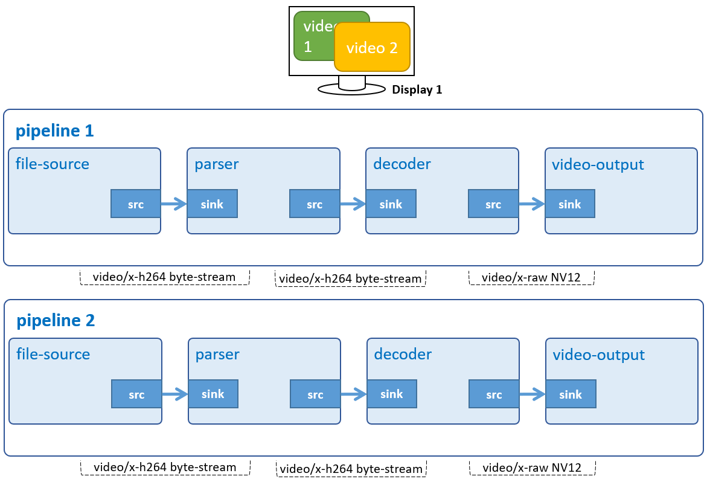

# Multiple Display 2

Display 2 H.264 video simultaneously on HDMI monitor.



## Development Environment

GStreamer: 1.16.3 (edited by Renesas).

## Application Content

+ [`main.c`](main.c)
+ [`Makefile`](Makefile)

### Walkthrough: [`main.c`](main.c)
>Note that this tutorial only discusses the important points of this application. For the rest of source code, please refer to section [Audio Play](/01_gst-audioplay/README.md) and [Audio Video play](/13_gst-audiovideoplay/README.md).

#### Command-line argument
```c
if (argc != ARG_COUNT) {
    g_print ("Error: Invalid arugments.\n");
    g_print ("Usage: %s <path to the first H264 file> <path to the second H264 file> \n", argv[ARG_PROGRAM_NAME]);
    return -1;
}
```
This application accepts 2 command-line arguments which points to 2 H.264 files.

#### Video pipeline
```c
guint create_video_pipeline (GstElement ** p_video_pipeline, const gchar * input_file,
                                   struct screen_t * screen, CustomData * data)
```
Basically, the pipeline is just like [Video Play](/02_gst-videoplay/README.md) except it uses `gst_bus_add_watch()` instead of `gst_bus_timed_pop_filtered()` to receive messages (such as: error or EOS (End-of-Stream)) from `bus_call()` asynchronously

#### Create elements
```c
create_video_pipeline (&video_pipeline_1, input_video_file_1,
                            screens[PRIMARY_SCREEN_INDEX], &shared_data);

create_video_pipeline (&video_pipeline_2, input_video_file_2,
                            screens[SECONDARY_SCREEN_INDEX], &shared_data);
```
Above lines of code create 2 pipelines:
-	 Pipeline `video_pipeline_1` displays the first video in the main Wayland desktop.
-	 Pipeline `video_pipeline_2` displays the second video in the secondary Wayland desktop.

## How to Build and Run GStreamer Application

This section shows how to cross-compile and deploy GStreamer _multiple displays 2_ application.

### How to Extract Renesas SDK
***Step 1***.	Install toolchain on a Host PC:
```sh
$   sudo sh ./poky-glibc-x86_64-core-image-weston-aarch64-smarc-rzg2l-toolchain-3.1.17.sh
```
Note:
> This step installs the RZG2L toolchain. If you want to install the RZV2L toolchain, please use `poky-glibc-x86_64-core-image-weston-aarch64-smarc-rzv2l-toolchain-3.1.17.sh` instead.\
> Sudo is optional in case user wants to extract SDK into a restricted directory (such as: _/opt/_)

If the installation is successful, the following messages will appear:
```sh
SDK has been successfully set up and is ready to be used.
Each time you wish to use the SDK in a new shell session, you need to source the environment setup script e.g.
$ . /opt/poky/3.1.17/environment-setup-aarch64-poky-linux
$ . /opt/poky/3.1.17/environment-setup-armv7vet2hf-neon-vfpv4-pokymllib32-linux-gnueabi
```
***Step 2***.	Set up cross-compile environment:
```sh
$   source /<Location in which SDK is extracted>/environment-setup-aarch64-poky-linux
```
Note:
>User needs to run the above command once for each login session.

### How to Build and Run GStreamer Application

***Step 1***.	Go to gst-multipledisplays2 directory:
```sh
$   cd $WORK/16_gst-multipledisplays2
```

***Step 2***.	Cross-compile:
```sh
$   make
```
***Step 3***.	Copy all files inside this directory to _/usr/share_ directory on the target board:
```sh
$   scp -r $WORK/16_gst-multipledisplays2/ <username>@<board IP>:/usr/share/
```
***Step 4***.	Run the application:

Download the input files `vga1.h264` and `vga2.h264` from _Renesas/videos_ in media repository then place all of them in _/home/media/videos_.

```sh
$   /usr/share/16_gst-multipledisplays2/gst-multipledisplays2 /home/media/videos/vga1.h264 /home/media/videos/vga2.h264
```
>RZ/G2L and RZ/V2L platform supports playing 2 1920x1080, 30 fps videos