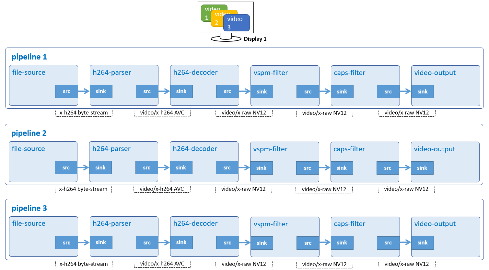

# Overlapped Display

Display 3 overlapping H.264 videos.



## Development Environment

GStreamer: 1.16.3 (edited by Renesas).

## Application Content

+ [`main.c`](main.c)
+ [`Makefile`](Makefile)

### Walkthrough: [`main.c`](main.c)
>Note that this tutorial only discusses the important points of this application. For the rest of source code, please refer to section [Audio Play](../01_gst-audioplay/README.md), [Audio Video play](../13_gst-audiovideoplay/README.md) and [Multiple Display 1](../15_gst-multipledisplays1/README.md)
#### Input location
```c
#define INPUT_VIDEO_FILE_1         "/home/media/videos/vga1.h264"
#define INPUT_VIDEO_FILE_2         "/home/media/videos/vga2.h264"
#define INPUT_VIDEO_FILE_3         "/home/media/videos/vga3.h264"
```
This application accepts one command-line argument which points to an Ogg/Vorbis file.

#### Video pipeline
```c
guint
create_video_pipeline (GstElement ** p_video_pipeline,
    const gchar * input_file, struct screen_t * screen, CustomData * data)
```
Basically, the pipeline is just like [Video Play](../02_gst-videoplay/README.md) except it uses `gst_bus_add_watch()` instead of `gst_bus_timed_pop_filtered()` to receive messages (such as: error or EOS (End-of-Stream)) from `bus_call()` asynchronously.

#### Create elements
```c
create_video_pipeline (&video_pipeline_1, input_video_file_1, &temp, &shared_data);
create_video_pipeline (&video_pipeline_2, input_video_file_2, &temp, &shared_data);
create_video_pipeline (&video_pipeline_3, input_video_file_3, &temp, &shared_data);
```
Above lines of code create 3 pipelines:
-	 Pipeline `video_pipeline_1` displays video vga1.h264 at the origin coordinate. In this application, it will always be at (0, 0).
-	 Pipeline `video_pipeline_2` displays video vga2.h264 at coordinate (width / 4, height / 4).
-	 Pipeline `video_pipeline_3` displays video vga3.h264 at coordinate (width / 2, height / 2).

### Play pipeline
```c
int main (int argc, char *argv[])
{
  play_pipeline (video_pipeline_1, &shared_data)
  play_pipeline (video_pipeline_2, &shared_data)
  play_pipeline (video_pipeline_3, &shared_data)
}

void play_pipeline (GstElement * pipeline, CustomData * p_shared_data)
{
  ++(p_shared_data->loop_reference);
  if (gst_element_set_state (pipeline, GST_STATE_PLAYING) == GST_STATE_CHANGE_FAILURE) {
    g_printerr ("Unable to set the pipeline to the playing state.\n");
    --(p_shared_data->loop_reference);
    gst_object_unref (pipeline);
  }
}
```
Basically, this function sets the state of pipeline to PLAYING. If successful, it will increase `loop_reference` to indicate that there is 1 more running pipeline. Note that this variable must be 3 for this application to play 3 H.264 videos.

### Stop pipelines
```c
static void try_to_quit_loop (CustomData * p_shared_data)
{
  g_mutex_lock (&p_shared_data->mutex);
  --(p_shared_data->loop_reference);
  if (0 == p_shared_data->loop_reference) {
    g_main_loop_quit ((p_shared_data->loop));
  }
  g_mutex_unlock (&p_shared_data->mutex);
}
```
The main event loop will stop only if variable `loop_reference` reaches to 0. This means the application will exit when all 3 pipelines stopped. Also note that mutex is used to prevent GStreamer threads from reading incorrect value of `loop_reference`.

## How to Build and Run GStreamer Application

This section shows how to cross-compile and deploy GStreamer _overlapped display_ application.

### How to Extract Renesas SDK
***Step 1***.	Install toolchain on a Host PC:
```sh
$   sudo sh ./poky-glibc-x86_64-core-image-weston-aarch64-rzv2h-evk-ver1-toolchain-*.sh
```
Note:
> This step installs the RZV2H toolchain.\
> Sudo is optional in case user wants to extract SDK into a restricted directory (such as: _/opt/_)

***Step 2***.	Set up cross-compile environment:
```sh
$   source /<Location in which SDK is extracted>/environment-setup-aarch64-poky-linux
```
Note:
>User needs to run the above command once for each login session.

### How to Build and Run GStreamer Application

***Step 1***.	Go to gst-lappeddisplay directory:
```sh
$   cd $WORK/17_gst-lappeddisplay
```

***Step 2***.	Cross-compile:
```sh
$   make
```
***Step 3***.	Copy all files inside this directory to _/usr/share_ directory on the target board:
```sh
$   scp -r $WORK/17_gst-lappeddisplay/ <username>@<board IP>:/usr/share/
```
***Step 4***.	Run the application:
-	 Download the input files `vga1.h264`, `vga2.h264` and `vga3.h264` from _Renesas/videos_ in media repository [(github.com/renesas-rz/media)](https://github.com/renesas-rz/media). Please place all of them in _/home/media/videos_.
```sh
$   /usr/share/17_gst-lappeddisplay/gst-lappeddisplay
```